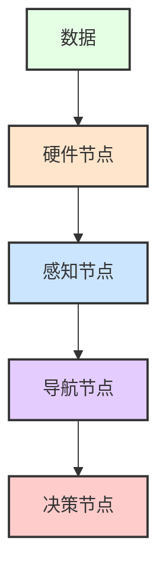
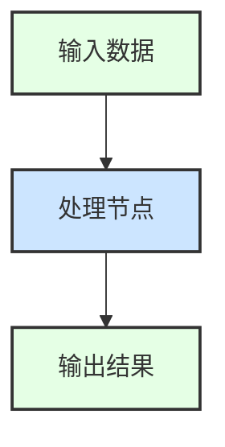

# Mermaid 流程图颜色方案

本文档定义了整个项目文档中 Mermaid 流程图使用的统一颜色方案。

## 🎨 统一颜色标准

### 按功能层分类

| 层级 | 颜色代码 | 颜色示例 | 用途 |
|------|----------|----------|------|
| **硬件层** | `#FFE5CC` |  | 串口通信、相机驱动等硬件节点 |
| **感知层** | `#CCE5FF` |  | 装甲板检测、追踪、弹道计算节点 |
| **导航层** | `#E5CCFF` |  | Point-LIO、重定位、地形分析、Nav2节点 |
| **决策层** | `#FFCCCC` |  | 行为树、条件节点、动作节点 |
| **数据/话题** | `#E5FFE5` |  | 输入数据、输出指令、ROS话题 |
| **通用/次要** | `#F5F5F5` |  | 中间处理步骤、辅助节点 |

## 📝 使用语法

使用兼容的 `classDef` 和 `class` 语法：

## ✅ 已优化的流程图

### 01_系统架构.md
- ✅ 架构层次图 (行22) - 四层架构完整着色
- ✅ 感知流水线图 (行117) - 感知层+数据层
- ✅ 导航流水线图 (行146) - 导航层+数据层
- ✅ 决策流水线图 (行188) - 决策层+数据层

### 02_硬件接口层.md
- ✅ 硬件层概述图 (行18) - 硬件层+数据层
- ✅ 串口通信工作流程 (行50) - 硬件层+数据层+处理步骤
- ✅ 相机工作流程 (行216) - 硬件层+数据层+处理步骤
- ✅ 帧率与曝光平衡图 (行331) - 硬件层+处理步骤

### 03_感知层.md
- ✅ 装甲板检测流程图 (行67) - 感知层+处理步骤+数据层
- ✅ OpenVINO检测流程 (行231) - 感知层+数据层+处理步骤
- ✅ 目标追踪流程 (行346) - 感知层+数据层+处理步骤
- ✅ 弹道计算流程 (行509) - 感知层+数据层+处理步骤

### 04_导航层.md
- ✅ 导航流水线图 (行22) - 已移除特殊字符，简化版本

### 05_决策层.md
- ✅ 决策流程图 (行21) - 决策层+数据层+处理步骤
- ✅ CalculateAttackPose算法图 (行176) - 决策层+数据层

### 06_ROS话题详解.md
- ✅ 数据流图 (行212) - 四层架构完整着色

### 08_运行与调试.md
- ✅ 启动流程图 (行37) - 四层架构+处理步骤
- ✅ Rosbag调试数据流图 (行274) - 硬件层+感知层+导航层

## 🔧 待优化流程图

所有主要流程图已完成优化！剩余的序列图(sequenceDiagram)保持原样即可：

### 02_硬件接口层.md
- 串口数据流时序图 (行134) - sequenceDiagram类型，保持原样
- 相机数据流时序图 (行343) - sequenceDiagram类型，保持原样

## 💡 优化建议

1. **保持一致性**：同类型节点在不同流程图中使用相同颜色
2. **避免过度着色**：只对关键节点着色，中间步骤使用浅灰色
3. **兼容性优先**：使用 `classDef` 语法而非 `style`，兼容性更好
4. **避免特殊字符**：节点标签中不要使用 `/`, `\` 等特殊字符

## 🚀 快速模板

根据节点类型选择合适的类别即可！
