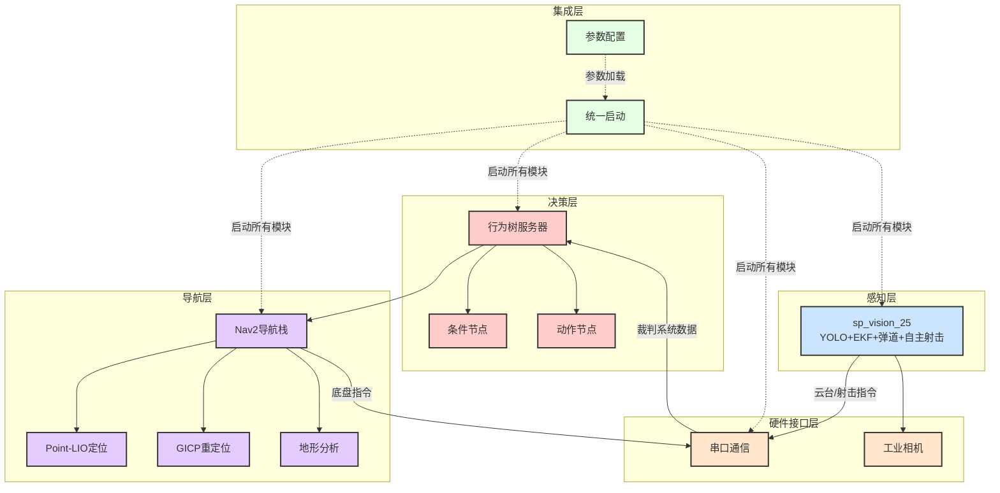
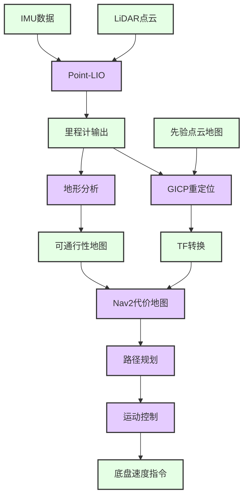
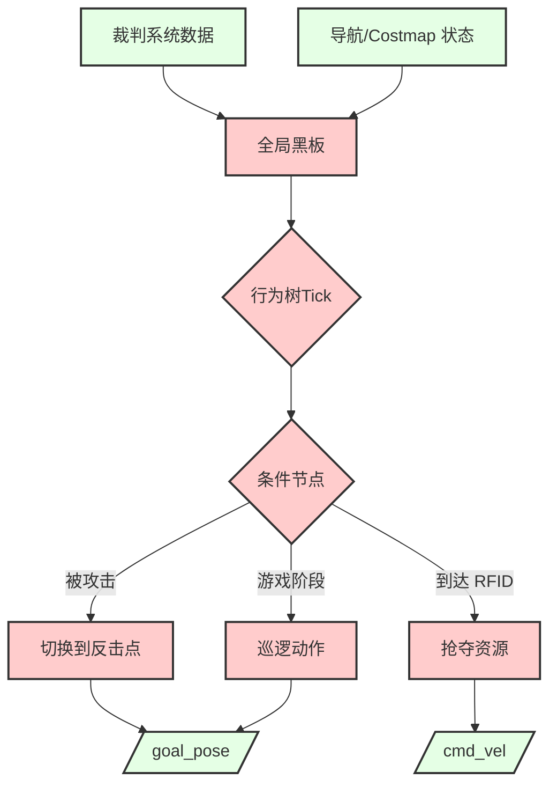
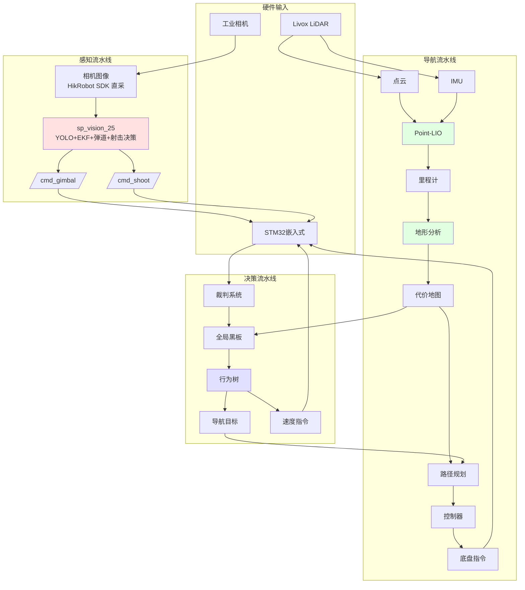
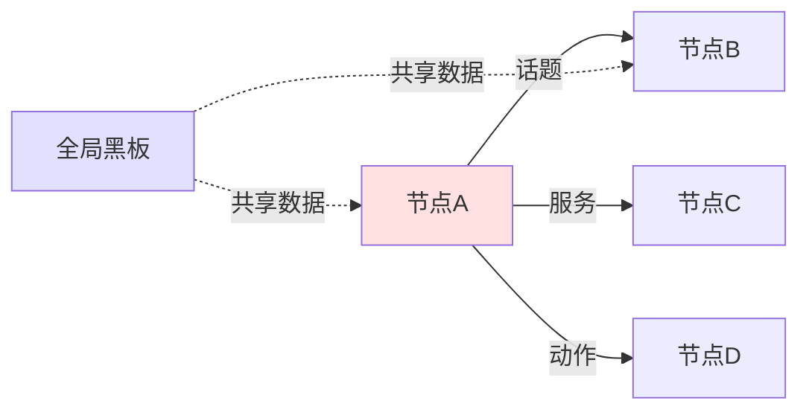
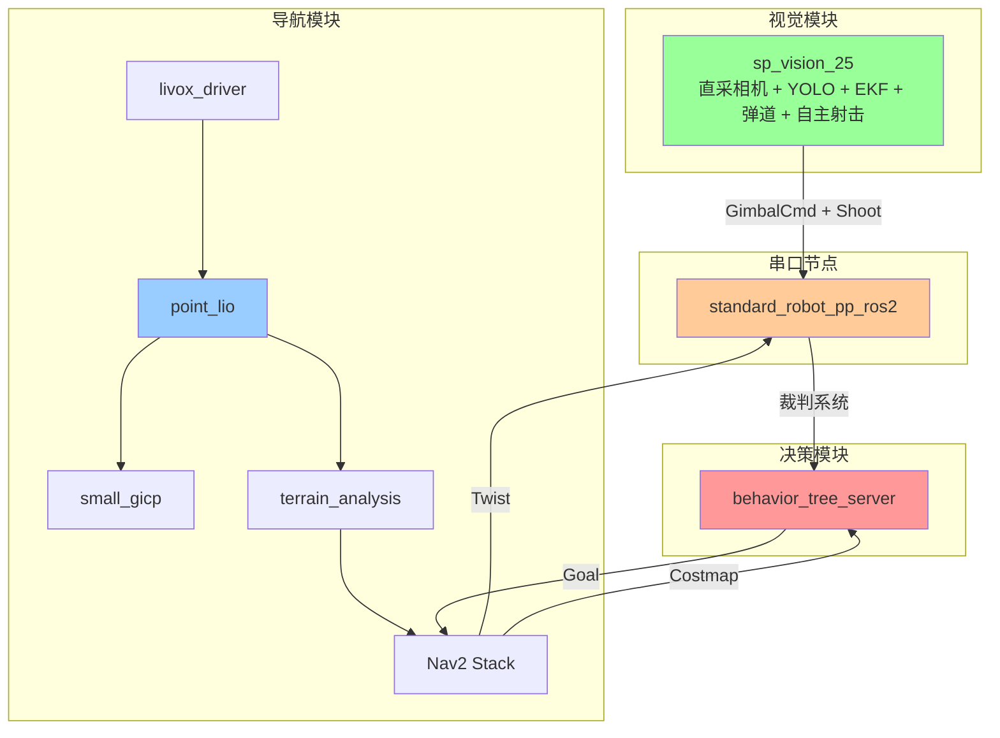

# 01. 系统架构总览

[返回主页](../README.md) | [下一章：硬件接口层 →](./02_硬件接口层.md)

---

## 目录
- [1. 整体架构设计](#1-整体架构设计)
- [2. 四层架构详解](#2-四层架构详解)
- [3. 系统数据流](#3-系统数据流)
- [4. 关键技术栈](#4-关键技术栈)
- [5. 模块交互关系](#5-模块交互关系)

---

## 1. 整体架构设计

PB2025 哨兵机器人采用分层模块化架构，将系统划分为**硬件接口层 / 感知层 / 导航层 / 决策层**四个功能层，再由**集成层**统一启动与配参。当前主感知由 `sp_vision_25` 单进程方案承担（直采相机、自主控制云台与射击）；旧 `pb2025_rm_vision` 多节点链路（armor_detector → armor_tracker → projectile_motion）**已废弃但保留**，仅在 `use_sp_vision:=False` 模式下启用。

### 1.1 架构层次图



### 1.2 设计原则

- **模块化**：每个功能层独立开发和测试
- **可组合**：支持 ROS2 Composable Nodes，提高性能
- **配置化**：集中式参数配置，便于调试
- **可扩展**：便于添加新的传感器和算法模块
- **容错性**：节点失败自动重启（可配置）

---

## 2. 四层架构详解

### 2.1 硬件接口层 (Hardware Interface Layer)

**职责**：与物理硬件通信，提供标准化的数据接口

| 模块 | 功能 | 关键输出 |
|------|------|---------|
| standard_robot_pp_ros2 | STM32串口通信 | 裁判系统数据、云台状态、IMU数据 |
| hik_camera_ros2_driver *(仅旧视觉模式)* | 工业相机驱动 | 高速图像流、相机标定信息 |

> sp_vision_25 模式下相机由 sp_vision 直接通过 HikRobot SDK 独占访问，**不**启动 hik_camera_ros2_driver。

📖 **详细文档**：[硬件接口层详解](./02_硬件接口层.md)

---

### 2.2 感知层 (Perception Layer)

**职责**：图像采集、装甲板检测、目标状态估计、弹道解算与**自主射击决策**

```mermaid
graph LR
    A[相机<br/>HikRobot SDK 直采] --> B[sp_vision_25<br/>YOLO 检测 + EKF 跟踪 + 弹道 + 自主射击]
    B --> C[/cmd_gimbal/]
    B --> D[/cmd_shoot/]
    B --> E[/sentry_debug/image<br/>调试可视化]

    classDef dataClass fill:#E5FFE5,stroke:#333,stroke-width:2px
    classDef perceptionClass fill:#CCE5FF,stroke:#333,stroke-width:2px

    class A,C,D,E dataClass
    class B perceptionClass
```

| 模块 | 功能 | 算法 |
|------|------|------|
| **sp_vision_25** *(主方案)* | 单进程感知 + 自主射击 | YOLO (OpenVINO) + EKF + 弹道补偿 + MPC 决策 |
| sp_vision_ros2_adapter | 可选 ROS2 桥接工具 | — |
| ~~armor_detector_opencv / openvino~~ *(已废弃)* | 装甲板检测 | 传统 CV / 深度学习 |
| ~~armor_tracker~~ *(已废弃)* | EKF 目标追踪 | 扩展卡尔曼滤波 |
| ~~projectile_motion~~ *(已废弃)* | 弹道补偿 + 云台/射击输出 | 抛物线 / 空气阻力模型 |

> 旧 pb2025_rm_vision 多节点链路仅在 `use_sp_vision:=False` 时加载，新功能不再添加。

📖 **详细文档**：[感知层详解](./03_感知层.md) | [sp_vision_25 深度分析](./09_sp_vision_25分析.md)

---

### 2.3 导航层 (Navigation Layer)

**职责**：定位、建图、路径规划与运动控制



| 模块 | 功能 | 算法 |
|------|------|------|
| point_lio | 激光惯性里程计 | 迭代误差卡尔曼滤波 |
| small_gicp_relocalization | 全局重定位 | GICP点云配准 |
| terrain_analysis | 地形分析 | 可通行性评估 |
| pb_nav2_plugins | 自定义Nav2插件 | 全向PID追踪控制器 |

📖 **详细文档**：[导航层详解](./04_导航层.md)

---

### 2.4 决策层 (Decision Layer)

**职责**：高层导航与战术决策（**不**控制射击；射击由 sp_vision_25 自主完成）



| 模块 | 功能 | 框架 |
|------|------|------|
| pb2025_sentry_behavior | 行为树执行器 | BehaviorTree.CPP v4 |
| 条件节点 | 状态判断 | IsAttacked, IsGameStatus, IsRfidDetected, IsStatusOK |
| 动作节点 | 执行动作 | PubNav2Goal, PubTwist, PubGimbalAbsolute, PubGimbalVelocity |

> 旧 `IsDetectEnemy` / `CalculateAttackPose` 节点依赖 `/detector/armors`、`/tracker/target`，仅在 `use_sp_vision:=False` 模式下可用。

📖 **详细文档**：[决策层详解](./05_决策层.md)

---

### 2.5 集成层 (Integration Layer)

**职责**：统一启动管理和参数配置

| 模块 | 功能 |
|------|------|
| pb2025_sentry_bringup | 主启动文件、地图/PCD管理 |
| node_params.yaml | 中心化参数配置文件 |

---

## 3. 系统数据流

### 3.1 完整数据流图



### 3.2 主要数据流说明

#### 感知流水线（sp_vision_25 主方案）
```
相机图像（~165Hz，HikRobot SDK 直采）→ sp_vision_25（YOLO + EKF + 弹道 + 自主射击决策）
  → /cmd_gimbal（GimbalCmd）+ /cmd_shoot（UInt8）→ 串口 → STM32
```

**关键话题**：
- `/cmd_gimbal` (pb_rm_interfaces/GimbalCmd)
- `/cmd_shoot` (example_interfaces/UInt8)
- `/sentry_debug/image` (sensor_msgs/Image，调试模式)

> **旧模式**（`use_sp_vision:=False`）仅供参考：
> ```
> /front_industrial_camera/image → armor_detector → /detector/armors
>   → armor_tracker → /tracker/target → projectile_motion → /cmd_gimbal + /cmd_shoot
> ```

#### 导航流水线
```
LiDAR点云(20Hz) + IMU(200Hz) → Point-LIO → Odometry → 地形分析 → Costmap → Nav2控制器 → Twist → 串口 → STM32
```

**关键话题**：
- `/livox/lidar` (sensor_msgs/PointCloud2)
- `/Odometry` (nav_msgs/Odometry)
- `/terrain_map` (sensor_msgs/PointCloud2)
- `/cmd_vel` (geometry_msgs/Twist)

#### 决策流水线
```
裁判系统消息 + 导航/Costmap 状态 → 全局黑板 → 行为树条件判断 → 动作执行 → /goal_pose + /cmd_vel
```

> sp_vision_25 模式下行为树**不**订阅 `/tracker/target`（不存在该话题），瞄准与射击由 sp_vision_25 自主完成。

**关键话题**：
- `/referee/*` (多种裁判系统消息)
- `/global_costmap/costmap` (nav_msgs/OccupancyGrid)
- `/goal_pose` (geometry_msgs/PoseStamped)

---

## 4. 关键技术栈

### 4.1 核心框架

| 技术 | 版本 | 用途 |
|------|------|------|
| ROS2 | Humble | 机器人操作系统 |
| BehaviorTree.CPP | v4.6.2 | 行为树框架 |
| Nav2 | Humble | 导航框架 |
| OpenVINO | 2023.3 | 深度学习推理 |
| PCL | 1.12+ | 点云处理 |

### 4.2 关键算法

| 算法 | 模块 | 说明 |
|------|------|------|
| 扩展卡尔曼滤波（EKF） | armor_tracker | 目标状态估计 |
| 迭代误差卡尔曼滤波 | point_lio | 激光惯性里程计 |
| GICP配准 | small_gicp | 点云地图匹配 |
| Theta* 规划器 | Nav2 | 任意角度路径规划 |
| PID追踪控制 | pb_omni_pid_pursuit_controller | 全向底盘控制 |

### 4.3 通信机制



- **话题通信**：主要数据传输方式（发布/订阅）
- **服务调用**：同步请求/响应（如 tracker reset）
- **动作服务器**：长时间异步任务（如 Nav2 导航）
- **全局黑板**：行为树节点间共享数据

---

## 5. 模块交互关系

### 5.1 节点依赖图



### 5.2 启动顺序

系统推荐的启动顺序（`bringup.launch.py` 自动处理）：

1. **串口通信** → 建立与嵌入式系统的连接
2. **感知节点** → sp_vision_25 独占开始采集与推理（旧模式为 hik_camera + armor_detector 串联）
3. **LiDAR驱动** → 开始点云采集
4. **导航模块** → 启动定位、建图和路径规划
5. **行为树** → 启动决策系统
6. **Rosbag录制** → 自动记录数据（可选）

---

## 6. 性能特性

### 6.1 实时性指标

| 模块 | 频率 | 延迟 |
|------|------|------|
| sp_vision_25 检测 + 追踪 + 弹道 | ~165Hz | <10ms |
| Point-LIO | 20Hz | <50ms |
| Nav2控制器 | 20Hz | <50ms |
| 行为树Tick | 5Hz | <200ms |

### 6.2 资源使用

- **CPU**: 推荐 8核以上（Intel i7/i9 或 AMD Ryzen）
- **内存**: 推荐 16GB+
- **GPU**: 可选（用于OpenVINO加速）
- **存储**: 建议 SSD（点云地图加载）

---

## 下一步

- 📖 [硬件接口层详解](./02_硬件接口层.md) - 了解串口通信和相机驱动
- 📖 [感知层详解](./03_感知层.md) - 了解视觉检测与追踪
- 📖 [导航层详解](./04_导航层.md) - 了解定位与路径规划
- 📖 [决策层详解](./05_决策层.md) - 了解行为树决策框架

---

[返回主页](../README.md) | [下一章：硬件接口层 →](./02_硬件接口层.md)
