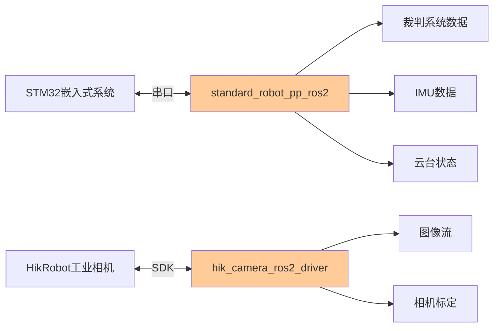
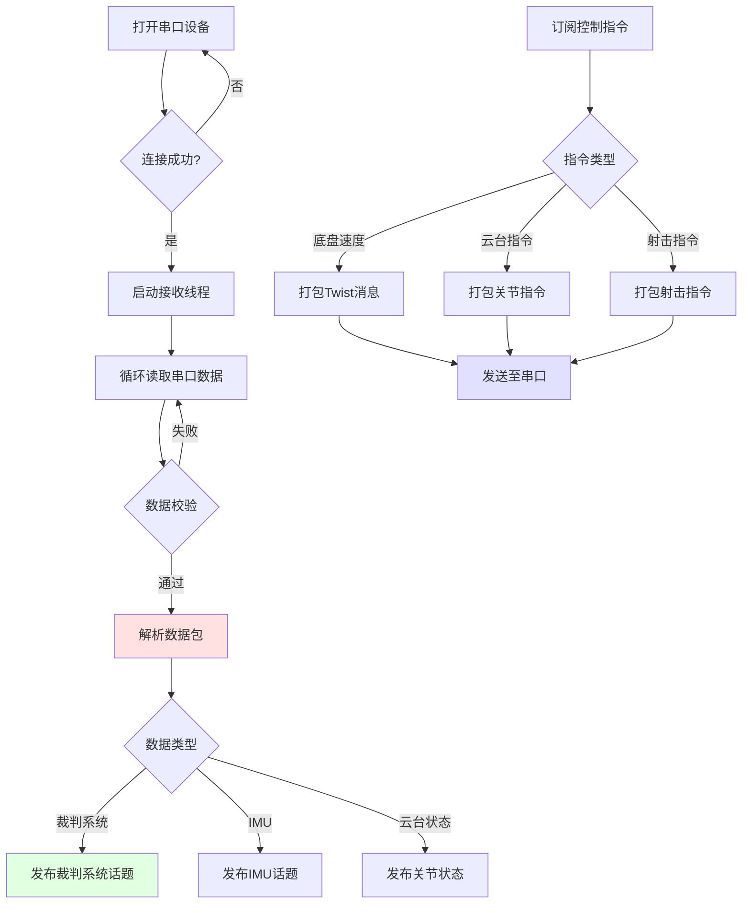
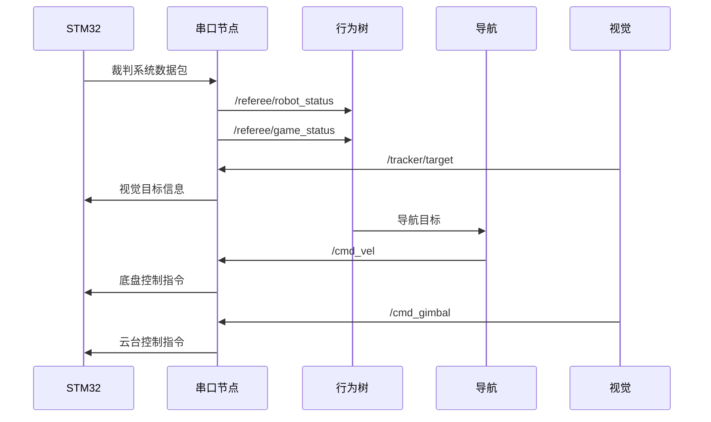
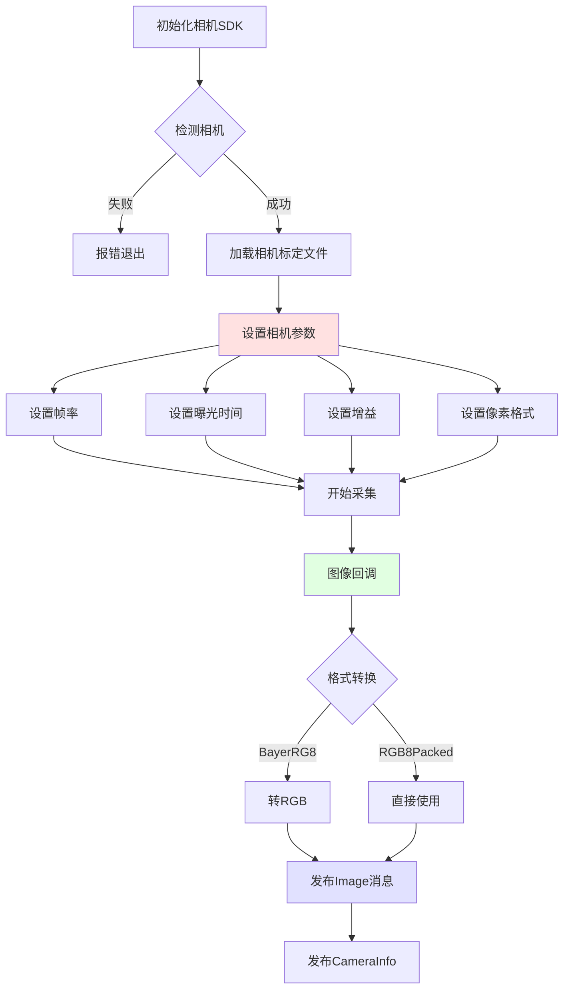
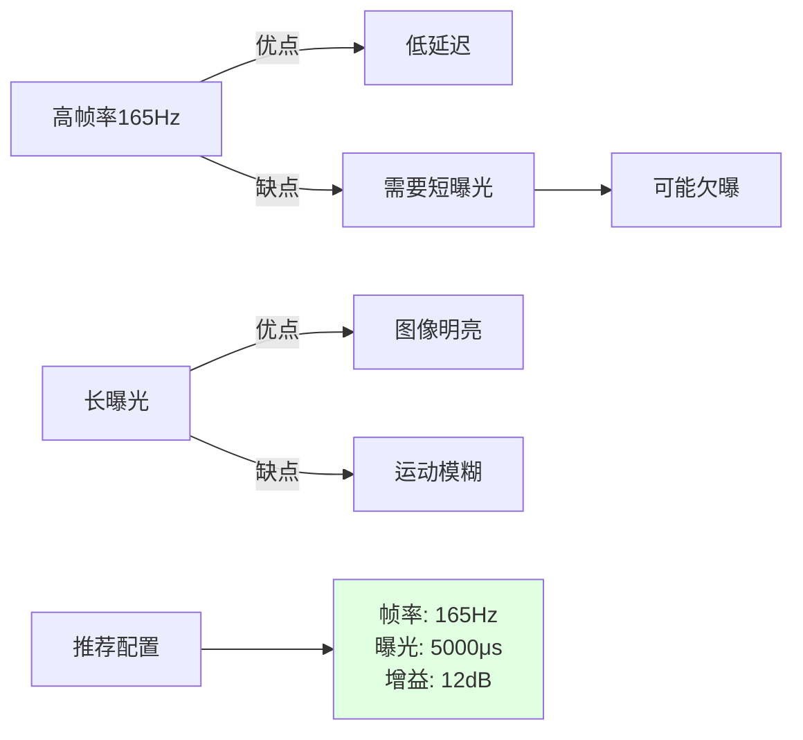
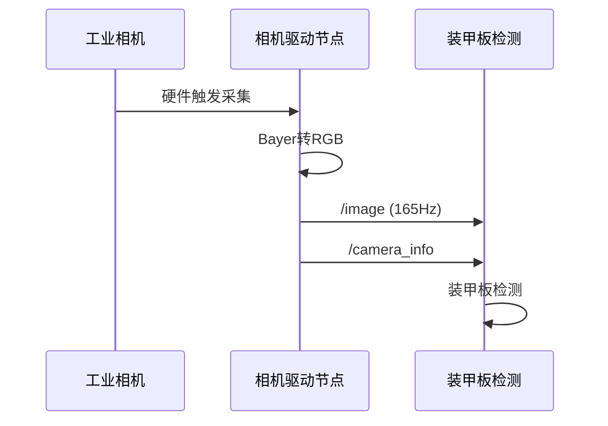

# 02. 硬件接口层

[← 上一章：系统架构](./01_系统架构.md) | [返回主页](../README_DEV.md) | [下一章：感知层 →](./03_感知层.md)

---

## 目录
- [1. 层级概述](#1-层级概述)
- [2. 串口通信节点](#2-串口通信节点)
- [3. 工业相机驱动节点](#3-工业相机驱动节点)

---

## 1. 层级概述

硬件接口层负责与物理硬件通信，提供标准化的ROS2接口。包含两个核心节点：



---

## 2. 串口通信节点

### 2.1 节点信息

**包名**: `standard_robot_pp_ros2`
**节点名**: `StandardRobotPpRos2Node`
**可执行文件**: `standard_robot_pp_ros2_node`

**功能**：与STM32嵌入式系统进行双向串口通信，处理裁判系统数据和机器人控制指令。

### 2.2 工作流程



### 2.3 发布的话题

| 话题名 | 消息类型 | 频率 | 说明 |
|--------|----------|------|------|
| `/serial/imu` | sensor_msgs/Imu | 200Hz | 嵌入式IMU数据 |
| `/serial/robot_state_info` | pb_rm_interfaces/RobotStateInfo | 10Hz | 机器人配置信息 |
| `/serial/gimbal_joint_state` | sensor_msgs/JointState | 100Hz | 云台关节位置（pitch, yaw） |
| `/serial/robot_motion` | geometry_msgs/Twist | 50Hz | 机器人运动状态 |
| `/referee/event_data` | pb_rm_interfaces/EventData | 10Hz | 场地事件数据 |
| `/referee/all_robot_hp` | pb_rm_interfaces/GameRobotHP | 1Hz | 所有机器人血量 |
| `/referee/game_status` | pb_rm_interfaces/GameStatus | 10Hz | 比赛状态（阶段、剩余时间） |
| `/referee/ground_robot_position` | pb_rm_interfaces/GroundRobotPosition | 10Hz | 地面机器人位置 |
| `/referee/rfid_status` | pb_rm_interfaces/RfidStatus | 10Hz | RFID卡检测状态 |
| `/referee/robot_status` | pb_rm_interfaces/RobotStatus | 10Hz | 机器人状态（HP、弹药、热量） |
| `/referee/buff` | pb_rm_interfaces/Buff | 10Hz | 机器人增益状态 |

### 2.4 订阅的话题

| 话题名 | 消息类型 | 说明 |
|--------|----------|------|
| `/cmd_vel` | geometry_msgs/Twist | 底盘速度指令（m/s, rad/s） |
| `/cmd_gimbal_joint` | sensor_msgs/JointState | 云台关节指令 |
| `/cmd_shoot` | example_interfaces/UInt8 | 射击指令 |
| `/tracker/target` | auto_aim_interfaces/Target | 视觉目标（用于自动颜色切换） |

### 2.5 关键参数

**文件位置**: `src/pb2025_sentry_bringup/params/node_params.yaml`

```yaml
standard_robot_pp_ros2:
  ros__parameters:
    # 串口配置
    device_name: /dev/ttyACM0        # 串口设备路径
    baud_rate: 115200                # 波特率
    flow_control: none               # 流控制
    parity: none                     # 校验位
    stop_bits: "1"                   # 停止位

    # 功能配置
    set_detector_color: true         # 是否发送检测颜色到嵌入式
    record_rosbag: true              # 是否启用rosbag自动录制
    debug: false                     # 调试模式
```

#### 参数说明

| 参数名 | 类型 | 默认值 | 说明 |
|--------|------|--------|------|
| `device_name` | string | "/dev/ttyACM0" | 串口设备路径，通常为 /dev/ttyUSB* 或 /dev/ttyACM* |
| `baud_rate` | int | 115200 | 波特率，需与嵌入式端一致 |
| `set_detector_color` | bool | true | 根据裁判系统自动设置装甲板检测颜色 |
| `record_rosbag` | bool | true | 在比赛倒计时时自动开始录制rosbag |
| `debug` | bool | false | 启用后输出详细调试信息 |

### 2.6 数据流示意



### 2.7 Rosbag自动录制机制

当 `record_rosbag: true` 时，节点会监听比赛状态：

1. **触发条件**: 比赛进入 5秒倒计时阶段 (`game_progress == COUNT_DOWN`)
2. **录制开始**: 自动启动 rosbag2_composable_recorder
3. **录制内容**:
   - `/serial/gimbal_joint_state`
   - `/front_industrial_camera/image`
   - `/front_industrial_camera/camera_info`
   - `/livox/imu`
   - `/livox/lidar`
4. **录制结束**: 比赛结束阶段 (`game_progress == GAME_OVER`)
5. **文件命名**: `rosbag_sentry_YYYYMMDD_HHMMSS`

### 2.8 故障排查

**常见问题**：

1. **串口打不开**
   ```bash
   # 检查设备是否存在
   ls -l /dev/ttyACM* /dev/ttyUSB*

   # 添加用户到dialout组
   sudo usermod -a -G dialout $USER
   # 注销后重新登录
   ```

2. **数据校验失败**
   - 检查波特率是否一致
   - 检查串口线缆连接质量
   - 查看 `debug: true` 输出的详细日志

3. **裁判系统数据不更新**
   - 确认裁判系统已连接
   - 使用 `ros2 topic hz /referee/game_status` 检查频率

---

## 3. 工业相机驱动节点

### 3.1 节点信息

**包名**: `hik_camera_ros2_driver`
**节点名**: `hik_camera_ros2_driver`
**可执行文件**: `hik_camera_ros2_driver_node`

**功能**：HikRobot 工业相机的ROS2驱动，提供高帧率图像采集。

### 3.2 工作流程



### 3.3 发布的话题

| 话题名 | 消息类型 | 频率 | 说明 |
|--------|----------|------|------|
| `/{camera_name}/image` | sensor_msgs/Image | 165Hz | 相机图像（默认BayerRG8或RGB8） |
| `/{camera_name}/camera_info` | sensor_msgs/CameraInfo | 165Hz | 相机标定信息（内参、畸变） |

默认 `camera_name` 为 `front_industrial_camera`。

### 3.4 关键参数

```yaml
hik_camera_ros2_driver:
  ros__parameters:
    # 相机标识
    camera_name: "front_industrial_camera"

    # 标定文件
    camera_info_url: "package://pb2025_sentry_bringup/params/camera_info.yaml"

    # 图像格式
    pixel_format: "BayerRG8"        # 推荐: RGB8Packed, BayerRG8
    adc_bit_depth: "Bits_8"         # BayerRG8必须用Bits_8

    # QoS设置
    use_sensor_data_qos: true       # 使用传感器数据QoS（best effort）

    # 相机参数
    acquisition_frame_rate: 165.0   # 帧率 (Hz)
    exposure_time: 5000             # 曝光时间 (微秒)
    gain: 12.0                      # 增益 (0.0~16.9 dB)
```

#### 参数详解

| 参数名 | 类型 | 默认值 | 说明 |
|--------|------|--------|------|
| `camera_name` | string | "front_industrial_camera" | 相机标识符，影响话题名称 |
| `camera_info_url` | string | - | 相机标定文件路径（YAML格式） |
| `pixel_format` | string | "BayerRG8" | 像素格式：<br>- `RGB8Packed`: 直接RGB输出<br>- `BayerRG8`: Bayer格式（需去马赛克） |
| `adc_bit_depth` | string | "Bits_8" | ADC位深度，BayerRG8必须用Bits_8 |
| `acquisition_frame_rate` | double | 165.0 | 帧率（Hz），过高可能导致丢帧 |
| `exposure_time` | double | 5000 | 曝光时间（μs），影响图像亮度和运动模糊 |
| `gain` | double | 12.0 | 相机增益（dB），提高亮度但增加噪声 |
| `use_sensor_data_qos` | bool | true | 使用传感器QoS（允许丢帧，降低延迟） |

### 3.5 相机标定

相机标定文件示例（`camera_info.yaml`）：

```yaml
image_width: 1280
image_height: 1024
camera_name: front_industrial_camera
camera_matrix:
  rows: 3
  cols: 3
  data: [1234.5, 0.0, 640.0,
         0.0, 1234.5, 512.0,
         0.0, 0.0, 1.0]
distortion_model: plumb_bob
distortion_coefficients:
  rows: 1
  cols: 5
  data: [-0.1, 0.05, 0.0, 0.0, 0.0]
```

**标定工具**：使用 ROS2 `camera_calibration` 包进行标定

```bash
ros2 run camera_calibration cameracalibrator \
  --size 8x6 --square 0.03 \
  image:=/front_industrial_camera/image \
  camera:=/front_industrial_camera
```

### 3.6 性能调优

#### 3.6.1 帧率与曝光平衡



#### 3.6.2 调试建议

1. **图像过暗**：增加 `exposure_time` 或 `gain`
2. **图像过亮**：减少 `exposure_time` 或 `gain`
3. **运动模糊**：减少 `exposure_time`
4. **丢帧严重**：降低 `acquisition_frame_rate`

### 3.7 数据流示意



### 3.8 故障排查

**常见问题**：

1. **相机检测失败**
   ```bash
   # 检查USB连接
   lsusb | grep HIK

   # 检查相机SDK安装
   ls /opt/MVS
   ```

2. **图像帧率低**
   - 检查USB3.0连接（不要用USB2.0）
   - 降低分辨率或帧率
   - 检查CPU负载

3. **图像质量差**
   - 重新标定相机
   - 调整曝光和增益
   - 检查镜头焦距

4. **QoS不匹配**
   ```bash
   # 如果检测节点收不到图像，检查QoS设置
   ros2 topic info /front_industrial_camera/image -v
   ```

---

## 下一步

- 📖 [感知层详解](./03_感知层.md) - 了解装甲板检测与追踪
- 📖 [ROS话题详解](./06_ROS话题详解.md) - 了解消息类型定义
- 📖 [参数配置指南](./07_参数配置.md) - 深入了解参数调优

---

[← 上一章：系统架构](./01_系统架构.md) | [返回主页](../README_DEV.md) | [下一章：感知层 →](./03_感知层.md)
