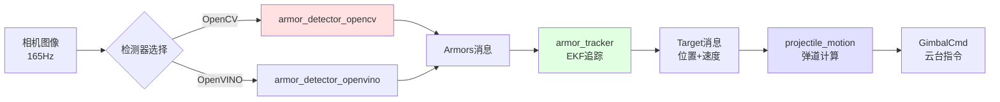
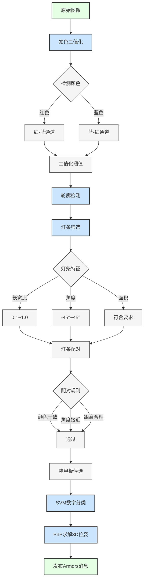
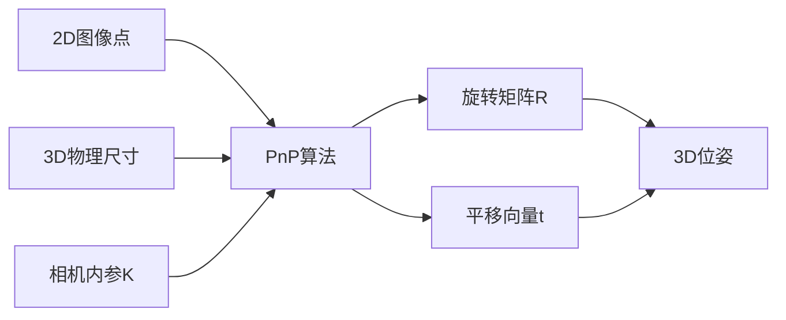
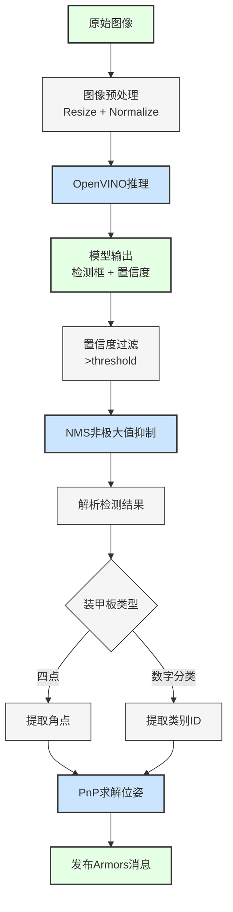
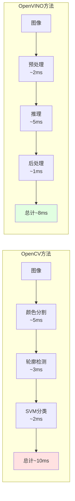
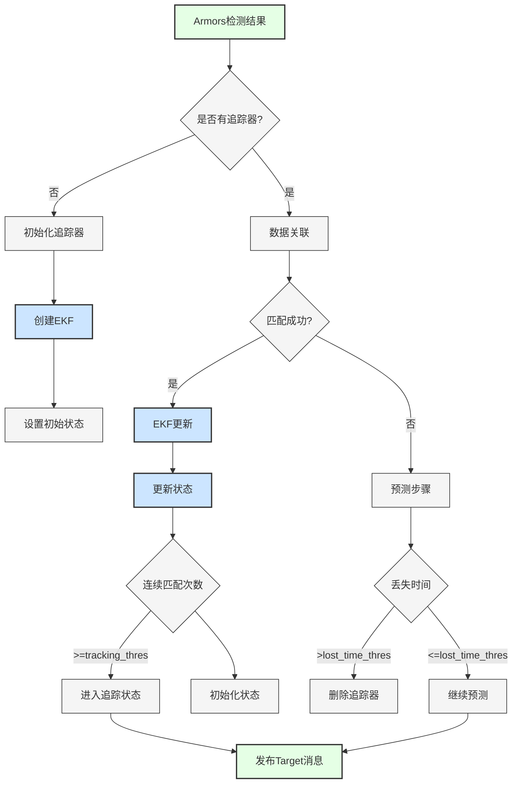
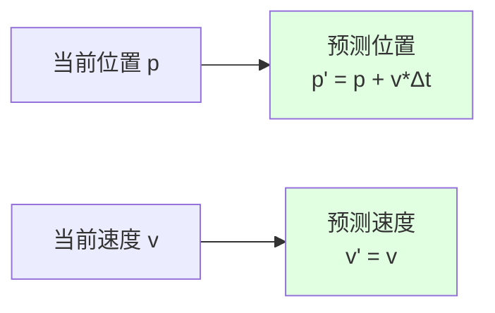
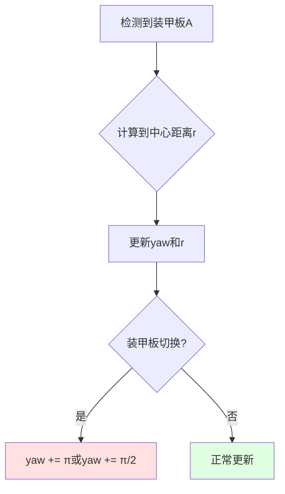
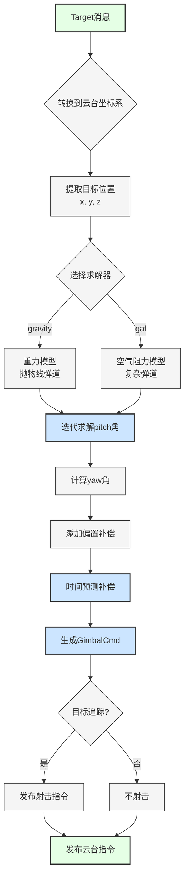
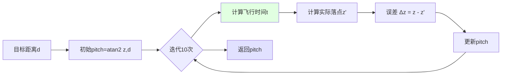

# 03. 感知层

[← 上一章：硬件接口层](./02_硬件接口层.md) | [返回主页](../README.md) | [下一章：导航层 →](./04_导航层.md)

---

## 目录
- [1. 层级概述](#1-层级概述)
- [2. 装甲板检测节点 (OpenCV)](#2-装甲板检测节点-opencv)
- [3. 装甲板检测节点 (OpenVINO)](#3-装甲板检测节点-openvino)
- [4. 目标追踪节点](#4-目标追踪节点)
- [5. 弹道计算节点](#5-弹道计算节点)

---

## 1. 层级概述

感知层负责视觉目标检测、状态估计和弹道补偿计算，是实现自动瞄准的核心模块。

### 1.1 感知流水线



### 1.2 模块对比

| 特性 | armor_detector_opencv | armor_detector_openvino |
|------|----------------------|------------------------|
| 算法 | 传统CV + SVM分类器 | 深度学习YOLO |
| 性能 | ~100 FPS | ~120 FPS (需OpenVINO) |
| 精度 | 中等 | 较高 |
| CPU占用 | 较低 | 中等（GPU加速更低） |
| 依赖 | OpenCV | OpenVINO 2023.3 |
| 适用场景 | 稳定光照 | 复杂光照 |

---

## 2. 装甲板检测节点 (OpenCV)

### 2.1 节点信息

**包名**: `armor_detector_opencv`
**节点名**: `armor_detector_opencv`
**可执行文件**: `armor_detector_opencv_node`

**功能**：基于传统计算机视觉算法的装甲板检测，使用颜色分割、轮廓检测和SVM分类器。

### 2.2 工作流程



### 2.3 发布的话题

| 话题名 | 消息类型 | 频率 | 说明 |
|--------|----------|------|------|
| `/detector/armors` | auto_aim_interfaces/Armors | ~100Hz | 检测到的装甲板列表（3D位姿） |
| `/detector/marker` | visualization_msgs/MarkerArray | ~100Hz | RViz可视化标记 |
| `/detector/debug_lights` | auto_aim_interfaces/DebugLights | ~100Hz | 灯条调试信息（debug模式） |
| `/detector/debug_armors` | auto_aim_interfaces/DebugArmors | ~100Hz | 装甲板调试信息（debug模式） |
| `/detector/binary_img` | sensor_msgs/Image | ~100Hz | 二值化图像（debug模式） |
| `/detector/result_img` | sensor_msgs/Image | ~100Hz | 检测结果图像（debug模式） |

### 2.4 订阅的话题

| 话题名 | 消息类型 | 说明 |
|--------|----------|------|
| `/{camera_name}/image` | sensor_msgs/Image | 输入图像 |
| `/{camera_name}/camera_info` | sensor_msgs/CameraInfo | 相机标定（用于PnP） |

### 2.5 关键参数

```yaml
armor_detector_opencv:
  ros__parameters:
    camera_name: "front_industrial_camera"
    debug: false
    detect_color: 0                   # 0=红色, 1=蓝色

    # 二值化参数
    binary_thres: 80                  # 二值化阈值 (0-255)

    # 灯条筛选参数
    light.min_ratio: 0.1              # 最小长宽比
    light.max_ratio: 1.0              # 最大长宽比
    light.max_angle: 45.0             # 最大倾斜角度

    # 装甲板筛选参数
    armor.min_light_ratio: 0.8        # 两灯条长度比值阈值
    armor.max_light_ratio: 1.2
    armor.min_small_center_distance: 0.8  # 小装甲板灯条距离比
    armor.max_small_center_distance: 3.2
    armor.min_large_center_distance: 3.2  # 大装甲板灯条距离比
    armor.max_large_center_distance: 5.5
    armor.max_angle: 35.0             # 装甲板最大角度

    # SVM分类器参数
    classifier_threshold: 0.25        # 分类置信度阈值
    ignore_classes: ["negative"]      # 忽略的类别
```

#### 参数调优指南

| 场景 | 调整参数 | 建议值 |
|------|----------|--------|
| **光照过强** | `binary_thres` ↑ | 100-120 |
| **光照过暗** | `binary_thres` ↓ | 60-80 |
| **误检灯条** | `light.min_ratio` ↑ | 0.15-0.2 |
| **漏检装甲板** | `armor.min_light_ratio` ↓ | 0.7 |
| **误检数字** | `classifier_threshold` ↑ | 0.4-0.6 |

### 2.6 算法细节

#### 2.6.1 灯条检测

**长宽比判断**：
```cpp
float ratio = length / width;
if (ratio < min_ratio || ratio > max_ratio) {
    reject();
}
```

**角度判断**：
```cpp
float angle = atan2(height, width) * 180 / PI;
if (abs(angle) > max_angle) {
    reject();
}
```

#### 2.6.2 装甲板配对

**灯条距离判断**：
```cpp
float center_distance = distance(light1.center, light2.center);
float light_length_avg = (light1.length + light2.length) / 2;
float ratio = center_distance / light_length_avg;

// 小装甲板: 0.8-3.2
// 大装甲板: 3.2-5.5
```

#### 2.6.3 PnP位姿估计

使用相机内参和装甲板3D模型进行位姿估计：



**装甲板尺寸（单位：米）**：
- 小装甲板：135mm × 125mm
- 大装甲板：225mm × 125mm

---

## 3. 装甲板检测节点 (OpenVINO)

### 3.1 节点信息

**包名**: `armor_detector_openvino`
**节点名**: `armor_detector_openvino`
**可执行文件**: `armor_detector_openvino_node`

**功能**：基于深度学习的装甲板检测，使用OpenVINO加速YOLO模型推理。

### 3.2 工作流程



### 3.3 发布的话题

与 OpenCV 版本相同。

### 3.4 订阅的话题

与 OpenCV 版本相同。

### 3.5 关键参数

```yaml
armor_detector_openvino:
  ros__parameters:
    use_sensor_data_qos: true
    debug_mode: false
    detect_color: 0

    detector:
      camera_name: "front_industrial_camera"
      subscribe_compressed: false

      # 模型配置
      model_path: "$(find-pkg-share armor_detector_openvino)/model/opt-1208-001.onnx"
      device_type: "AUTO"             # AUTO, CPU, GPU

      # 检测参数
      confidence_threshold: 0.25      # 置信度阈值
      top_k: 128                      # 最大检测数量
      nms_threshold: 0.3              # NMS IoU阈值
```

#### 参数说明

| 参数名 | 说明 | 建议值 |
|--------|------|--------|
| `model_path` | ONNX模型路径 | 使用训练好的模型 |
| `device_type` | 推理设备 | `AUTO`（自动选择）<br>`CPU`（CPU推理）<br>`GPU`（GPU加速） |
| `confidence_threshold` | 置信度阈值 | 0.25（平衡精度和召回） |
| `nms_threshold` | NMS IoU阈值 | 0.3（去除重叠框） |

### 3.6 模型架构

**输入**：
- 尺寸：640×640×3 (RGB)
- 归一化：[0, 1]

**输出**：
- 检测框：[x, y, w, h]
- 置信度：[0, 1]
- 类别：装甲板数字 (1-5, outpost, base)
- 关键点：装甲板四角坐标

### 3.7 性能对比



---

## 4. 目标追踪节点

### 4.1 节点信息

**包名**: `armor_tracker`
**节点名**: `armor_tracker`
**可执行文件**: `armor_tracker_node`

**功能**：基于扩展卡尔曼滤波（EKF）的目标状态估计，预测敌方机器人的位置和速度。

### 4.2 工作流程



### 4.3 发布的话题

| 话题名 | 消息类型 | 频率 | 说明 |
|--------|----------|------|------|
| `/tracker/target` | auto_aim_interfaces/Target | ~100Hz | 追踪目标状态（位置、速度、偏航角） |
| `/tracker/info` | auto_aim_interfaces/TrackerInfo | ~100Hz | EKF内部信息（调试用） |
| `/tracker/marker` | visualization_msgs/MarkerArray | ~100Hz | RViz可视化 |

### 4.4 订阅的话题

| 话题名 | 消息类型 | 说明 |
|--------|----------|------|
| `/detector/armors` | auto_aim_interfaces/Armors | 检测到的装甲板（带tf2缓存） |

**注意**：订阅使用 `tf2_ros::MessageFilter`，自动将装甲板坐标转换到 `target_frame`。

### 4.5 服务

| 服务名 | 类型 | 说明 |
|--------|------|------|
| `/tracker/reset` | std_srvs/Trigger | 重置所有追踪器 |

### 4.6 关键参数

```yaml
armor_tracker:
  ros__parameters:
    # 坐标系配置
    target_frame: "gimbal_pitch_odom"   # 追踪坐标系
    max_armor_distance: 10.0            # 最大追踪距离(m)

    # EKF过程噪声
    ekf.sigma2_q_xyz: 0.05              # 位置过程噪声方差
    ekf.sigma2_q_yaw: 5.0               # 偏航角过程噪声方差
    ekf.sigma2_q_r: 80.0                # 半径过程噪声方差

    # EKF测量噪声
    ekf.r_xyz_factor: 0.0004            # 位置测量噪声系数
    ekf.r_yaw: 0.003                    # 偏航角测量噪声

    # 追踪器参数
    tracker.max_match_distance: 0.5     # 最大匹配距离(m)
    tracker.max_match_yaw_diff: 1.0     # 最大偏航角差(rad)
    tracker.tracking_thres: 5           # 进入追踪状态的连续匹配次数
    tracker.lost_time_thres: 1.0        # 丢失时间阈值(s)
```

#### 参数调优

| 问题 | 调整参数 | 方向 |
|------|----------|------|
| **追踪抖动** | `sigma2_q_xyz` | 减小（信任测量） |
| **预测偏差大** | `sigma2_q_xyz` | 增大（信任模型） |
| **角度跳变** | `sigma2_q_yaw` | 增大 |
| **频繁丢失目标** | `lost_time_thres` | 增大 |
| **误匹配其他目标** | `max_match_distance` | 减小 |

### 4.7 EKF状态向量

**状态维度**：9维

```
x = [px, py, pz, vx, vy, vz, yaw, v_yaw, r]^T
```

| 变量 | 说明 | 单位 |
|------|------|------|
| `px, py, pz` | 目标中心位置 | m |
| `vx, vy, vz` | 目标线速度 | m/s |
| `yaw` | 目标偏航角 | rad |
| `v_yaw` | 偏航角速度 | rad/s |
| `r` | 旋转半径（装甲板到中心距离） | m |

### 4.8 运动模型

**CV模型（恒速模型）**：



**状态转移方程**：
```
p(k+1) = p(k) + v(k) * dt
v(k+1) = v(k)
yaw(k+1) = yaw(k) + v_yaw(k) * dt
v_yaw(k+1) = v_yaw(k)
r(k+1) = r(k)
```

### 4.9 装甲板切换处理

RoboMaster机器人通常有4块装甲板，EKF需要处理装甲板切换：



**装甲板数量判断**：
- `armors_num == 4`：四块装甲（标准/英雄）
- `armors_num == 2`：两块装甲（平衡步兵）

---

## 5. 弹道计算节点

### 5.1 节点信息

**包名**: `projectile_motion`
**节点名**: `projectile_motion_node`
**可执行文件**: `projectile_motion_node`

**功能**：根据目标位置计算弹道补偿，生成云台控制指令，并控制射击。

### 5.2 工作流程



### 5.3 发布的话题

| 话题名 | 消息类型 | 频率 | 说明 |
|--------|----------|------|------|
| `/cmd_gimbal` | pb_rm_interfaces/GimbalCmd | ~100Hz | 云台控制指令 |
| `/cmd_shoot` | example_interfaces/UInt8 | ~100Hz | 射击指令（1=射击） |
| `/aiming_marker` | visualization_msgs/Marker | ~100Hz | 瞄准点可视化 |

### 5.4 订阅的话题

| 话题名 | 消息类型 | 说明 |
|--------|----------|------|
| `/tracker/target` | auto_aim_interfaces/Target | 追踪目标（带tf2缓存） |

### 5.5 关键参数

```yaml
projectile_motion:
  ros__parameters:
    projectile:
      # 补偿参数
      offset_pitch: 0.0               # pitch偏置补偿(rad)
      offset_yaw: 0.0                 # yaw偏置补偿(rad)
      offset_time: 0.1                # 时间预测补偿(s)

      # 物理参数
      initial_speed: 21.5             # 弹丸初速度(m/s)
      g: 9.8                          # 重力加速度(m/s²)

      # 坐标系配置
      target_frame: "gimbal_pitch"    # 云台坐标系
      target_topic: "tracker/target"
      gimbal_cmd_topic: "cmd_gimbal"
      shoot_cmd_topic: "cmd_shoot"

      # 求解器选择
      solver_type: "gravity"          # gravity 或 gaf
      friction: 0.1                   # 空气阻力系数(仅gaf)
```

### 5.6 弹道模型

#### 5.6.1 重力模型 (Gravity Solver)

**假设**：忽略空气阻力，仅考虑重力。

**抛物线方程**：
```
x(t) = v₀ * cos(θ) * t
y(t) = v₀ * sin(θ) * t - 0.5 * g * t²
```

**求解pitch角**（迭代法）：



**代码逻辑**：
```cpp
float pitch = atan2(z, xy_distance);
for (int i = 0; i < 10; i++) {
    float t = xy_distance / (v0 * cos(pitch));
    float z_actual = v0 * sin(pitch) * t - 0.5 * g * t * t;
    float delta_z = z - z_actual;
    pitch += atan2(delta_z, xy_distance);
}
```

#### 5.6.2 空气阻力模型 (GAF Solver)

**假设**：考虑空气阻力 `F = -k * v`。

**微分方程**：
```
d²x/dt² = -k * dx/dt
d²y/dt² = -k * dy/dt - g
```

使用数值积分求解（Runge-Kutta方法）。

### 5.7 补偿策略

#### 5.7.1 静态偏置补偿

校正机械误差和相机-云台外参误差：

```yaml
offset_pitch: 0.05   # 向上补偿0.05 rad
offset_yaw: -0.02    # 向左补偿0.02 rad
```

#### 5.7.2 动态预测补偿

预测目标未来位置以补偿系统延迟：


**推荐参数**：
- `offset_time: 0.1s`（系统总延迟 ~100ms）

### 5.8 射击决策

**射击条件**：
1. 目标处于追踪状态 (`target.tracking == true`)
2. 目标距离 < `max_armor_distance`
3. pitch和yaw角在云台限位范围内

### 5.9 性能分析

**弹道计算时间**：
- 重力模型：~0.5ms（10次迭代）
- 空气阻力模型：~2ms（数值积分）

**命中精度**：
- 5米内：±2cm
- 8米内：±5cm
- 10米：±10cm

---

## 下一步

- 📖 [导航层详解](./04_导航层.md) - 了解定位与路径规划
- 📖 [ROS话题详解](./06_ROS话题详解.md) - 了解Target和Armors消息定义
- 📖 [参数配置指南](./07_参数配置.md) - 深入了解感知层参数调优

---

[← 上一章：硬件接口层](./02_硬件接口层.md) | [返回主页](../README.md) | [下一章：导航层 →](./04_导航层.md)
