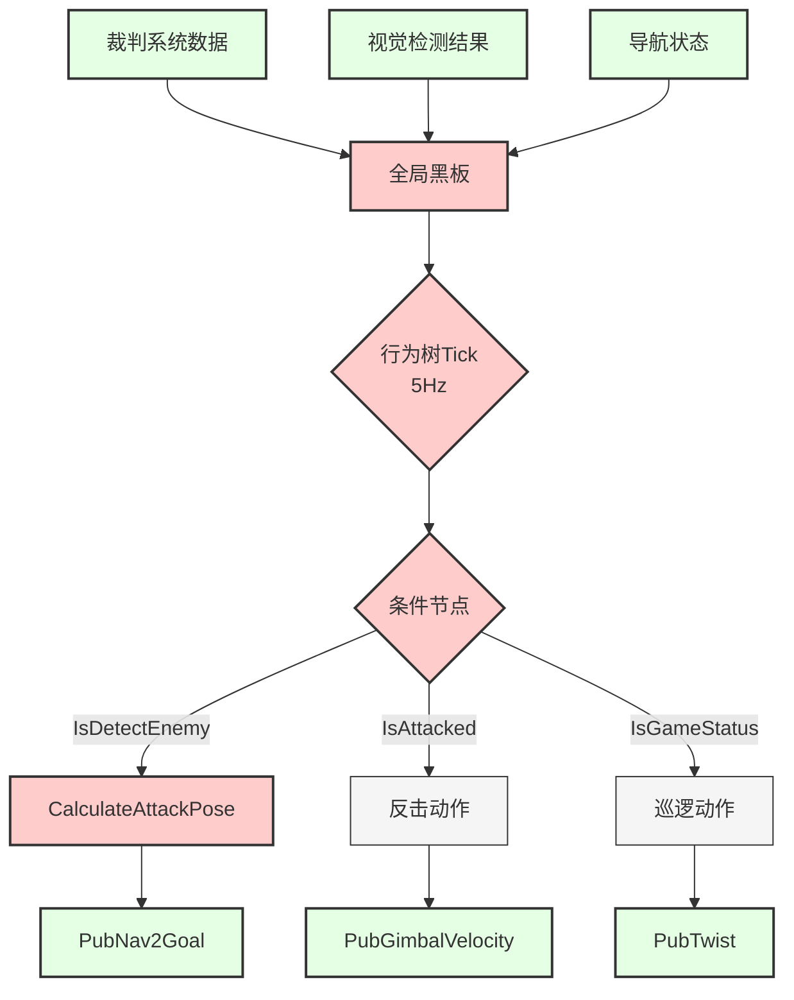
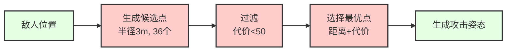

# 05. 决策层

[← 上一章：导航层](./04_导航层.md) | [返回主页](../README.md) | [下一章：ROS话题详解 →](./06_ROS话题详解.md)

---

## 目录
- [1. 层级概述](#1-层级概述)
- [2. 行为树服务器](#2-行为树服务器)
- [3. 条件节点](#3-条件节点)
- [4. 动作节点](#4-动作节点)

---

## 1. 层级概述

决策层基于BehaviorTree.CPP框架，实现高层任务规划和决策逻辑。

### 1.1 决策流程



---

## 2. 行为树服务器

### 2.1 节点信息

**包名**: `pb2025_sentry_behavior`
**节点名**: `pb2025_sentry_behavior_server`

### 2.2 全局黑板订阅

| 话题名 | 黑板Key | 说明 |
|--------|---------|------|
| `/referee/event_data` | `referee_eventData` | 场地事件 |
| `/referee/game_status` | `referee_gameStatus` | 比赛状态 |
| `/referee/robot_status` | `referee_robotStatus` | 机器人状态 |
| `/referee/rfid_status` | `referee_rfidStatus` | RFID状态 |
| `/tracker/target` | `tracker_target` | 视觉目标 |
| `/global_costmap/costmap` | `nav_globalCostmap` | 全局代价地图 |

### 2.3 关键参数

```yaml
pb2025_sentry_behavior_server:
  tick_frequency: 5                 # 行为树Tick频率(Hz)
  groot2_port: 1667                 # Groot2监控端口
  behavior_trees:
    - "/path/to/sentry_behavior.xml"
```

---

## 3. 条件节点

### 3.1 IsDetectEnemy

**功能**: 判断是否检测到敌人

**输入端口**:
- `armor_id`: 预期装甲板ID列表（如"1;3;5"表示1号、3号、5号）
- `max_distance`: 最大检测距离(m)

**黑板输入**:
- `detector_armors`: 检测到的装甲板

**返回**:
- SUCCESS: 检测到符合条件的敌人
- FAILURE: 未检测到

### 3.2 IsAttacked

**功能**: 判断机器人是否被攻击

**黑板输入**:
- `referee_robotStatus`: 机器人状态

**输出端口**:
- `gimbal_yaw`: 攻击来源方向

**返回**:
- SUCCESS: 检测到装甲板被击中
- FAILURE: 未被攻击

### 3.3 IsGameStatus

**功能**: 判断比赛状态

**输入端口**:
- `expected_game_progress`: 预期比赛阶段（0-5）
- `min_remain_time`: 最小剩余时间(s)
- `max_remain_time`: 最大剩余时间(s)

**比赛阶段**:
```
0: NOT_START       - 未开始
1: PREPARATION     - 准备阶段
2: SELF_CHECKING   - 自检阶段
3: COUNT_DOWN      - 5秒倒计时
4: RUNNING         - 比赛进行中
5: GAME_OVER       - 比赛结束
```

### 3.4 IsRfidDetected

**功能**: 判断RFID卡检测状态

**输入端口**:
- `friendly_fortress_gain_point`: 己方堡垒增益点
- `friendly_supply_zone`: 己方补给区
- `center_gain_point`: 中心增益点

### 3.5 IsStatusOK

**功能**: 判断机器人状态是否正常

**输入端口**:
- `hp_min`: 最低血量
- `heat_max`: 最大射击热量
- `ammo_min`: 最小弹药量

---

## 4. 动作节点

### 4.1 CalculateAttackPose

**功能**: 计算最佳进攻位置

**输入端口**:
- `tracker_port`: 视觉目标（Target）
- `costmap_port`: 全局代价地图

**输出端口**:
- `goal`: 进攻位姿（PoseStamped）

**参数**:
```yaml
CalculateAttackPose:
  attack_radius: 3.0                # 攻击半径(m)
  num_sectors: 36                   # 扇区数量
  cost_threshold: 50                # 代价阈值
  visualize: true                   # 可视化
```

**算法**:
1. 以敌人为中心生成圆形候选点
2. 过滤掉高代价区域
3. 选择最优攻击点



### 4.2 PubNav2Goal

**功能**: 发布导航目标（话题方式）

**输入端口**:
- `goal`: 目标位姿

**发布话题**:
- `/goal_pose`: geometry_msgs/PoseStamped

**注意**: 使用话题代替action，避免BehaviorTree.ROS2的halt bug

### 4.3 PubTwist

**功能**: 发布速度指令

**输入端口**:
- `linear_x`, `linear_y`, `linear_z`: 线速度(m/s)
- `angular_x`, `angular_y`, `angular_z`: 角速度(rad/s)

**发布话题**:
- `/cmd_vel`: geometry_msgs/Twist

### 4.4 PubGimbalAbsolute

**功能**: 发布云台绝对位置指令

**输入端口**:
- `gimbal_pitch`: pitch角(rad)
- `gimbal_yaw`: yaw角(rad)

**发布话题**:
- `/cmd_gimbal_joint`: sensor_msgs/JointState

### 4.5 PubGimbalVelocity

**功能**: 发布云台速度指令

**输入端口**:
- `pitch_velocity`: pitch角速度(rad/s)
- `yaw_velocity`: yaw角速度(rad/s)

---

## 5. 行为树示例

### 5.1 基础巡逻行为树

```xml
<root BTCPP_format="4">
  <BehaviorTree ID="SentryBehavior">
    <ReactiveSequence>
      <!-- 游戏进行中 -->
      <IsGameStatus expected_game_progress="4"/>

      <ReactiveFallback>
        <!-- 检测到敌人 -->
        <ReactiveSequence>
          <IsDetectEnemy armor_id="1;3;5" max_distance="8.0"/>
          <CalculateAttackPose attack_radius="3.0" 
                               goal="{attack_goal}"/>
          <PubNav2Goal goal="{attack_goal}"/>
        </ReactiveSequence>

        <!-- 被攻击反击 -->
        <ReactiveSequence>
          <IsAttacked gimbal_yaw="{反击yaw}"/>
          <PubGimbalAbsolute gimbal_yaw="{反击yaw}" 
                             gimbal_pitch="0.0"/>
        </ReactiveSequence>

        <!-- 默认巡逻 -->
        <PubTwist linear_x="0.5" angular_z="0.3"/>
      </ReactiveFallback>
    </ReactiveSequence>
  </BehaviorTree>
</root>
```

### 5.2 Groot2可视化

使用Groot2监控行为树执行：

1. 确保 `groot2_port: 1667` 已配置
2. 浏览器打开 `http://localhost:1667`
3. 实时查看节点状态（Success/Failure/Running）

---

## 下一步

- 📖 [ROS话题详解](./06_ROS话题详解.md) - 了解所有消息类型
- 📖 [参数配置指南](./07_参数配置.md) - 调优行为树参数
- 📖 [运行与调试](./08_运行与调试.md) - 调试行为树

---

[← 上一章：导航层](./04_导航层.md) | [返回主页](../README.md) | [下一章：ROS话题详解 →](./06_ROS话题详解.md)
