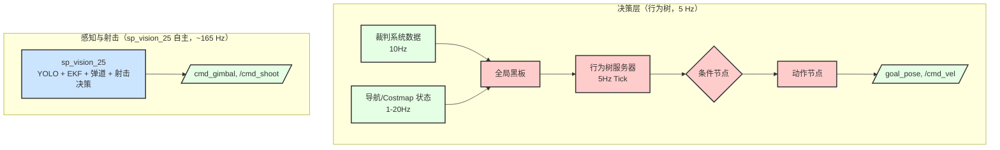
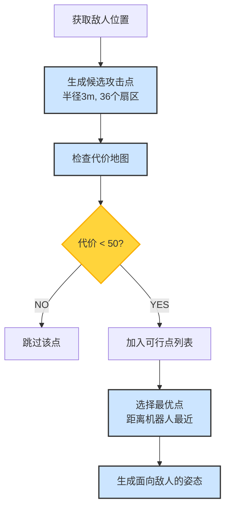
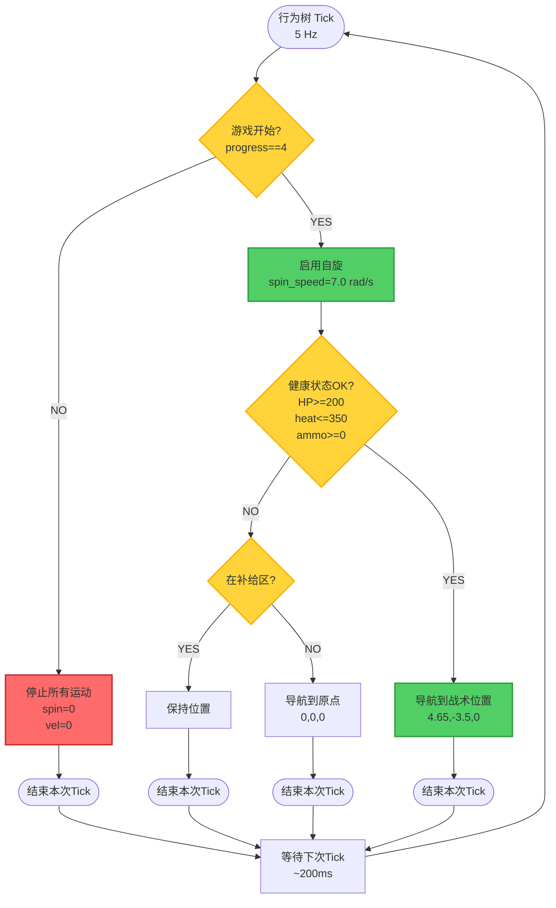
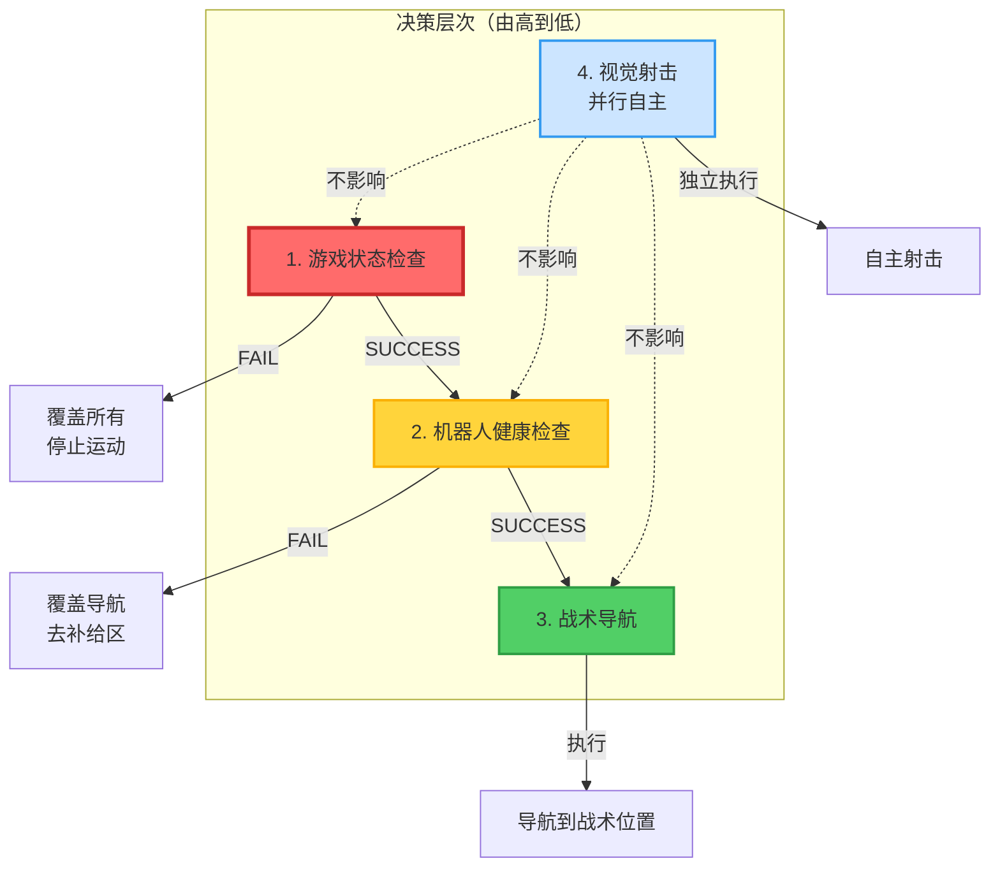

# 05. 决策层

[← 上一章：导航层](./04_导航层.md) | [返回主页](../README.md) | [下一章：ROS话题详解 →](./06_ROS话题详解.md)

---

## 目录
- [1. 层级概述](#1-层级概述)
- [2. 自主瞄准与射击（由 sp_vision_25 完成，行为树不参与）](#2-自主瞄准与射击由-sp_vision_25-完成行为树不参与)
- [4. 行为树服务器](#4-行为树服务器)
- [5. 条件节点](#5-条件节点)
- [6. 动作节点](#6-动作节点)
- [7. 当前比赛策略（rmul_2025）](#7-当前比赛策略rmul_2025)
- [8. 完整系统决策流程](#8-完整系统决策流程)
- [9. 优先级与决策层次](#9-优先级与决策层次)

---

## 1. 层级概述

决策层基于 BehaviorTree.CPP v4 框架，**仅负责导航与战术级决策**：发布导航目标 (`/goal_pose`) 与底盘速度 (`/cmd_vel`)。**瞄准与射击完全由 sp_vision_25 自主完成**，行为树不参与。

### 1.1 架构设计



### 1.2 关键特性

**分层自主架构**：
- **感知层 (sp_vision_25)**：自主完成检测、跟踪、弹道、瞄准与射击决策（~165 Hz）
- **行为树层**：战术级导航与任务规划（5 Hz）
- **导航层**：路径规划与运动控制（20 Hz）

**重要**：射击与云台**不受行为树控制**。行为树仅通过移动机器人位置间接影响视野。

> ⚠️ 旧 `pb2025_rm_vision` 模式（`use_sp_vision:=False`）下 `projectile_motion_node` 同样直接发 `/cmd_shoot`、`/cmd_gimbal`，行为树仍不参与射击。本节"自主射击"特性在两种模式下都成立。

---

## 2. 自主瞄准与射击（由 sp_vision_25 完成，行为树不参与）

`sp_vision_25` 在单一进程内集成了 YOLO 检测、EKF 跟踪、弹道补偿与射击决策，自行发布：

- `/cmd_gimbal` (`pb_rm_interfaces/GimbalCmd`) — 云台目标角度
- `/cmd_shoot` (`example_interfaces/UInt8`) — 0=不射击 / 1=射击

行为树**不订阅**目标话题，也**不发布**这两个话题。详细算法、跟踪状态机、对准容差与参数请参阅：

- [`docs/03_感知层.md`](./03_感知层.md) — 节点结构与启动
- [`docs/09_sp_vision_25分析.md`](./09_sp_vision_25分析.md) — YOLO/EKF/MPC 算法、跟踪状态机、自动开火逻辑
- [`docs/07_参数配置.md`](./07_参数配置.md#3-感知层参数sp_vision_25-主) — `min_detect_count`、`max_temp_lost_count`、`first_tolerance`、`second_tolerance`、`auto_fire`、`yaw_offset`、`pitch_offset` 等
- [`docs/13_四元数转换与参数调优.md`](./13_四元数转换与参数调优.md) — 手眼标定与角度补偿

> 旧 `projectile_motion_node` 的 0.1 rad 对准阈值、`tracking_thres=5` 等细节归档于 [docs/03 附录 A](./03_感知层.md#附录-a-旧-pb2025_rm_vision已废弃)。

---

## 4. 行为树服务器

### 4.1 节点信息

**包名**: `pb2025_sentry_behavior`
**节点名**: `pb2025_sentry_behavior_server`
**Tick频率**: 5 Hz (可配置)

### 4.2 全局黑板订阅

全局黑板是所有行为树节点共享的数据存储：

| 话题名 | 消息类型 | 黑板Key | 频率 | 说明 |
|--------|----------|---------|------|------|
| `/referee/game_status` | GameStatus | `referee_gameStatus` | 10 Hz | 比赛状态和时间 |
| `/referee/robot_status` | RobotStatus | `referee_robotStatus` | 10 Hz | 血量、热量、弹药 |
| `/referee/rfid_status` | RfidStatus | `referee_rfidStatus` | 10 Hz | 场地区域检测 |
| `/referee/event_data` | EventData | `referee_eventData` | 10 Hz | 场地事件 |
| `/referee/all_robot_hp` | GameRobotHP | `referee_allRobotHP` | 10 Hz | 所有机器人血量 |
| `/referee/ground_robot_position` | GroundRobotPosition | `referee_groundRobotPosition` | 10 Hz | 机器人位置 |
| `/referee/buff` | Buff | `referee_buff` | 10 Hz | 增益状态 |
| `/detector/armors` *(仅旧视觉模式)* | Armors | `detector_armors` | ~165 Hz | 检测到的装甲板 |
| `/tracker/target` *(仅旧视觉模式)* | Target | `tracker_target` | ~100 Hz | 跟踪目标状态 |
| `/global_costmap/costmap` | OccupancyGrid | `nav_globalCostmap` | 1 Hz | 全局代价地图 |

**黑板访问示例**：
```cpp
// 在条件节点中读取黑板数据
auto msg = getInput<GameStatus>("key_port");  // key_port = "{@referee_gameStatus}"
```

### 4.3 关键参数

```yaml
pb2025_sentry_behavior_server:
  tick_frequency: 5                 # 行为树Tick频率(Hz)
  groot2_port: 1667                 # Groot2监控端口
  behavior_trees:
    - "rmul_2025.xml"              # 当前使用的行为树
```

---

## 5. 条件节点

条件节点用于检查系统状态，返回 SUCCESS 或 FAILURE。

### 5.1 IsDetectEnemy *(仅旧视觉模式)*

> 该节点需订阅 `/detector/armors`。`use_sp_vision:=True` 时该话题不存在，节点始终返回 FAILURE；sp_vision 模式下本节点不应用于决策。

**文件**: `plugins/condition/is_detect_enemy.cpp`
**功能**: 判断是否检测到敌人装甲板

**输入端口**:
- `armor_id`: 预期装甲板ID列表（如`"1;3;5"`）
- `max_distance`: 最大检测距离 (m)，默认 8.0
- `key_port`: 黑板数据键，默认 `{@detector_armors}`

**判断逻辑**:
```cpp
for (const auto & armor : msg->armors) {
    int armor_id = std::stoi(armor.number);
    float distance = hypot(armor.pose.position.x,
                          armor.pose.position.y);

    bool is_id_match = (armor_id in expected_ids);
    bool is_within_range = (distance <= max_distance);

    if (is_id_match && is_within_range) {
        return SUCCESS;  // 检测到符合条件的敌人
    }
}
return FAILURE;
```

**使用场景**: 触发主动追击行为

### 5.2 IsAttacked

**文件**: `plugins/condition/is_attacked.cpp`
**功能**: 检测机器人是否被攻击，并返回攻击来源方向

**黑板输入**: `referee_robotStatus` (机器人状态)

**输出端口**:
- `gimbal_yaw`: 被击中装甲板的方向 (rad)
- `gimbal_pitch`: 默认 0.0

**判断逻辑**:
```cpp
bool is_attacked = msg->is_hp_deduced &&
                   msg->hp_deduction_reason == ARMOR_HIT;

if (is_attacked) {
    // 根据被击中的装甲板ID计算方向
    switch (msg->armor_id) {
        case 0: gimbal_yaw = 0.0;      // 前方
        case 1: gimbal_yaw = π/2;      // 左侧
        case 2: gimbal_yaw = π;        // 后方
        case 3: gimbal_yaw = -π/2;     // 右侧
    }
    setOutput("gimbal_yaw", gimbal_yaw);
    return SUCCESS;
}
return FAILURE;
```

**使用场景**: 触发反击行为，快速转向攻击来源

### 5.3 IsGameStatus

**文件**: `plugins/condition/is_game_status.cpp`
**功能**: 检查比赛状态和剩余时间

**输入端口**:
- `expected_game_progress`: 预期比赛阶段 (0-5)
- `min_remain_time`: 最小剩余时间 (秒)
- `max_remain_time`: 最大剩余时间 (秒)
- `key_port`: 黑板数据键 `{@referee_gameStatus}`

**比赛阶段枚举**:
```
0: NOT_START       - 未开始
1: PREPARATION     - 准备阶段 (15秒)
2: SELF_CHECKING   - 自检阶段 (15秒)
3: COUNT_DOWN      - 5秒倒计时
4: RUNNING         - 比赛进行中 (420秒 = 7分钟)
5: GAME_OVER       - 比赛结束
```

**判断逻辑**:
```cpp
bool is_progress_match = (msg->game_progress == expected_game_progress);
bool is_time_in_range = (msg->stage_remain_time >= min_remain_time) &&
                        (msg->stage_remain_time <= max_remain_time);
return (is_progress_match && is_time_in_range) ? SUCCESS : FAILURE;
```

**使用场景**: 控制比赛阶段相关行为（如仅在比赛进行时移动）

### 5.4 IsRfidDetected

**文件**: `plugins/condition/is_rfid_detected.cpp`
**功能**: 检测机器人是否在特定场地区域

**输入端口** (布尔值，至少一个为 true):
- `friendly_supply_zone_non_exchange`: 己方补给区 (RMUL)
- `friendly_supply_zone_exchange`: 己方补给兑换区 (RMUC)
- `center_gain_point`: 中心增益点 (RMUL)
- `friendly_fortress_gain_point`: 己方堡垒增益点

**RFID状态枚举**:
```
0: NOT_DETECTED    - 未检测到
1: DETECTING       - 检测中
2: DETECTED        - 已检测到
```

**使用场景**: 触发补给、增益获取行为

### 5.5 IsStatusOK

**文件**: `plugins/condition/is_status_ok.cpp`
**功能**: 检查机器人健康状态

**输入端口**:
- `hp_min`: 最低血量阈值，默认 200 (50% of 400)
- `heat_max`: 最大射击热量阈值，默认 350 (低于限制 400)
- `ammo_min`: 最小弹药量阈值，默认 0
- `key_port`: 黑板数据键 `{@referee_robotStatus}`

**判断逻辑**:
```cpp
bool is_hp_ok = (msg->current_hp >= hp_min);
bool is_heat_ok = (msg->shooter_17mm_1_barrel_heat <= heat_max);
bool is_ammo_ok = (msg->projectile_allowance_17mm >= ammo_min);
return (is_hp_ok && is_heat_ok && is_ammo_ok) ? SUCCESS : FAILURE;
```

**使用场景**: 触发补给行为或战术撤退

---

## 6. 动作节点

动作节点执行具体的机器人行为，可能返回 SUCCESS、FAILURE 或 RUNNING。

### 6.1 CalculateAttackPose *(仅旧视觉模式)*

> 该节点需订阅 `/tracker/target`。sp_vision_25 模式下不发布该话题，使用本节点的行为树需切换到 `use_sp_vision:=False`。

**文件**: `plugins/action/calculate_attack_pose.cpp`
**功能**: 计算围绕敌人的最佳攻击位置

**输入端口**:
- `tracker_port`: 敌人目标位置 `{@tracker_target}`
- `costmap_port`: 全局代价地图 `{@nav_globalCostmap}`

**输出端口**:
- `goal`: 计算出的攻击位姿 (geometry_msgs/PoseStamped)

**算法流程**:


**参数**:
```yaml
CalculateAttackPose:
  attack_radius: 3.0                # 攻击半径 (m)
  num_sectors: 36                   # 候选点数量 (每10°一个)
  cost_threshold: 50                # 代价阈值 (< 50 可通行)
```

**使用场景**: 动态追击敌人时计算最佳射击位置

### 6.2 PubNav2Goal

**文件**: `plugins/action/pub_nav2_goal.cpp`
**功能**: 发布导航目标到 Nav2

**为什么用话题不用 Action？**
- 绕过 BehaviorTree.ROS2 的 halt bug
- 无法获取实时反馈，但更稳定

**输入端口**:
- `goal`: 目标位姿，格式 `"x;y;yaw"` 或 PoseStamped

**发布话题**:
- `/goal_pose`: geometry_msgs/PoseStamped (map 坐标系)

**XML 示例**:
```xml
<PubNav2Goal goal="4.65;-3.5;0" topic_name="goal_pose"/>
```

### 6.3 PublishTwist

**文件**: `plugins/action/pub_twist.cpp`
**功能**: 发布底盘速度指令

**输入端口**:
- `v_x`, `v_y`, `v_z`: 线速度 (m/s)
- `v_roll`, `v_pitch`, `v_yaw`: 角速度 (rad/s)
- `duration`: 持续时间 (ms)，默认 1000

**发布话题**:
- `/cmd_vel`: geometry_msgs/Twist

**XML 示例**:
```xml
<PublishTwist v_x="0.5" v_y="0.0" v_yaw="0.3" duration="2000"/>
```

**特性**: 节点被 halt 时自动发布零速度

### 6.4 PublishGimbalAbsolute

**文件**: `plugins/action/pub_gimbal_absolute.cpp`
**功能**: 发布云台绝对角度指令

**输入端口**:
- `gimbal_pitch`: 目标 Pitch 角 (rad)
- `gimbal_yaw`: 目标 Yaw 角 (rad)
- `duration`: 持续时间 (ms)

**发布话题**:
- `/cmd_gimbal_joint`: sensor_msgs/JointState

**消息类型**:
- `position = [pitch, yaw]`
- 坐标系：相对于云台 Yaw 关节

**使用场景**: 反击时快速转向攻击来源

### 6.5 PublishGimbalVelocity

**文件**: `plugins/action/pub_gimbal_velocity.cpp`
**功能**: 发布云台速度指令

**输入端口**:
- `pitch_velocity`: Pitch 角速度 (rad/s)
- `yaw_velocity`: Yaw 角速度 (rad/s)
- `duration`: 持续时间 (ms)

**使用场景**: 巡逻扫描、搜索目标

### 6.6 PublishSpinSpeed

**文件**: `plugins/action/pub_spin_speed.cpp`
**功能**: 发布底盘自旋速度

**输入端口**:
- `spin_speed`: 自旋角速度 (rad/s)

**发布话题**:
- `/cmd_spin`: std_msgs/Float64

**使用场景**: 保持底盘旋转以实现 360° 视野

---

## 7. 当前比赛策略（rmul_2025）

### 7.1 行为树结构

**文件**: `src/pb2025_sentry_behavior/behavior_trees/rmul_2025.xml`

```xml
<root BTCPP_format="4" main_tree_to_execute="rmul_2025">

  <!-- 主行为树 -->
  <BehaviorTree ID="rmul_2025">
    <KeepRunningUntilFailure>
      <ForceSuccess>
        <ReactiveSequence>
          <!-- 1. 检查游戏是否开始 -->
          <SubTree ID="check_game_start"/>

          <!-- 2. 启用底盘自旋 -->
          <PublishSpinSpeed spin_speed="7.0"/>

          <!-- 3. 检查机器人状态 -->
          <SubTree ID="check_robot_status"/>

          <!-- 4. 导航到战术位置 -->
          <PubNav2Goal goal="4.65;-3.5;0"/>
        </ReactiveSequence>
      </ForceSuccess>
    </KeepRunningUntilFailure>
  </BehaviorTree>

  <!-- 子树：检查游戏开始 -->
  <BehaviorTree ID="check_game_start">
    <Fallback>
      <!-- 检查比赛进行中 (stage 4, 0-420秒) -->
      <IsGameStatus expected_game_progress="4"
                    min_remain_time="0"
                    max_remain_time="420"/>

      <!-- 如果未开始，停止所有运动 -->
      <ForceFailure>
        <Sequence>
          <PublishSpinSpeed spin_speed="0.0"/>
          <PublishTwist v_x="0.0" v_y="0.0" v_yaw="0.0"/>
        </Sequence>
      </ForceFailure>
    </Fallback>
  </BehaviorTree>

  <!-- 子树：检查机器人状态 -->
  <BehaviorTree ID="check_robot_status">
    <Fallback>
      <!-- 检查健康状态 (HP>=200, 热量<=350) -->
      <IsStatusOK hp_min="200" heat_max="350" ammo_min="0"/>

      <!-- 如果不健康，去补给区或回家 -->
      <ForceFailure>
        <Fallback>
          <!-- 已在补给区？留在这里 -->
          <IsRfidDetected friendly_supply_zone_non_exchange="true"/>

          <!-- 不在补给区？导航回家 -->
          <PubNav2Goal goal="0;0;0"/>
        </Fallback>
      </ForceFailure>
    </Fallback>
  </BehaviorTree>

</root>
```

### 7.2 决策流程图



### 7.3 策略特点

**当前策略是简化的固定位置策略**：

✅ **包含的功能**：
- 比赛状态检测（仅在比赛进行时移动）
- 健康状态监控（低血量/高热量时回补给区）
- 固定战术位置（4.65m, -3.5m）
- 底盘自旋（7.0 rad/s，360°视野）

❌ **未包含的功能** (但代码已实现)：
- 敌人检测触发追击（`IsDetectEnemy`）
- 动态攻击位置计算（`CalculateAttackPose`）
- 被攻击时的反击（`IsAttacked`）
- 动态敌人追踪

**设计理念**：
- **简单可靠**：固定位置，降低故障风险
- **视觉自主射击**：依赖视觉系统自动射击
- **防御优先**：保持血量，避免高热量

---

## 8. 完整系统决策流程

### 8.1 多层决策架构

```mermaid
flowchart TB
    subgraph "裁判系统数据层"
        REF[裁判系统<br/>10 Hz]
        REF --> |比赛状态| GAME_DATA[game_progress<br/>stage_remain_time]
        REF --> |机器人状态| ROBOT_DATA[current_hp<br/>barrel_heat<br/>projectile_allowance]
        REF --> |场地检测| RFID_DATA[supply_zone<br/>gain_point]
    end

    subgraph "行为树决策层 (5 Hz)"
        BT[行为树服务器] --> |读取| BB[全局黑板]
        GAME_DATA --> BB
        ROBOT_DATA --> BB
        RFID_DATA --> BB

        BT --> COND[条件节点]
        COND --> |IsGameStatus| ACT1[导航动作]
        COND --> |IsStatusOK| ACT2[补给动作]
        COND --> |IsRfidDetected| ACT3[增益动作]

        ACT1 --> NAV_CMD[/goal_pose]
        ACT2 --> NAV_CMD
        ACT1 --> VEL_CMD[/cmd_vel]
        ACT1 --> SPIN_CMD[/cmd_spin]
    end

    subgraph "感知/射击决策层 (sp_vision_25, ~165 Hz)"
        CAM[HikRobot 相机<br/>SDK 直采] --> SPV[sp_vision_25<br/>YOLO + EKF + 弹道 + 自动开火]
        SPV --> GIM_CMD[/cmd_gimbal]
        SPV --> SHOOT_CMD[/cmd_shoot]
    end

    subgraph "导航决策层 (20 Hz)"
        NAV_CMD --> NAV2[Nav2 栈]
        NAV2 --> PLAN[路径规划<br/>Theta*]
        PLAN --> CTRL[运动控制<br/>Omni PID]
        CTRL --> CHASSIS_CMD[/cmd_vel]
    end

        SER → 串口 STM32
        SER --> |串口| STM32[STM32<br/>嵌入式控制器]
        GIM_CMD --> SER
        SHOOT_CMD --> SER
        CHASSIS_CMD --> SER
        VEL_CMD --> SER
        SPIN_CMD --> SER

        STM32 --> GIMBAL[云台电机]
        STM32 --> SHOOTER[发射机构]
        STM32 --> WHEELS[底盘轮组]
    end

    STM32 --> |反馈| SER
    SER --> |/serial/gimbal_joint_state| SPV
    SER --> |/referee/*| REF

    style SPV fill:#CCE5FF,stroke:#333,stroke-width:3px
    style BT fill:#FFCCCC,stroke:#333,stroke-width:2px
    style NAV2 fill:#E5CCFF,stroke:#333,stroke-width:2px
```

### 8.2 决策优先级

各层决策的优先级和响应时间：

| 优先级 | 决策层 | 频率 | 响应时间 | 控制范围 |
|--------|--------|------|----------|----------|
| **最高** | sp_vision_25 自主射击 | ~165 Hz | <10 ms | 云台、发射机构 |
| **高** | 行为树（游戏状态） | 5 Hz | ~200 ms | 全系统开关 |
| **中** | 行为树（健康状态） | 5 Hz | ~200 ms | 战术决策 |
| **低** | 行为树（导航） | 5 Hz | ~200 ms | 底盘运动 |
| **底层** | 导航路径规划 | 20 Hz | ~50 ms | 局部避障 |

### 8.3 并行自主系统

以下系统**不受行为树控制**，完全自主运行：

1. **感知/射击系统** (sp_vision_25, ~165 Hz)
   - YOLO 检测 + EKF 追踪
   - 弹道补偿 + 云台控制
   - 自动开火决策

2. **导航路径规划** (20 Hz)
   - 全局路径规划
   - 局部路径规划
   - 动态避障
   - 运动控制

3. **串口通信** (100 Hz)
   - 裁判系统数据接收
   - 云台/底盘命令转发
   - 状态反馈

4. **底盘自旋** (连续)
   - 由行为树设置速度
   - 底层PID控制器维持

---

## 9. 优先级与决策层次

### 9.1 决策覆盖关系



### 9.2 冲突解决规则

**规则1**: 游戏状态具有最高优先级
```
IF game_progress != 4:
    STOP all motion (navigation, spin, velocity)
    IGNORE all other behaviors
```

**规则2**: 健康状态覆盖战术行为
```
IF hp < 200 OR heat > 350:
    IF at_supply_zone:
        STAY (do nothing)
    ELSE:
        NAVIGATE to home (0, 0, 0)
    IGNORE tactical navigation
```

**规则3**: 视觉射击独立运行
```
ALWAYS:
    IF tracking == true AND gimbal_aligned:
        cmd_shoot = 1
    ELSE:
        cmd_shoot = 0
```

### 9.3 行为互斥性

**互斥行为**（同一时刻只能执行一个）：
- 战术导航 vs 回家导航 vs 去补给区
- 巡逻速度 vs 静止

**并行行为**（可同时执行）：
- 底盘自旋 + 导航移动
- 视觉射击 + 底盘运动
- 云台控制 + 底盘控制

### 9.4 故障安全机制

**失去裁判系统连接**：
- 行为树仍可运行（使用最后接收的数据）
- 游戏状态检查可能失败 → 停止运动（安全）

**失去视觉数据**：
- 跟踪器进入 LOST 状态
- 自动停止射击
- 行为树导航不受影响

**导航失败**：
- Nav2 超时或路径规划失败
- 行为树持续尝试（`KeepRunningUntilFailure`）
- 不影响视觉射击

---

## 10. 高级主题

### 10.1 自定义行为树开发

**步骤1**: 创建新的行为树 XML
```bash
cd src/pb2025_sentry_behavior/behavior_trees/
cp rmul_2025.xml my_custom_tree.xml
```

**步骤2**: 编辑行为逻辑
```xml
<BehaviorTree ID="my_custom_tree">
  <ReactiveSequence>
    <!-- 添加自定义逻辑 -->
    <IsDetectEnemy armor_id="1;3;5" max_distance="8.0"/>
    <CalculateAttackPose attack_radius="3.0" goal="{attack_goal}"/>
    <PubNav2Goal goal="{attack_goal}"/>
  </ReactiveSequence>
</BehaviorTree>
```

**步骤3**: 更新配置文件
```yaml
pb2025_sentry_behavior_server:
  behavior_trees:
    - "my_custom_tree.xml"  # 使用新树
```

### 10.2 添加自定义节点

**条件节点模板**:
```cpp
class MyCondition : public BT::SyncActionNode {
public:
  MyCondition(const std::string & name, const BT::NodeConfig & config)
  : SyncActionNode(name, config) {}

  BT::NodeStatus tick() override {
    // 读取黑板数据
    auto data = getInput<DataType>("key_port").value();

    // 条件判断
    if (my_condition_met(data)) {
      return BT::NodeStatus::SUCCESS;
    }
    return BT::NodeStatus::FAILURE;
  }

  static BT::PortsList providedPorts() {
    return {BT::InputPort<DataType>("key_port")};
  }
};
```

### 10.3 使用 Groot2 实时监控

**启动步骤**：
1. 确保 `groot2_port: 1667` 已配置
2. 启动行为树服务器
3. 浏览器访问 `http://www.groot2.app`
4. Connect to: `ws://localhost:1667`

**监控功能**：
- 🟢 绿色：SUCCESS
- 🔴 红色：FAILURE
- 🟡 黄色：RUNNING
- ⚪ 灰色：IDLE

### 10.4 调试技巧

**查看行为树日志**：
```bash
ros2 run pb2025_sentry_behavior pb2025_sentry_behavior_server --ros-args --log-level debug
```

**监控黑板数据**：
```bash
# 查看裁判系统数据
ros2 topic echo /referee/game_status
ros2 topic echo /referee/robot_status

# 查看视觉数据
ros2 topic echo /tracker/target

# 查看导航命令
ros2 topic echo /goal_pose
```

**检查条件节点返回值**：
在 XML 中添加日志：
```xml
<IsGameStatus expected_game_progress="4" _successMessage="Game started!" _failureMessage="Game not started"/>
```

---

## 11. 常见问题

**Q1: 为什么射击不受行为树控制？**

**A**: 设计决策。射击需要 100 Hz 的快速响应，行为树只有 5 Hz。将射击决策下放到视觉层可以：
- 降低延迟（10ms vs 200ms）
- 简化行为树逻辑
- 提高系统鲁棒性（视觉故障不影响导航）

---

**Q2: 如何实现动态追击敌人？**

**A**: 使用 `IsDetectEnemy` + `CalculateAttackPose`：

```xml
<ReactiveSequence>
  <IsDetectEnemy armor_id="1;3;5" max_distance="8.0"/>
  <CalculateAttackPose attack_radius="3.0" goal="{attack_goal}"/>
  <PubNav2Goal goal="{attack_goal}"/>
</ReactiveSequence>
```

这样机器人会：
1. 检测到敌人
2. 计算最佳攻击位置
3. 导航到该位置
4. 视觉系统自动射击

---

**Q3: 被攻击时如何反击？**

**A**: 添加 `IsAttacked` 条件：

```xml
<ReactiveFallback>
  <!-- 优先级1: 反击 -->
  <ReactiveSequence>
    <IsAttacked gimbal_yaw="{attack_yaw}"/>
    <PublishGimbalAbsolute gimbal_yaw="{attack_yaw}" gimbal_pitch="0.0"/>
  </ReactiveSequence>

  <!-- 优先级2: 其他行为 -->
  <OtherBehavior/>
</ReactiveFallback>
```

---

**Q4: 行为树 Tick 频率应该设置为多少？**

**A**:
- **默认 5 Hz** 适合大多数场景
- **更高（10 Hz）**：需要更快的战术响应
- **更低（2 Hz）**：简单巡逻，降低 CPU 负载

**不建议超过 10 Hz**，因为导航规划本身是 20 Hz。

---

**Q5: 如何调试行为树不执行？**

**A**: 检查清单：
1. ✅ 游戏状态是否为 4（比赛进行中）
2. ✅ 机器人健康状态是否OK（HP、热量、弹药）
3. ✅ 黑板数据是否正常接收（`ros2 topic hz /referee/*`）
4. ✅ 使用 Groot2 查看实时执行状态
5. ✅ 查看日志：`--ros-args --log-level debug`

---

## 下一步

- 📖 [ROS话题详解](./06_ROS话题详解.md) - 了解所有消息类型
- 📖 [参数配置指南](./07_参数配置.md) - 调优决策参数
- 📖 [运行与调试](./08_运行与调试.md) - 完整调试流程

---

[← 上一章：导航层](./04_导航层.md) | [返回主页](../README.md) | [下一章：ROS话题详解 →](./06_ROS话题详解.md)
