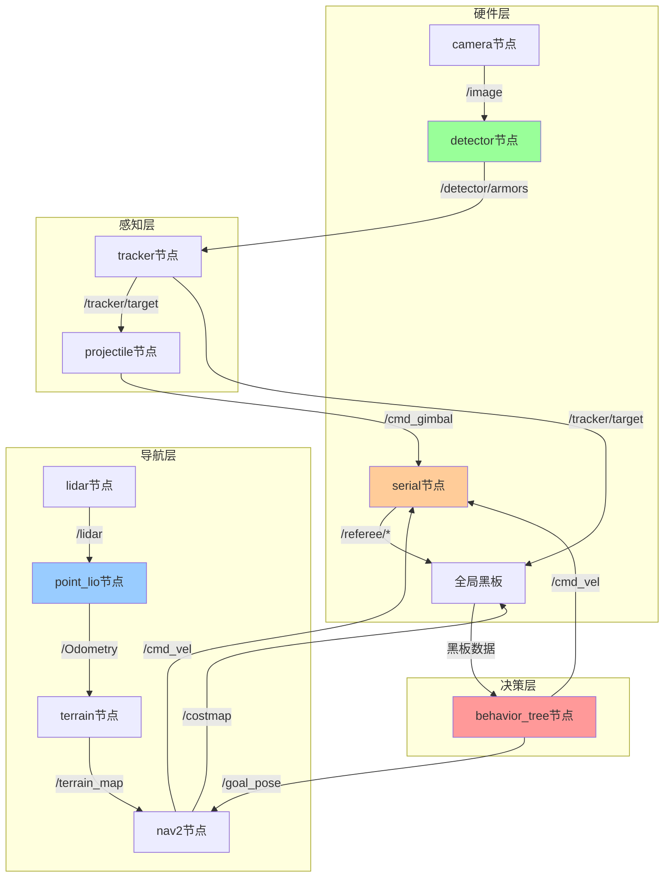

# 06. ROS话题详解

[← 上一章：决策层](./05_决策层.md) | [返回主页](../README.md) | [下一章：参数配置 →](./07_参数配置.md)

---

## 目录
- [1. 自定义消息接口](#1-自定义消息接口)
- [2. 裁判系统消息](#2-裁判系统消息)
- [3. 视觉消息](#3-视觉消息)
- [4. 控制消息](#4-控制消息)
- [5. 话题订阅发布关系](#5-话题订阅发布关系)

---

## 1. 自定义消息接口

### 1.1 pb_rm_interfaces包

**位置**: `src/interfaces/pb_rm_interfaces`

**消息列表**:
- `GameStatus.msg` - 比赛状态
- `RobotStatus.msg` - 机器人状态
- `RfidStatus.msg` - RFID卡状态
- `EventData.msg` - 场地事件
- `GameRobotHP.msg` - 所有机器人血量
- `GroundRobotPosition.msg` - 地面机器人位置
- `Buff.msg` - 机器人增益
- `GimbalCmd.msg` - 云台控制指令
- `Gimbal.msg` - 云台状态

### 1.2 auto_aim_interfaces包

**位置**: `src/interfaces/auto_aim_interfaces`

**消息列表**:
- `Armor.msg` - 单个装甲板
- `Armors.msg` - 装甲板数组
- `Target.msg` - 追踪目标
- `TrackerInfo.msg` - 追踪器调试信息
- `DebugArmor.msg` - 装甲板调试信息
- `DebugLight.msg` - 灯条调试信息

---

## 2. 裁判系统消息

### 2.1 GameStatus

**话题**: `/referee/game_status`
**频率**: 10Hz

```
uint8 game_progress              # 比赛阶段(0-5)
uint16 stage_remain_time         # 阶段剩余时间(秒)
```

**game_progress枚举**:
- 0: NOT_START - 未开始
- 1: PREPARATION - 准备阶段  
- 2: SELF_CHECKING - 自检阶段
- 3: COUNT_DOWN - 5秒倒计时
- 4: RUNNING - 比赛进行中
- 5: GAME_OVER - 比赛结束

### 2.2 RobotStatus

**话题**: `/referee/robot_status`
**频率**: 10Hz

```
uint8 robot_id                   # 机器人ID (1-10)
uint8 robot_level                # 机器人等级 (1-3)
uint16 current_hp                # 当前血量
uint16 maximum_hp                # 最大血量

uint16 barrel_cooling_value      # 枪管冷却值
uint16 heat_limit                # 热量上限
uint16 barrel_heat               # 当前枪管热量

geometry_msgs/Pose robot_pos     # 机器人位置

uint8 armor_id                   # 被击中装甲板ID (0-4)
uint8 hp_deduction_reason        # 扣血原因
bool is_hp_deduced               # 是否被扣血

uint16 projectile_allowance_17mm # 17mm弹丸允许发射量
uint16 remaining_gold_coin       # 剩余金币
```

**hp_deduction_reason枚举**:
- 0: ARMOR_HIT - 装甲板被击中
- 1: SYSTEM_OFFLINE - 模块离线
- 2: OVER_SHOOT_SPEED - 超射速
- 3: OVER_HEAT - 枪口热量超限
- 4: OVER_POWER - 底盘功率超限
- 5: ARMOR_COLLISION - 装甲板撞击

### 2.3 RfidStatus

**话题**: `/referee/rfid_status`
**频率**: 10Hz

```
bool friendly_fortress_gain_point              # 己方堡垒增益点
bool friendly_supply_zone_non_exchange         # 己方补给区
bool friendly_supply_zone_exchange             # 己方兑换区
bool center_gain_point                         # 中心增益点（RMUL）
bool enemy_supply_zone_non_exchange            # 敌方补给区
# ... 共23个RFID位置
```

---

## 3. 视觉消息

### 3.1 Armor

```
string number                    # 装甲板数字 ("1"-"5", "outpost", "base")
string type                      # 装甲板类型 ("small", "large")
float64 distance_to_image_center # 到图像中心距离
geometry_msgs/Pose pose          # 3D位姿 (相机坐标系)
```

### 3.2 Armors

**话题**: `/detector/armors`
**频率**: ~100Hz

```
std_msgs/Header header
Armor[] armors                   # 检测到的装甲板数组
```

### 3.3 Target

**话题**: `/tracker/target`
**频率**: ~100Hz

```
std_msgs/Header header
bool tracking                    # 是否处于追踪状态
string id                        # 目标ID（装甲板数字）
uint8 armors_num                 # 装甲板数量 (2或4)

geometry_msgs/Point position     # 目标中心位置 (m)
geometry_msgs/Vector3 velocity   # 目标速度 (m/s)
float64 yaw                      # 目标偏航角 (rad)
float64 v_yaw                    # 偏航角速度 (rad/s)
float64 radius_1                 # 旋转半径1 (m)
float64 radius_2                 # 旋转半径2 (m)
float64 dz                       # Z轴偏移 (m)
```

---

## 4. 控制消息

### 4.1 cmd_vel

**话题**: `/cmd_vel`
**类型**: `geometry_msgs/Twist`
**频率**: 20Hz

```
geometry_msgs/Vector3 linear     # 线速度 (m/s)
  float64 x                      # 前进速度
  float64 y                      # 横移速度 (全向底盘)
  float64 z                      # (未使用)

geometry_msgs/Vector3 angular    # 角速度 (rad/s)
  float64 x                      # (未使用)
  float64 y                      # (未使用)
  float64 z                      # 旋转速度
```

### 4.2 cmd_gimbal

**话题**: `/cmd_gimbal`
**类型**: `pb_rm_interfaces/GimbalCmd`
**频率**: ~100Hz

```
uint8 ctrl_mode                  # 控制模式
  # 1: ABSOLUTE_ANGLE - 绝对角度控制
  # 2: VELOCITY - 速度控制

float64 position_ref_pitch       # pitch角目标(rad)
float64 position_ref_yaw         # yaw角目标(rad)
float64 velocity_ref_pitch       # pitch角速度(rad/s)
float64 velocity_ref_yaw         # yaw角速度(rad/s)
```

### 4.3 cmd_shoot

**话题**: `/cmd_shoot`
**类型**: `example_interfaces/UInt8`
**频率**: ~100Hz

```
uint8 data                       # 1=射击, 0=停止
```

---

## 5. 话题订阅发布关系

### 5.1 数据流图



### 5.2 关键话题列表

| 话题名 | 发布者 | 订阅者 | 频率 | 说明 |
|--------|--------|--------|------|------|
| `/front_industrial_camera/image` | camera | detector | 165Hz | 相机图像 |
| `/detector/armors` | detector | tracker | ~100Hz | 检测装甲板 |
| `/tracker/target` | tracker | projectile, BT | ~100Hz | 追踪目标 |
| `/cmd_gimbal` | projectile | serial | ~100Hz | 云台指令 |
| `/livox/lidar` | lidar | point_lio | 20Hz | 点云数据 |
| `/Odometry` | point_lio | nav2 | 20Hz | 里程计 |
| `/terrain_map` | terrain | nav2 | 5Hz | 地形地图 |
| `/cmd_vel` | nav2, BT | serial | 20Hz | 底盘速度 |
| `/goal_pose` | BT | nav2 | 变化时 | 导航目标 |
| `/referee/*` | serial | BT | 10Hz | 裁判系统 |

---

## 6. 消息查看命令

```bash
# 查看消息定义
ros2 interface show auto_aim_interfaces/msg/Target
ros2 interface show pb_rm_interfaces/msg/RobotStatus

# 查看话题数据
ros2 topic echo /tracker/target
ros2 topic echo /referee/robot_status

# 查看话题信息
ros2 topic info /detector/armors
ros2 topic hz /front_industrial_camera/image

# 发布测试消息
ros2 topic pub /cmd_vel geometry_msgs/Twist \
  "{linear: {x: 0.5}, angular: {z: 0.3}}"
```

---

[← 上一章：决策层](./05_决策层.md) | [返回主页](../README.md) | [下一章：参数配置 →](./07_参数配置.md)
