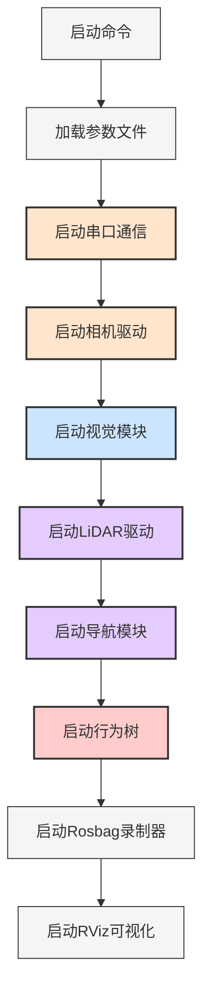
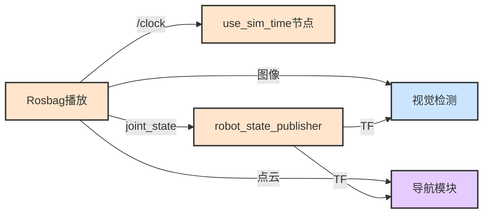

# 08. 运行与调试指南

[← 上一章：参数配置](./07_参数配置.md) | [返回主页](../README.md)

---

## 目录
- [1. 系统启动](#1-系统启动)
- [2. 单模块调试](#2-单模块调试)
- [3. Rosbag工作流](#3-rosbag工作流)
- [4. 可视化与监控](#4-可视化与监控)
- [5. 常见问题排查](#5-常见问题排查)
- [6. 性能调优](#6-性能调优)

---

## 1. 系统启动

### 1.1 完整系统启动

```bash
# 进入工作空间
cd ~/pb2025_sentry_ws

# Source环境
source install/setup.bash

# 启动完整系统
ros2 launch pb2025_sentry_bringup bringup.launch.py \
  world:=competition_map \
  use_rviz:=True \
  params_file:=$(pwd)/src/pb2025_sentry_bringup/params/node_params.yaml
```

### 1.2 启动流程图



### 1.3 重要启动参数

| 参数 | 说明 | 默认值 | 使用场景 |
|------|------|--------|----------|
| `world` | 地图/PCD文件名（不含扩展名） | "" | **必须指定** |
| `use_rviz` | 启动RViz可视化 | False | 调试时设为True |
| `use_sim_time` | 使用仿真时间 | False | 播放rosbag时设为True |
| `use_composition` | 使用Composable Nodes | True | 提高性能 |
| `detector` | 装甲板检测器类型 | opencv | opencv 或 openvino |
| `slam` | 启用SLAM模式 | False | 建图时设为True |
| `use_robot_state_pub` | 发布TF从joint_state | False | rosbag回放时设为True |
| `use_hik_camera` | 启动相机节点 | True | rosbag回放时设为False |

### 1.4 启动检查清单

**硬件检查**：
```bash
# 1. 检查串口设备
ls -l /dev/ttyACM* /dev/ttyUSB*

# 2. 检查相机连接
lsusb | grep HIK

# 3. 检查LiDAR连接
ip addr | grep 192.168.1
```

**ROS检查**：
```bash
# 1. 检查节点状态
ros2 node list

# 2. 检查话题
ros2 topic list

# 3. 检查TF树
ros2 run tf2_tools view_frames
```

---

## 2. 单模块调试

### 2.1 串口通信调试

```bash
# 启动串口节点
ros2 launch standard_robot_pp_ros2 standard_robot_pp_ros2.launch.py \
  use_rviz:=True \
  params_file:=/path/to/node_params.yaml

# 监控裁判系统数据
ros2 topic echo /referee/robot_status

# 监控云台状态
ros2 topic echo /serial/gimbal_joint_state

# 发送测试指令
ros2 topic pub /cmd_vel geometry_msgs/Twist \
  "{linear: {x: 0.5, y: 0.0, z: 0.0}, angular: {x: 0.0, y: 0.0, z: 0.5}}"
```

### 2.2 相机调试

```bash
# 启动相机节点
ros2 launch hik_camera_ros2_driver hik_camera_launch.py \
  params_file:=/path/to/node_params.yaml

# 查看图像
ros2 run rqt_image_view rqt_image_view \
  /front_industrial_camera/image

# 检查帧率
ros2 topic hz /front_industrial_camera/image

# 检查相机信息
ros2 topic echo /front_industrial_camera/camera_info --once
```

### 2.3 视觉系统调试

```bash
# 启动视觉模块（包含相机+检测+追踪+弹道）
ros2 launch pb2025_vision_bringup rm_vision_reality_launch.py \
  use_composition:=True \
  use_rviz:=True \
  detector:=opencv \
  params_file:=/path/to/node_params.yaml

# 查看检测结果
ros2 topic echo /detector/armors

# 查看追踪目标
ros2 topic echo /tracker/target

# 启用调试模式（修改参数后重启）
# 在node_params.yaml中设置：
# armor_detector_opencv.debug: true
```

### 2.4 导航系统调试

```bash
# 启动导航模块
ros2 launch pb2025_nav_bringup rm_navigation_reality_launch.py \
  world:=competition_map \
  slam:=False \
  use_rviz:=True

# 查看里程计
ros2 topic echo /Odometry

# 查看代价地图
ros2 run rviz2 rviz2 -d $(ros2 pkg prefix pb2025_sentry_bringup)/share/pb2025_sentry_bringup/rviz/sentry_default_view.rviz

# 发送导航目标
ros2 topic pub /goal_pose geometry_msgs/PoseStamped \
  "{header: {frame_id: 'map'}, pose: {position: {x: 1.0, y: 1.0, z: 0.0}}}"

# 重定位（在RViz中使用2D Pose Estimate）
ros2 topic pub /initialpose geometry_msgs/PoseWithCovarianceStamped \
  "{header: {frame_id: 'map'}, pose: {pose: {position: {x: 0.0, y: 0.0, z: 0.0}}}}"
```

### 2.5 行为树调试

```bash
# 启动行为树节点
ros2 launch pb2025_sentry_behavior pb2025_sentry_behavior_launch.py \
  params_file:=/path/to/node_params.yaml

# 使用Groot2监控行为树（需要安装Groot2）
# 在浏览器中打开：http://localhost:1667

# 查看全局黑板数据
ros2 topic list | grep referee
ros2 topic list | grep detector
ros2 topic list | grep tracker
```

---

## 3. Rosbag工作流

### 3.1 自动录制（比赛模式）

**配置** `node_params.yaml`：
```yaml
standard_robot_pp_ros2:
  record_rosbag: true  # 启用自动录制

rosbag_recorder:
  bag_prefix: "rosbag_sentry_"
  topics:
    - /serial/gimbal_joint_state
    - /front_industrial_camera/image
    - /front_industrial_camera/camera_info
    - /livox/imu
    - /livox/lidar
```

**触发条件**：
- 比赛进入 5秒倒计时 → 开始录制
- 比赛结束 → 停止录制并保存

### 3.2 手动录制

```bash
# 录制指定话题
ros2 bag record -o my_test_$(date +%Y%m%d_%H%M%S) \
  /serial/gimbal_joint_state \
  /front_industrial_camera/image \
  /livox/lidar \
  /livox/imu \
  --compression-mode file \
  --compression-format zstd

# 录制所有话题
ros2 bag record -a -o full_system_$(date +%Y%m%d_%H%M%S)
```

### 3.3 回放Rosbag

```bash
# 基础回放（发布/clock）
ros2 bag play my_rosbag.db3 --clock

# 循环回放
ros2 bag play my_rosbag.db3 --clock --loop

# 调整播放速率
ros2 bag play my_rosbag.db3 --clock --rate 0.5  # 0.5倍速
```

### 3.4 配合Rosbag调试

**启动系统（不启动硬件节点）**：
```bash
ros2 launch pb2025_sentry_bringup bringup.launch.py \
  world:=competition_map \
  use_sim_time:=True \
  use_robot_state_pub:=True \
  use_hik_camera:=False \
  use_rviz:=True
```

**播放rosbag**：
```bash
ros2 bag play my_rosbag.db3 --clock
```



---

## 4. 可视化与监控

### 4.1 RViz配置

**默认配置文件**：
```
src/pb2025_sentry_bringup/rviz/sentry_default_view.rviz
```

**关键显示项**：
- `/front_industrial_camera/image` - 相机图像
- `/detector/marker` - 检测到的装甲板
- `/tracker/marker` - 追踪目标
- `/terrain_map` - 可通行性地图
- `/global_costmap/costmap` - 全局代价地图
- `/local_costmap/costmap` - 局部代价地图
- `/plan` - 规划路径
- TF树 - 坐标系关系

### 4.2 RQt工具

```bash
# 节点图查看
rqt_graph

# 话题监控
rqt_topic

# 绘图工具
rqt_plot /Odometry/pose/pose/position/x /Odometry/pose/pose/position/y

# 参数配置
rqt_reconfigure

# 图像查看
rqt_image_view
```

### 4.3 性能监控

```bash
# CPU/内存监控
htop

# 话题带宽
ros2 topic bw /front_industrial_camera/image

# 话题频率
ros2 topic hz /tracker/target

# 节点信息
ros2 node info /armor_detector_opencv
```

---

## 5. 常见问题排查

### 5.1 串口问题

**问题**：无法打开串口设备

```bash
# 解决方案1：添加用户权限
sudo usermod -a -G dialout $USER
# 注销后重新登录

# 解决方案2：临时权限
sudo chmod 666 /dev/ttyACM0
```

**问题**：数据校验失败

- 检查波特率是否匹配（115200）
- 检查串口线缆质量
- 启用debug模式查看详细日志

### 5.2 相机问题

**问题**：相机检测失败

```bash
# 检查USB连接
lsusb | grep HIK

# 检查SDK安装
ls /opt/MVS

# 重启相机SDK
sudo systemctl restart mvs-driver
```

**问题**：图像帧率低

- 确保使用USB 3.0接口（蓝色）
- 降低分辨率或帧率
- 检查CPU负载（不超过80%）

### 5.3 视觉检测问题

**问题**：检测不到装甲板

**调试步骤**：
```bash
# 1. 启用debug模式
# 修改node_params.yaml: armor_detector_opencv.debug: true

# 2. 查看二值化图像
ros2 run rqt_image_view rqt_image_view /detector/binary_img

# 3. 调整阈值
# binary_thres: 80 (光照强增大，光照弱减小)

# 4. 查看检测结果
ros2 topic echo /detector/debug_armors
```

**问题**：误检测率高

- 增大 `classifier_threshold` (0.4-0.6)
- 调整灯条筛选参数 `light.min_ratio`

### 5.4 导航问题

**问题**：定位漂移

```bash
# 1. 检查LiDAR数据
ros2 topic hz /livox/lidar
ros2 topic echo /livox/lidar --once

# 2. 检查IMU数据
ros2 topic hz /livox/imu

# 3. 重定位（在RViz中设置初始位姿）

# 4. 检查地图加载
ros2 topic echo /map_server/map --once
```

**问题**：路径规划失败

- 检查代价地图是否正确
- 增大膨胀半径 `inflation_radius`
- 检查起点和终点是否在空闲空间

### 5.5 行为树问题

**问题**：行为树不执行

```bash
# 1. 检查全局黑板数据
ros2 topic list | grep referee

# 2. 查看比赛状态
ros2 topic echo /referee/game_status

# 3. 使用Groot2监控（浏览器打开 localhost:1667）

# 4. 检查条件节点
# 确保裁判系统数据正常
# 确保视觉目标数据正常
```

### 5.6 TF问题

**问题**：TF树不完整

```bash
# 查看TF树
ros2 run tf2_tools view_frames

# 检查特定TF
ros2 run tf2_ros tf2_echo map odom
ros2 run tf2_ros tf2_echo odom base_footprint

# 确保robot_state_publisher在运行
ros2 node list | grep robot_state_publisher
```

---

## 6. 性能调优

### 6.1 计算性能优化

**使用Composable Nodes**：
```bash
# 默认已启用
use_composition:=True
```

**好处**：
- 减少进程间通信开销
- 降低内存占用
- 提高消息传递效率

### 6.2 网络优化

**QoS设置**：
```yaml
# 传感器数据使用best effort
use_sensor_data_qos: true
```

**DDS配置**（可选）：
```xml
<!-- cyclonedds.xml -->
<CycloneDDS>
  <Domain>
    <Internal>
      <MinimumSocketReceiveBufferSize>10MB</MinimumSocketReceiveBufferSize>
    </Internal>
  </Domain>
</CycloneDDS>
```

### 6.3 算法参数调优

**视觉检测**：
- 降低相机帧率（165Hz → 120Hz）可减少CPU占用
- 使用OpenVINO GPU加速（如有独显）

**导航**：
- 降低点云分辨率 `filter_size_surf: 0.2 → 0.3`
- 减少地形分析范围 `localTerrainMapRadius: 4.0 → 3.0`

**行为树**：
- 降低tick频率 `tick_frequency: 5 → 3`（如不需要高响应）

### 6.4 系统监控脚本

```bash
#!/bin/bash
# monitor.sh - 系统性能监控脚本

echo "=== ROS2节点状态 ==="
ros2 node list

echo -e "\n=== 话题频率 ==="
ros2 topic hz /front_industrial_camera/image --once --wait-for-data --timeout 5
ros2 topic hz /detector/armors --once --wait-for-data --timeout 5
ros2 topic hz /tracker/target --once --wait-for-data --timeout 5

echo -e "\n=== CPU占用前5节点 ==="
ps aux --sort=-%cpu | head -6

echo -e "\n=== TF延迟 ==="
ros2 run tf2_ros tf2_monitor
```

---

## 7. 日志与诊断

### 7.1 启用详细日志

```bash
# 所有节点使用debug级别
ros2 launch pb2025_sentry_bringup bringup.launch.py log_level:=debug

# 单个节点debug
ros2 run armor_detector_opencv armor_detector_opencv_node --ros-args --log-level debug
```

### 7.2 保存日志

```bash
# 日志文件位置
~/.ros/log/

# 查看最新日志
ros2 run rqt_console rqt_console
```

---

## 8. 快速命令参考

```bash
# === 构建 ===
colcon build --symlink-install --cmake-args -DCMAKE_BUILD_TYPE=Release --parallel-workers 10
colcon build --packages-select <pkg_name> --symlink-install

# === 启动 ===
ros2 launch pb2025_sentry_bringup bringup.launch.py world:=<map> use_rviz:=True

# === 监控 ===
ros2 topic list
ros2 topic hz <topic>
ros2 topic echo <topic>
ros2 node list
ros2 node info <node>

# === Rosbag ===
ros2 bag record -o <name> <topics>
ros2 bag play <bag> --clock

# === TF ===
ros2 run tf2_tools view_frames
ros2 run tf2_ros tf2_echo <source_frame> <target_frame>

# === 可视化 ===
rviz2 -d <config_file>
rqt_graph
rqt_image_view
```

---

**恭喜！您已完成开发手册的学习。**

建议按以下顺序实践：
1. 搭建开发环境
2. 单模块调试（从硬件层到决策层）
3. 完整系统集成测试
4. 使用rosbag进行离线调试
5. 性能调优

有问题请参考各章节详细文档或提交Issue。

---

[← 上一章：参数配置](./07_参数配置.md) | [返回主页](../README.md)
