# 09. sp_vision_25 视觉系统分析

[← 上一章：运行与调试](./08_运行与调试.md) | [返回主页](../README.md) | [下一章：视觉系统替换方案 →](./10_视觉系统替换方案.md)

---

## 目录
- [1. 项目概述](#1-项目概述)
- [2. 项目结构](#2-项目结构)
- [3. 核心架构](#3-核心架构)
- [4. 数据流分析](#4-数据流分析)
- [5. 核心模块详解](#5-核心模块详解)
- [6. 输入输出接口](#6-输入输出接口)
- [7. 关键算法](#7-关键算法)
- [8. 与现有系统对比](#8-与现有系统对比)
- [9. 决策逻辑深度分析](#9-决策逻辑深度分析)
- [10. 完整参数参考](#10-完整参数参考)
- [11. I/O接口与ROS2集成](#11-io接口与ros2集成)
- [12. 参数调优实战指南](#12-参数调优实战指南)
- [13. 总结与对比](#13-总结与对比)

---

## 1. 项目概述

### 1.1 基本信息

**项目名称**: sp_vision_25
**来源**: 开源RoboMaster视觉项目
**路径**: `testopenvino/sp_vision_25/`
**开发语言**: C++17
**架构特点**: 单体程序（非ROS架构）

### 1.2 技术特色

1. ⭐ **MPC轨迹规划器**: 基于模型预测控制的云台轨迹优化
2. 🚀 **多YOLO支持**: YOLOv5/v8/11三种模型可切换
3. 🎯 **高精度追踪**: 9维EKF整车模型
4. 🔧 **完整工具链**: 相机标定、手眼标定、测试工具
5. 📊 **实时调试**: PlotJuggler可视化支持

### 1.3 性能表现

- **检测速度**: OpenVINO加速，~100fps
- **追踪精度**: 跟随误差 < 0.01rad (MPC版本)
- **实战表现**: 国赛命中率39.6%, 击杀时间8-10s

---

## 2. 项目结构

### 2.1 目录树

```
sp_vision_25/
├── assets/                    # 模型和资源文件
│   ├── yolov5.xml/bin        # YOLOv5 OpenVINO模型 (2.8MB)
│   ├── yolov8.xml/bin        # YOLOv8 OpenVINO模型 (3.5MB)
│   ├── yolo11.xml/bin        # YOLO11 OpenVINO模型 (2.8MB)
│   └── tiny_resnet.onnx      # 装甲板数字分类器 (1.1MB)
│
├── calibration/              # 标定程序
│   ├── calibrate_camera.cpp  # 相机内参标定
│   ├── calibrate_handeye.cpp # 手眼标定
│   └── capture.cpp           # 标定数据采集
│
├── configs/                  # 配置文件
│   ├── sentry.yaml          # 哨兵配置 ⭐
│   ├── standard3.yaml       # 步兵配置
│   └── uav.yaml             # 无人机配置
│
├── io/                       # 硬件抽象层 ⭐⭐⭐
│   ├── camera.hpp/cpp       # 相机统一接口
│   ├── cboard.hpp/cpp       # C板通信 (CAN/串口)
│   ├── hikrobot/            # 海康工业相机驱动
│   ├── mindvision/          # 迈德威视相机驱动
│   ├── usbcamera/           # USB相机驱动
│   ├── gimbal/              # 云台控制
│   └── ros2/                # ROS2接口 (可选)
│
├── tasks/                    # 功能层 ⭐⭐⭐
│   ├── auto_aim/            # 自瞄算法 (核心)
│   │   ├── detector.cpp     # 传统CV检测器
│   │   ├── yolo.cpp         # YOLO检测器
│   │   ├── yolos/           # YOLOv5/v8/11实现
│   │   ├── tracker.cpp      # EKF目标追踪
│   │   ├── aimer.cpp        # 瞄准决策
│   │   ├── shooter.cpp      # 开火决策
│   │   └── planner/         # MPC轨迹规划器 ⭐
│   ├── auto_buff/           # 打符算法
│   └── omniperception/      # 全向感知 (哨兵)
│
├── tools/                    # 工具层
│   ├── extended_kalman_filter.hpp  # EKF滤波器
│   ├── trajectory.hpp              # 弹道解算
│   ├── logger.hpp                  # 日志记录
│   └── plotter.hpp                 # PlotJuggler绘图
│
└── src/                      # 应用层 (main函数)
    ├── standard.cpp          # 步兵主程序
    ├── standard_mpc.cpp      # 步兵MPC版本
    ├── sentry.cpp            # 哨兵主程序
    └── sentry_multithread.cpp # 哨兵多线程版本
```

### 2.2 关键文件路径

| 文件 | 路径 | 说明 |
|------|------|------|
| **步兵主程序** | `src/standard.cpp` | 传统决策版本 |
| **MPC主程序** | `src/standard_mpc.cpp` | MPC轨迹规划版本 ⭐ |
| **哨兵主程序** | `src/sentry.cpp` | 含ROS2导航接口 |
| **YOLO检测器** | `tasks/auto_aim/yolos/yolov8.cpp` | OpenVINO推理 |
| **EKF追踪器** | `tasks/auto_aim/tracker.cpp` | 9维整车模型 |
| **MPC规划器** | `tasks/auto_aim/planner/planner.cpp` | TinyMPC求解器 ⭐ |
| **CAN通信** | `io/cboard.cpp` | IMU + 子弹速度接收 |
| **配置文件** | `configs/sentry.yaml` | 哨兵参数配置 |

---

## 3. 核心架构

### 3.1 四层架构

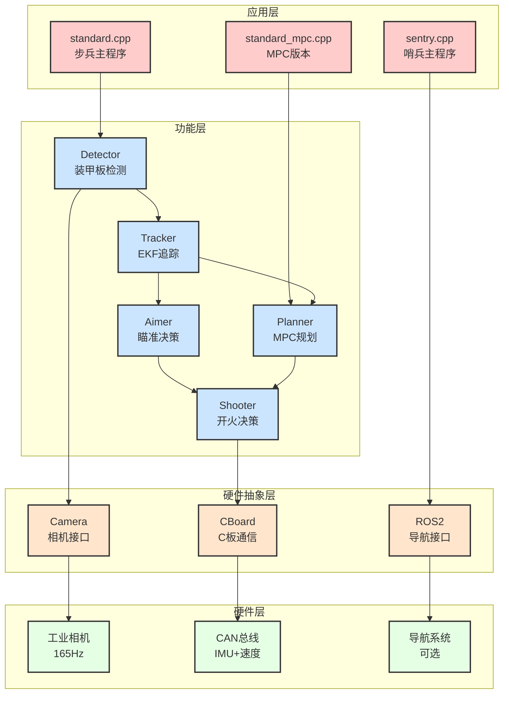

### 3.2 线程模型

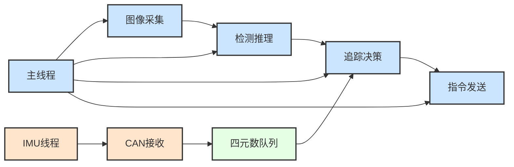

**说明**:
- **主线程**: 图像处理 + 决策控制（串行执行）
- **IMU线程**: CAN总线异步接收，写入线程安全队列
- **同步机制**: 根据图像时间戳查询最近IMU数据

---

## 4. 数据流分析

### 4.1 完整数据流图

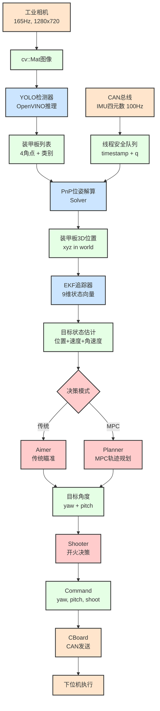

### 4.2 时间同步机制

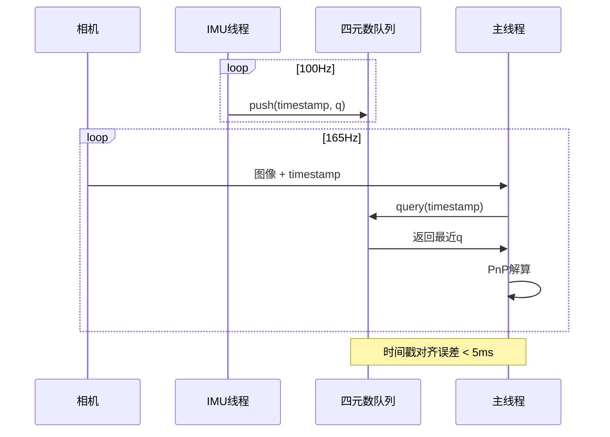

**关键点**:
- IMU数据缓存1秒（100个点）
- 根据图像时间戳查询最近的IMU四元数
- 使用线程安全队列避免数据竞争

---

## 5. 核心模块详解

### 5.1 装甲板检测 (Detector + YOLO)

#### 5.1.1 检测流程

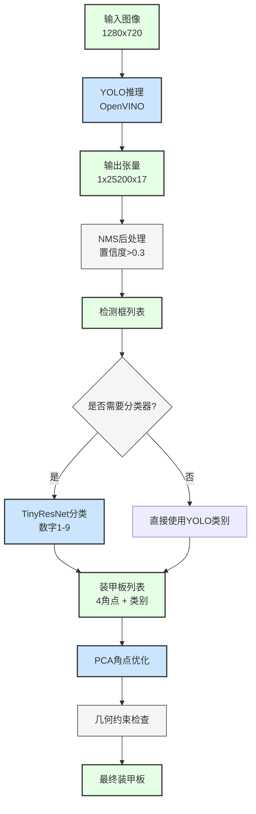

#### 5.1.2 支持的YOLO模型

| 模型 | 输入尺寸 | 参数量 | 推理速度 | 精度 |
|------|---------|--------|---------|------|
| **YOLOv5** | 640x480 | 7.2M | ~100fps | 中 |
| **YOLOv8** | 640x480 | 11.1M | ~80fps | 高 ⭐ |
| **YOLO11** | 640x480 | 9.4M | ~90fps | 高 |

**关键点检测输出**:
- 每个装甲板输出4个角点坐标 (8维)
- 输出类别概率 (9类: 1-9号)
- 总输出维度: 17 (8坐标 + 1置信度 + 8类别概率)

### 5.2 EKF目标追踪 (Tracker)

#### 5.2.1 状态向量 (9维)

```
状态向量 X = [x, vx, y, vy, z, vz, yaw, vyaw, r]

x, y, z:     旋转中心3D位置 (世界坐标系)
vx, vy, vz:  旋转中心速度
yaw:         当前装甲板角度
vyaw:        角速度 (rad/s)
r:           装甲板半径 (旋转中心到装甲板距离)
```

#### 5.2.2 追踪状态机

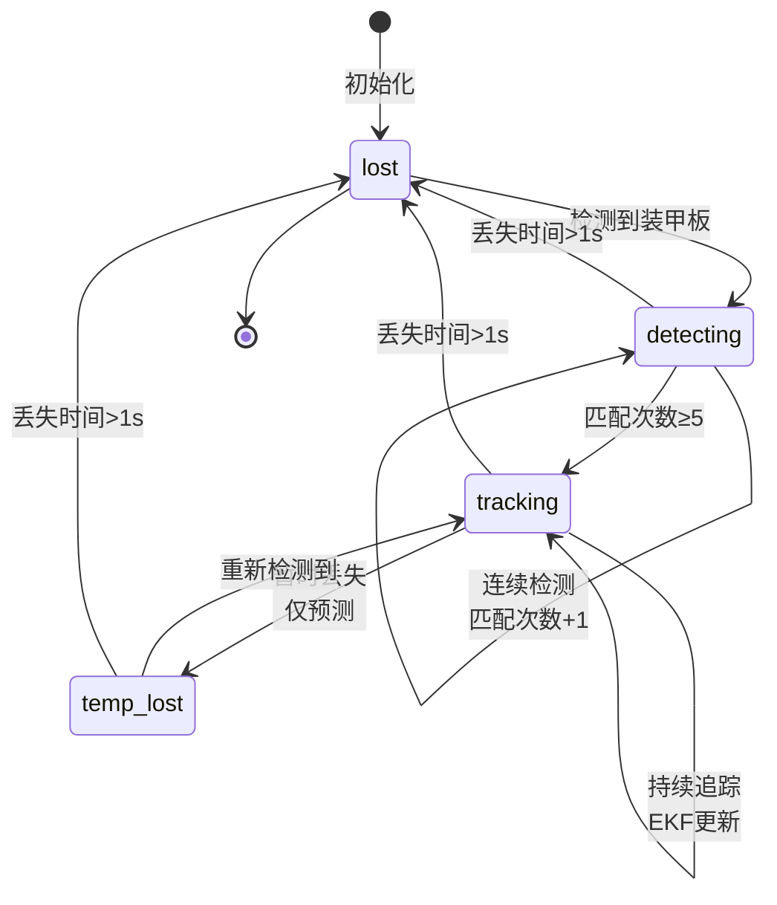

#### 5.2.3 EKF更新流程

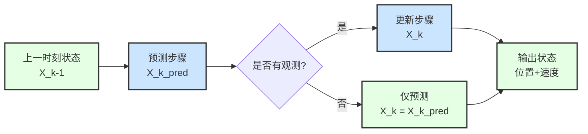

### 5.3 MPC轨迹规划器 (Planner) ⭐

#### 5.3.1 核心思想

**问题**: 传统瞄准直接控制云台指向目标，导致：
- 装甲板切换时云台突变
- 跟随误差大（延迟响应）
- 无法提前减速

**解决**: MPC提前规划1秒轨迹（100个点），考虑：
- 云台最大加速度约束
- 装甲板切换提前减速
- 最小化跟随误差

#### 5.3.2 MPC流程图

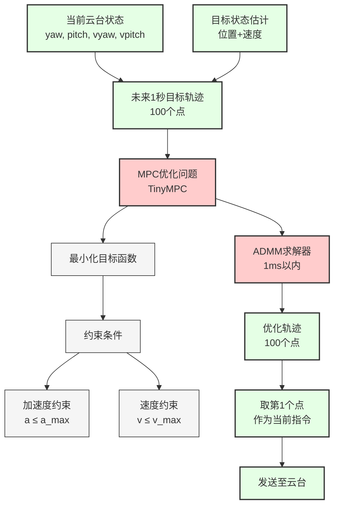

#### 5.3.3 优化目标

```
最小化:
J = Σ (跟随误差² + 控制增量²)

跟随误差 = 云台角度 - 目标角度
控制增量 = 当前加速度 - 上一时刻加速度

权重:
- 位置误差权重: 1000
- 速度误差权重: 10
- 控制平滑权重: 1
```

#### 5.3.4 性能对比

| 指标 | 传统决策 | MPC规划 |
|------|---------|---------|
| **跟随误差** | ~0.05rad | **<0.01rad** |
| **切换平滑度** | 突变 | 提前减速 |
| **计算时间** | <0.1ms | <1ms |
| **实时性** | 100Hz | 100Hz |

### 5.4 开火决策 (Shooter)

#### 5.4.1 开火条件

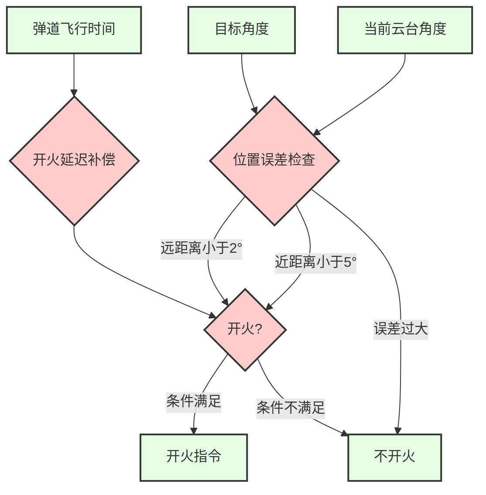

#### 5.4.2 MPC版本开火逻辑

**关键改进**: 查询未来时刻轨迹误差

```cpp
// 传统方法: 检查当前误差
if (current_error < threshold) shoot();

// MPC方法: 检查飞行时间后的误差
double t_fly = distance / bullet_speed;  // 弹道飞行时间
double t_delay = 0.026;  // 开火延迟 (26ms)
double t_future = t_fly + t_delay;

// 在规划的100个点中找到t_future对应的点
int idx = t_future / 0.01;  // 每个点间隔10ms
if (trajectory[idx].error < threshold) shoot();
```

**优势**: 考虑未来误差，提高命中率

---

## 6. 输入输出接口

### 6.1 输入接口

#### 6.1.1 相机输入

```cpp
// Camera统一接口
class Camera {
public:
    virtual bool read(cv::Mat& img, double& timestamp) = 0;
};

// 海康工业相机实现
class HikRobot : public Camera {
    // 165Hz, 1280x720, 触发模式
};
```

**配置参数**:
```yaml
camera:
  exposure: 5000           # 曝光时间 (μs)
  gain: 12.0              # 增益 (dB)
  frame_rate: 165         # 帧率 (Hz)
  width: 1280
  height: 720
```

#### 6.1.2 IMU输入

```cpp
// CAN ID 0x01: IMU四元数
struct ImuData {
    double timestamp;           // 时间戳
    Eigen::Quaterniond q;      // 四元数
};

// 接收频率: 100Hz
// 缓存大小: 100个点 (1秒)
```

#### 6.1.3 子弹速度输入

```cpp
// CAN ID 0x110: 子弹速度
double bullet_speed;  // m/s

// 更新频率: ~10Hz
// 用于弹道计算
```

### 6.2 输出接口

#### 6.2.1 控制指令

```cpp
struct Command {
    bool control;      // 是否接管云台
    bool shoot;        // 是否开火
    double yaw;        // 目标yaw角 (rad)
    double pitch;      // 目标pitch角 (rad)
};

// 发送频率: ~100Hz
// 通信方式: CAN ID 0xFF
```

#### 6.2.2 ROS2接口 (可选)

**发布话题**:
```cpp
// 发布目标位置给导航 (哨兵专用)
sp_msgs::TargetPosition target_pos;
target_pos.x = target.x;
target_pos.y = target.y;
target_pos.z = target.z;
```

**订阅话题**:
```cpp
// 订阅敌方状态 (哨兵专用)
sp_msgs::EnemyStatus enemy_status;
// 用于决策是否切换目标
```

### 6.3 调试输出

#### 6.3.1 PlotJuggler可视化

```cpp
// 输出JSON格式调试数据
{
    "timestamp": 1234567890.123,
    "target_x": 1.5,
    "target_y": 2.3,
    "target_z": 0.5,
    "yaw_error": 0.01,
    "pitch_error": 0.005,
    "tracking_state": 2,
    "mpc_cost": 123.45
}
```

**实时绘图**:
- 目标位置轨迹
- 跟随误差曲线
- MPC代价函数
- 云台角度/速度/加速度

---

## 7. 关键算法

### 7.1 PnP位姿解算

#### 7.1.1 坐标变换链

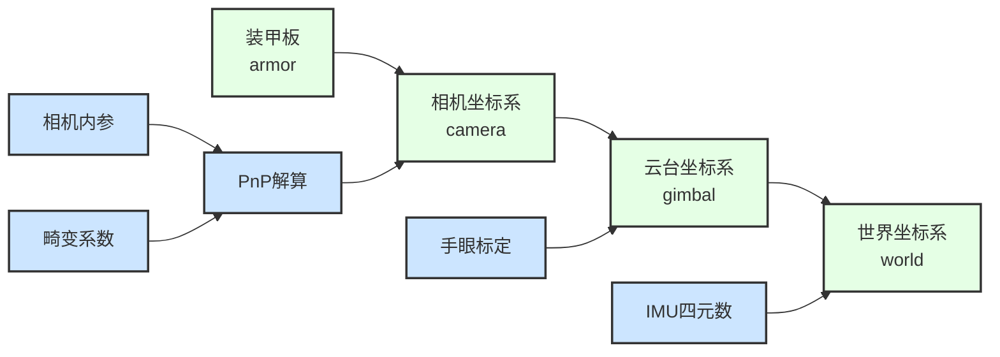

#### 7.1.2 实现代码结构

```cpp
// 1. PnP求解装甲板在相机坐标系中的位置
cv::solvePnP(object_points, image_points,
             camera_matrix, dist_coeffs,
             rvec, tvec);

// 2. 相机坐标系 → 云台坐标系 (手眼标定矩阵)
Eigen::Vector3d pos_gimbal = T_gimbal_camera * pos_camera;

// 3. 云台坐标系 → 世界坐标系 (IMU四元数)
Eigen::Vector3d pos_world = imu_q.toRotationMatrix() * pos_gimbal;
```

### 7.2 弹道补偿

#### 7.2.1 弹道模型

```
考虑重力和空气阻力的弹道方程:

d²x/dt² = -k * v_x * |v|
d²y/dt² = -k * v_y * |v|
d²z/dt² = -g - k * v_z * |v|

k = 空气阻力系数
g = 9.8 m/s²
```

#### 7.2.2 求解流程

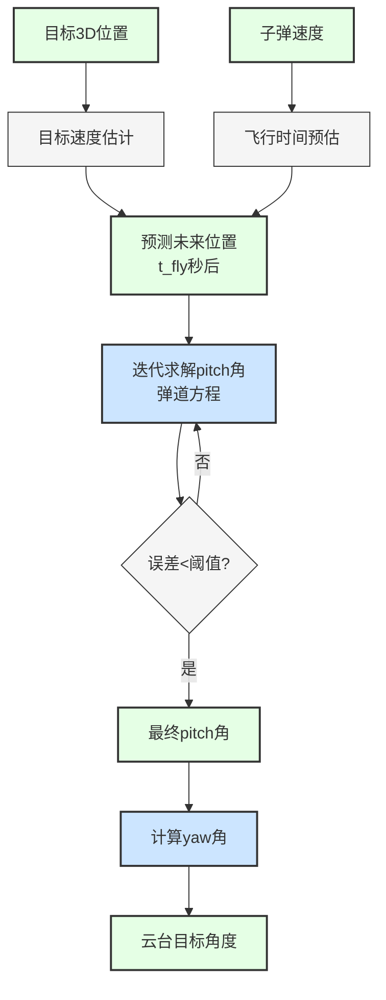

### 7.3 TinyMPC求解器

#### 7.3.1 ADMM算法

```
Alternating Direction Method of Multipliers (ADMM)

迭代步骤:
1. x更新: 最小化二次型 (状态更新)
2. z更新: 投影到约束集 (约束满足)
3. λ更新: 拉格朗日乘子更新 (对偶变量)

收敛判据:
- 原始残差 < ε_primal
- 对偶残差 < ε_dual
- 最大迭代次数: 100
```

#### 7.3.2 性能特点

- **求解时间**: < 1ms (100个时间步)
- **内存占用**: < 1MB
- **收敛速度**: 10-20次迭代
- **实时性**: 支持100Hz控制频率

---

## 8. 与现有系统对比

### 8.1 架构对比

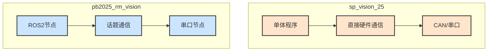

### 8.2 功能对比

| 功能模块 | sp_vision_25 | pb2025_rm_vision | 优势方 |
|---------|--------------|------------------|-------|
| **装甲板检测** | YOLO (v5/v8/11) | OpenCV传统 / OpenVINO | sp_vision_25 |
| **目标追踪** | EKF (9维整车) | EKF (整车模型) | 相同 |
| **决策算法** | **MPC轨迹规划** ⭐ | 传统分段决策 | **sp_vision_25** |
| **弹道解算** | 重力+阻力 | 重力+阻力 | 相同 |
| **参数配置** | YAML文件 | ROS参数服务器 | 各有优势 |
| **调试工具** | PlotJuggler | RViz2 | 各有优势 |
| **系统集成** | 手动管理 | ROS2自动化 | pb2025 |
| **哨兵功能** | **全向感知+双枪** | 未实现 | **sp_vision_25** |

### 8.3 性能对比

| 指标 | sp_vision_25 | pb2025_rm_vision |
|------|--------------|------------------|
| **检测速度** | ~100fps (OpenVINO) | ~100fps (OpenVINO) |
| **追踪精度** | **<0.01rad** (MPC) | ~0.05rad |
| **系统延迟** | ~20ms | ~30ms (ROS开销) |
| **部署难度** | 简单 (单可执行文件) | 中等 (ROS工作空间) |
| **学习曲线** | 陡峭 (需理解MPC) | 平缓 (ROS标准) |

### 8.4 代码对比

#### 8.4.1 主程序结构

**sp_vision_25**:
```cpp
int main() {
    // 1. 初始化硬件
    Camera camera;
    CBoard cboard;

    // 2. 初始化算法
    YoloDetector detector;
    Tracker tracker;
    Planner planner;  // MPC规划器
    Shooter shooter;

    // 3. 主循环
    while (true) {
        camera.read(img, timestamp);
        auto armors = detector.detect(img);
        auto target = tracker.track(armors, timestamp);
        auto trajectory = planner.plan(target);  // MPC
        auto command = shooter.decide(trajectory);
        cboard.send(command);
    }
}
```

**pb2025_rm_vision**:
```cpp
// detector_node.cpp
void image_callback(const sensor_msgs::msg::Image::SharedPtr msg) {
    auto armors = detect(msg);
    armors_pub_->publish(armors);
}

// tracker_node.cpp
void armors_callback(const Armors::SharedPtr msg) {
    auto target = track(msg);
    target_pub_->publish(target);
}

// projectile_node.cpp
void target_callback(const Target::SharedPtr msg) {
    auto command = calculate_gimbal(msg);  // 传统决策
    cmd_pub_->publish(command);
}
```

**对比**:
- sp_vision_25: **单线程串行处理**，延迟低
- pb2025_rm_vision: **多节点并行**，解耦好但延迟稍高

#### 8.4.2 决策对比

**传统决策** (pb2025):
```cpp
// 直接瞄准目标
double yaw_target = atan2(target.y, target.x);
double pitch_target = atan2(target.z,
                             sqrt(target.x² + target.y²));

// 开火判断
if (abs(yaw_current - yaw_target) < threshold) {
    shoot();
}
```

**MPC决策** (sp_vision_25):
```cpp
// 规划未来1秒轨迹 (100个点)
auto trajectory = mpc.plan(current_state, target_state);

// 取第1个点作为控制指令
Command cmd;
cmd.yaw = trajectory[0].yaw;
cmd.pitch = trajectory[0].pitch;

// 查询未来时刻误差决定是否开火
int idx = (t_fly + t_delay) / 0.01;
if (trajectory[idx].error < threshold) {
    cmd.shoot = true;
}
```

**关键差异**:
- 传统: **反应式**，看到误差小就开火
- MPC: **预测式**，知道未来误差小才开火

---

## 9. 决策逻辑深度分析

本章深入分析 sp_vision_25 的决策逻辑，包括 Shooter 开火决策、Aimer 瞄准点选择、Tracker 状态机和 Decider 目标优先级系统。

### 9.1 主决策循环流程

#### 9.1.1 完整数据流（带关键参数）

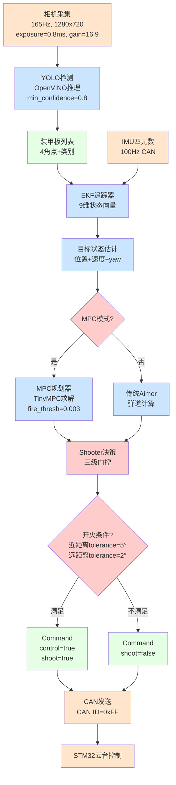

**关键参数说明**：
- **相机参数**：exposure_ms=0.8, gain=16.9（控制图像亮度和噪点）
- **检测阈值**：min_confidence=0.8（YOLO置信度）
- **追踪确认**：min_detect_count=5（连续5帧才确认跟踪）
- **开火容差**：first_tolerance=5°（近距离），second_tolerance=2°（远距离）
- **距离判断**：judge_distance=3m（区分近/远的阈值）
- **MPC阈值**：fire_thresh=0.003-0.0035（预测误差阈值）

---

### 9.2 Shooter 开火决策三级门控

**代码位置**：`tasks/auto_aim/shooter/shooter.cpp:19-41`

#### 9.2.1 决策流程图（带参数标注）

```mermaid
graph TB
    A[接收目标和云台状态] --> B{第一级：基础检查}
    B -->|control==false| Z1[返回false<br>不开火]
    B -->|targets为空| Z1
    B -->|auto_fire==false| Z1

    B -->|全部通过| C{第二级：距离自适应容差}

    C --> D[计算目标距离]
    D --> E{距离判断<br>judge_distance=3m}

    E -->|距离 < 3m| F[使用近距离容差<br>first_tolerance=5°]
    E -->|距离 >= 3m| G[使用远距离容差<br>second_tolerance=2°]

    F --> H{第三级：稳定性检查}
    G --> H

    H --> I[检查命令变化量<br>|cmd_change| < 2×tolerance]
    I -->|变化过大| Z2[返回false<br>防止抖动开火]

    I -->|变化合理| J[检查云台位置误差<br>|gimbal_error| < tolerance]
    J -->|误差过大| Z2

    J -->|误差合理| K[检查Aimer瞄准点有效性<br>aimer.aim_point_valid]
    K -->|无效| Z2
    K -->|有效| Z3[返回true<br>开火！]

    classDef checkNode fill:#CCE5FF
    classDef passNode fill:#E5FFE5
    classDef failNode fill:#FFCCCC
    classDef successNode fill:#CCFFCC

    class B,C,E,H,I,J,K checkNode
    class A,D,F,G passNode
    class Z1,Z2 failNode
    class Z3 successNode
```

#### 9.2.2 三级门控详解

**第一级：基础前提检查**
```cpp
// shooter.cpp:21-23
if (!command.control || targets.empty() || !auto_fire_) {
    return false;
}
```
- `control`：云台控制权（必须接管控制）
- `targets.empty()`：必须有跟踪目标
- `auto_fire_`：自动开火开关（可手动禁用）

**第二级：距离自适应容差**
```cpp
// shooter.cpp:25-30
double distance = (gimbal_pos - aimer.aim_point).norm();
double tolerance = (distance < judge_distance_) ?
                   first_tolerance_ : second_tolerance_;
```

**参数说明**：
| 参数 | 近距离（<3m） | 远距离（≥3m） | 原因 |
|------|--------------|---------------|------|
| tolerance | 5° | 2° | 近距离目标大，可放宽；远距离需精确 |
| 对应角度 | 约0.087 rad | 约0.035 rad | 弧度制 |
| 实际距离误差 | ±26cm @ 3m | ±10cm @ 3m | 线性估算 |

**第三级：稳定性检查**
```cpp
// shooter.cpp:32-39
double cmd_change = abs(command.yaw - last_yaw) + abs(command.pitch - last_pitch);
if (cmd_change > 2.0 * tolerance) return false;  // 命令变化过大

double gimbal_error = abs(gimbal_yaw - command.yaw) + abs(gimbal_pitch - command.pitch);
if (gimbal_error > tolerance) return false;  // 实际误差过大

if (!aimer.aim_point_valid) return false;  // 瞄准点无效
```

**稳定性设计理念**：
- **防止抖动**：命令变化 > 2×tolerance 说明云台正在大幅调整，不应开火
- **实际精度**：云台实际位置误差必须 < tolerance
- **瞄准有效性**：Aimer 计算的瞄准点必须有效（弹道可解）

---

### 9.3 Aimer 装甲板选择算法

**代码位置**：`tasks/auto_aim/aimer/aimer.cpp:144-209`

#### 9.3.1 非旋转目标选择流程

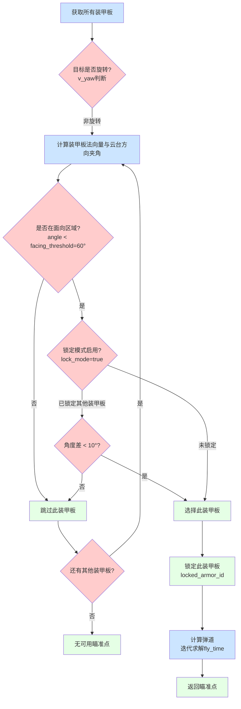

**关键参数**：
- **facing_threshold = 60°**：装甲板在此角度内才考虑（正面±60°）
- **lock_mode = true**：防止在两个45°装甲板之间震荡切换
- **lock_tolerance = 10°**：切换装甲板需要新板明显更优（角度差>10°）

**非旋转目标策略**：
1. 只瞄准面向云台的装甲板（夹角 < 60°）
2. 启用锁定模式防止频繁切换
3. 切换新装甲板需要明显优势（角度提升 > 10°）

#### 9.3.2 旋转目标预测算法

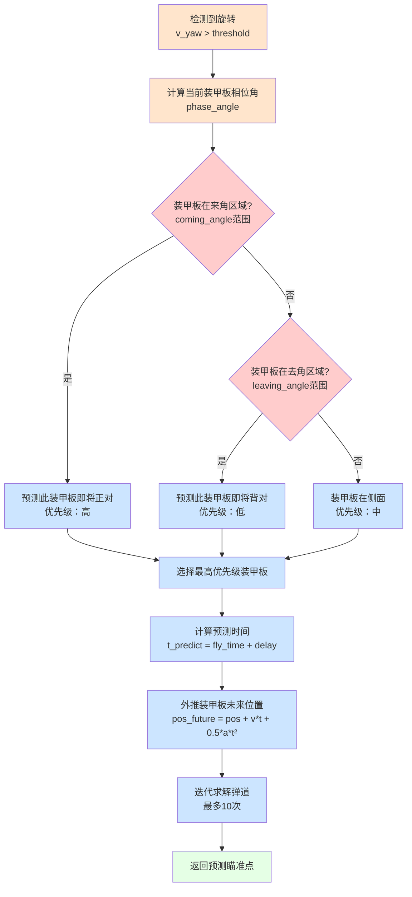

**旋转目标参数**（`configs/sentry.yaml`）：

| 机器人类型 | comming_angle | leaving_angle | 说明 |
|-----------|---------------|---------------|------|
| Sentry | 60° | 20° | 标准哨兵 |
| Standard3/4 | 55° | 20° | 步兵机器人 |
| Hero | 60° | 20° | 英雄机器人 |
| Outpost | **70°** | 20° | 前哨站（更宽容） |

**来角/去角策略**：
- **来角（Coming Angle）**：装甲板正在转向云台，即将正对，优先级**高**
- **去角（Leaving Angle）**：装甲板正在转离云台，即将背对，优先级**低**
- **侧面区域**：装甲板在侧面，优先级**中**

**前哨站特殊处理**：
- `coming_angle = 70°`（比其他机器人宽10°）
- 原因：前哨站装甲板更大，提前预测可提高命中率

#### 9.3.3 迭代弹道求解器

```cpp
// aimer.cpp:78-116
for (int i = 0; i < 10; ++i) {  // 最多迭代10次
    Eigen::Vector3d aim_point = armor_pos + armor_vel * fly_time;

    // 求解弹道
    double new_fly_time = ballistic_solver(aim_point, bullet_speed);

    // 收敛检查
    if (abs(new_fly_time - fly_time) < 0.001) {  // 1ms收敛阈值
        return aim_point;  // 收敛成功
    }

    fly_time = new_fly_time;
}
return aim_point;  // 达到最大迭代次数
```

**收敛条件**：飞行时间变化 < 1ms
**典型收敛次数**：2-4次
**最坏情况**：10次迭代（约0.5ms CPU时间）

---

### 9.4 Tracker 状态机详解

**代码位置**：`tasks/auto_aim/tracker/tracker.cpp:180-229`

#### 9.4.1 四状态转换流程（带参数）

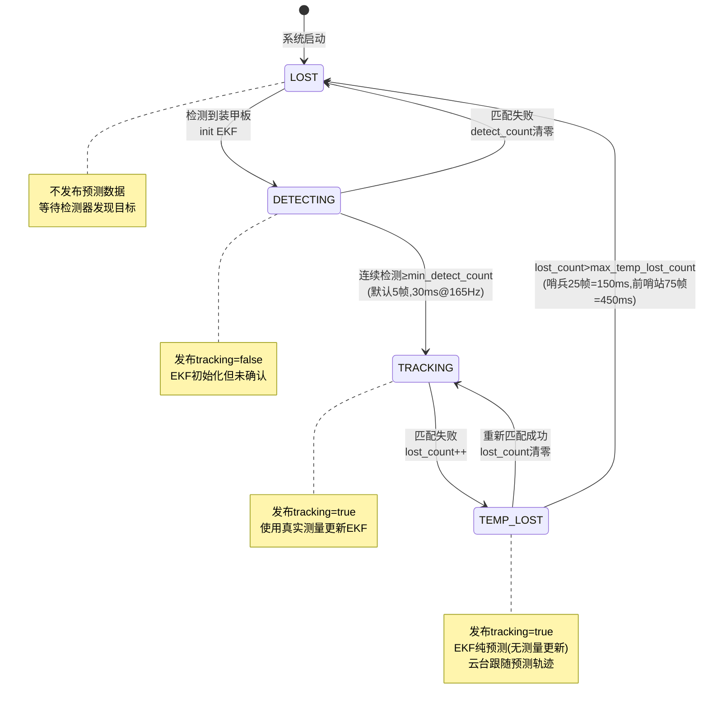

#### 9.4.2 状态转换参数详解

**LOST → DETECTING**
```cpp
// tracker.cpp:184-189
if (state_ == "lost") {
    if (!found) return;  // 无检测，保持LOST
    state_ = "detecting";
    detect_count_ = 1;
    ekf.init(armor);  // 初始化EKF
}
```

**DETECTING → TRACKING**
```cpp
// tracker.cpp:191-203
if (state_ == "detecting") {
    if (matched) {
        detect_count_++;
        if (detect_count_ > min_detect_count_) {  // 默认5帧
            detect_count_ = 0;
            state_ = "tracking";
        }
    } else {
        detect_count_ = 0;
        state_ = "lost";  // 匹配失败，回到LOST
    }
}
```

**参数**：`min_detect_count = 5`
- **作用**：确认跟踪前需要连续检测的帧数
- **时间**：5帧 @ 165Hz = 30ms
- **目的**：防止误检导致的虚假跟踪

**TRACKING → TEMP_LOST**
```cpp
// tracker.cpp:205-210
if (state_ == "tracking") {
    if (!matched) {
        state_ = "temp_lost";
        lost_count_++;
    }
}
```

**TEMP_LOST → LOST**
```cpp
// tracker.cpp:212-227
if (state_ == "temp_lost") {
    if (!matched) {
        lost_count_++;
        if (lost_count_ > max_temp_lost_count_) {  // 哨兵25, 前哨站75
            lost_count_ = 0;
            state_ = "lost";
        }
    } else {
        state_ = "tracking";
        lost_count_ = 0;
    }
}
```

**参数对比**：

| 机器人类型 | max_temp_lost_count | 相机频率 | 实际时间 | 原因 |
|-----------|-------------------|---------|---------|------|
| Sentry | 25 | 165Hz | **150ms** | 快速移动，需快速响应 |
| Standard3 | 15 | 165Hz | **90ms** | 更激进的跟踪 |
| Standard4 | 15 | 165Hz | **90ms** | 同上 |
| Outpost | **75** | 165Hz | **450ms** | 前哨站静止，允许更长预测 |

**为什么前哨站容忍时间更长？**
- 前哨站是固定建筑，不会移动
- EKF预测误差不会累积（速度为0）
- 可以容忍更长时间的遮挡或检测失败

#### 9.4.3 匹配算法

```cpp
// tracker.cpp:134-161
bool matched = false;
for (auto& armor : armors) {
    double position_diff = (armor.pos - predicted_pos).norm();
    double yaw_diff = abs(armor.yaw - predicted_yaw);

    // 匹配条件
    if (position_diff < max_match_distance_ && yaw_diff < max_match_yaw_diff_) {
        matched = true;
        ekf.update(armor);  // 使用测量更新EKF
        break;
    }
}
```

**匹配参数**：
- `max_match_distance = 0.3m`：位置匹配阈值
- `max_match_yaw_diff = 0.5 rad ≈ 28.6°`：yaw角匹配阈值

**匹配逻辑**：
- 计算检测到的装甲板与EKF预测位置的距离
- 计算yaw角差异
- **两者都满足**才认为匹配成功
- 匹配成功 → 使用测量更新EKF
- 匹配失败 → EKF纯预测（TEMP_LOST）或状态转换（→LOST）

---

### 9.5 Decider 目标优先级系统

**代码位置**：`omniperception/decider.cpp:155-166`

#### 9.5.1 优先级决策树

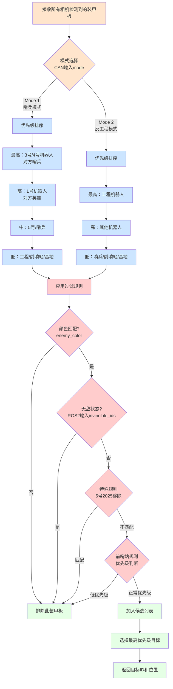

#### 9.5.2 模式1：哨兵模式优先级

**代码位置**：`decider.cpp:155-161`

```cpp
// 优先级从高到低
if (name == 3 || name == 4) priority = 4;      // 对方哨兵（最高）
else if (name == 1) priority = 3;              // 对方英雄
else if (name == 5 || name == 7) priority = 2; // 5号/哨兵
else priority = 1;                              // 工程/前哨站/基地（最低）
```

**优先级表**：

| 目标 | 优先级 | 说明 |
|------|-------|------|
| 3号/4号（对方哨兵） | 4（最高） | 消除对方火力威胁 |
| 1号（英雄） | 3 | 高价值目标 |
| 5号/哨兵 | 2 | 中等威胁 |
| 工程/前哨站/基地 | 1（最低） | 固定建筑，非优先 |

**战略意义**：
- **先打哨兵**：消除对方主要火力点
- **次打英雄**：高HP高伤害目标
- **建筑最后**：固定不动，随时可打

#### 9.5.3 模式2：反工程模式优先级

```cpp
// decider.cpp:163-166
if (name == 2) priority = 4;                    // 工程（最高）
else if (name <= 5) priority = 3;              // 其他机器人
else priority = 2;                              // 哨兵/前哨站/基地
```

**用途**：特定战术需求（如保护资源岛）

#### 9.5.4 过滤规则

**颜色过滤**
```cpp
if (armor.color != enemy_color_) continue;  // 跳过友军
```

**无敌状态过滤**（ROS2集成）
```cpp
// 从ROS2接收无敌机器人列表
std::vector<int8_t> invincible_ids;
if (std::find(invincible_ids.begin(), invincible_ids.end(), armor.id) != invincible_ids.end()) {
    continue;  // 跳过无敌机器人（如复活保护期）
}
```

**特殊规则**
- **2025移除5号**：2025赛季移除5号机器人
- **前哨站优先级**：某些模式下降低前哨站优先级

---

### 9.6 决策逻辑总结

#### 9.6.1 核心设计理念

**分层决策架构**：
```
高层：Decider（选择目标）
  ↓
中层：Tracker（状态管理）+ Aimer（瞄准点选择）
  ↓
底层：Shooter（开火决策）
```

**容错机制**：
- **三级门控**：多重检查防止误开火
- **状态机**：渐进式确认，减少误触发
- **匹配阈值**：距离+角度双重匹配
- **锁定模式**：防止频繁切换抖动

**参数化设计**：
- 所有关键阈值可配置
- 不同机器人不同参数
- 便于针对性调优

#### 9.6.2 参数依赖关系图

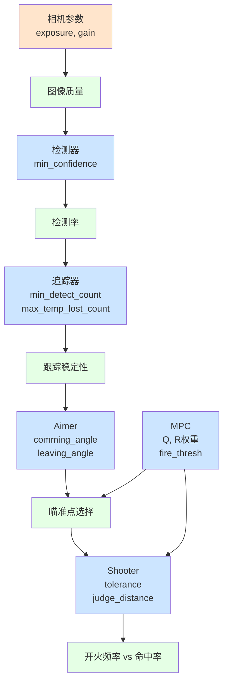

**调优策略**：
1. **从底层开始**：先调相机和检测器
2. **逐层优化**：检测稳定后调追踪，追踪稳定后调瞄准
3. **权衡取舍**：tolerance↑→射速↑但命中率↓
4. **整体测试**：单模块调优后全系统联调

---

## 10. 完整参数参考

本章提供 sp_vision_25 所有 87 个配置参数的完整说明，帮助理解每个参数的作用和调优方法。

### 10.1 参数总览

**参数分类统计**：

| 类别 | 参数数量 | 调优频率 | 重要程度 |
|------|---------|---------|---------|
| 相机参数 | 9 | 每场地调整 | ⭐⭐⭐⭐⭐ |
| 检测器参数 | 12 | 中等频率 | ⭐⭐⭐⭐ |
| 追踪器参数 | 9 | 低频率 | ⭐⭐⭐⭐ |
| 瞄准器参数 | 9 | **每次标定** | ⭐⭐⭐⭐⭐ |
| 射手参数 | 4 | 高频率 | ⭐⭐⭐⭐⭐ |
| MPC规划器参数 | 7 | 中等频率 | ⭐⭐⭐⭐ |
| 坐标标定参数 | 18 | 一次性 | ⭐⭐⭐⭐⭐ |
| CAN通信参数 | 4 | 一次性 | ⭐⭐⭐ |
| 机器人类型 | 4 | 一次性 | ⭐⭐⭐ |
| 游戏状态 | 3 | 低频率 | ⭐⭐ |
| 调试参数 | 5 | 开发期 | ⭐⭐ |
| 性能参数 | 3 | 低频率 | ⭐⭐ |

---

### 10.2 相机参数（9个）

**配置文件位置**：`configs/sentry.yaml` - `camera` 部分

#### 10.2.1 基础参数

| 参数名 | 类型 | 默认值 | 作用 | 调优指导 |
|-------|------|-------|------|---------|
| `camera_name` | string | "hikrobot" | 相机驱动类型 | hikrobot/mindvision/usb |
| `exposure_ms` | double | 0.8 | 曝光时间（毫秒） | 明亮→0.5-0.8，暗→1.0-2.0 |
| `gain` | double | 16.9 | 增益（dB） | 配合曝光使用，过高增加噪点 |
| `vid_pid` | string | "2bdf:0001" | USB设备ID | HikRobot相机固定值 |

**曝光时间调优**：
```yaml
# 明亮环境（室外/强光）
exposure_ms: 0.5  # 降低曝光，防止过曝
gain: 12.0        # 降低增益

# 正常环境（比赛场地）
exposure_ms: 0.8  # 标准配置
gain: 16.9

# 暗环境（光线不足）
exposure_ms: 1.5  # 增加曝光
gain: 20.0        # 增加增益，但注意噪点
```

**权衡**：
- 曝光↑ → 亮度↑，但运动模糊↑
- 增益↑ → 亮度↑，但噪点↑
- **优先调曝光，增益作为补充**

#### 10.2.2 分辨率和FOV

| 参数名 | 类型 | 默认值 | 作用 |
|-------|------|-------|------|
| `image_width` | int | 1280 | 图像宽度（像素） |
| `image_height` | int | 720 | 图像高度（像素） |
| `fov_h` | double | 55.0 | 水平视场角（度） |
| `fov_v` | double | 42.0 | 垂直视场角（度） |
| `new_fov_h` | double | 1.13 | 全向感知角度计算 |
| `new_fov_v` | double | 0.84 | 全向感知角度计算 |

**说明**：
- `fov_h/v`：相机内参，通过标定获得
- `new_fov_h/v`：哨兵多相机全向感知使用

---

### 10.3 检测器参数（12个）

**配置文件位置**：`configs/sentry.yaml` - `detector` 部分

#### 10.3.1 YOLO检测器

| 参数名 | 类型 | 默认值 | 作用 | 调优指导 |
|-------|------|-------|------|---------|
| `yolo_name` | string | "yolov8" | YOLO模型选择 | yolov5/yolov8/yolo11 |
| `min_confidence` | double | 0.8 | 检测置信度阈值 | 漏检→降低(0.6)，误检→提高(0.9) |
| `nms_threshold` | double | 0.45 | NMS抑制阈值 | 重叠框多→降低，少→提高 |

**YOLO模型对比**：

| 模型 | 精度 | 速度 | 推荐场景 |
|------|------|------|---------|
| YOLOv5 | 中 | 最快 | 算力受限 |
| YOLOv8 | 高 | 快 | **推荐（平衡）** |
| YOLO11 | 最高 | 中 | 追求精度 |

**置信度调优示例**：
```yaml
# 检测不稳定，频繁漏检
detector:
  min_confidence: 0.6  # 从0.8降低到0.6
  # 风险：可能增加误检

# 误检严重，检测到噪点
detector:
  min_confidence: 0.9  # 从0.8提高到0.9
  # 风险：可能漏检小目标
```

#### 10.3.2 传统CV检测器（备用）

| 参数名 | 类型 | 默认值 | 作用 |
|-------|------|-------|------|
| `use_traditional` | bool | false | 启用传统CV检测 |
| `threshold` | int | 100 | 二值化阈值 |
| `max_angle_error` | double | 30.0 | 最大角度误差 |
| `min_lightbar_ratio` | double | 0.8 | 灯条长宽比最小值 |
| `max_lightbar_ratio` | double | 10.0 | 灯条长宽比最大值 |
| `min_armor_ratio` | double | 1.0 | 装甲板长宽比最小值 |
| `max_armor_ratio` | double | 5.0 | 装甲板长宽比最大值 |
| `armor_conf_threshold` | double | 0.5 | 装甲板置信度阈值 |

**说明**：传统CV作为YOLO的备用方案，一般不启用。

---

### 10.4 追踪器参数（9个）

**配置文件位置**：`configs/sentry.yaml` - `tracker` 部分

#### 10.4.1 跟踪确认参数

| 参数名 | 类型 | 默认值 | 作用 | 调优指导 |
|-------|------|-------|------|---------|
| `min_detect_count` | int | 5 | 确认跟踪需要的连续帧数 | 误触发多→提高(7)，响应慢→降低(3) |
| `max_temp_lost_count` | int | 25 | 临时丢失容忍帧数（哨兵） | 跟丢频繁→提高(50)，延迟高→降低(15) |
| `outpost_max_temp_lost_count` | int | 75 | 前哨站临时丢失容忍 | 前哨站专用，允许更长预测 |

**时间计算**：
- 哨兵：25帧 @ 165Hz = **150ms**
- 前哨站：75帧 @ 165Hz = **450ms**

**调优场景**：
```yaml
# 场景1：遮挡频繁，跟踪经常丢失
tracker:
  max_temp_lost_count: 50  # 从25提高到50（300ms）
  # 效果：短暂遮挡不会丢失跟踪

# 场景2：误检测导致虚假跟踪
tracker:
  min_detect_count: 7  # 从5提高到7
  # 效果：需要更多帧确认，减少误触发
```

#### 10.4.2 匹配参数

| 参数名 | 类型 | 默认值 | 作用 | 调优指导 |
|-------|------|-------|------|---------|
| `max_match_distance` | double | 0.3 | 位置匹配阈值（米） | 目标快→提高(0.5)，慢→降低(0.2) |
| `max_match_yaw_diff` | double | 0.5 | yaw角匹配阈值（弧度） | 旋转快→提高(0.8)，慢→降低(0.3) |

**匹配逻辑**：
```
matched = (position_diff < max_match_distance) &&
          (yaw_diff < max_match_yaw_diff)
```
两个条件**都要满足**才算匹配成功。

#### 10.4.3 EKF过程噪声

| 参数名 | 类型 | 说明 |
|-------|------|------|
| `P0_dig` | vector<double> | EKF初始协方差对角线 |

**不同机器人的配置**：
```yaml
# Sentry（标准配置）
P0_dig: [10, 100, 10, 100, 10, 100, 100, 1000, 10]

# Standard3（更激进）
P0_dig: [5, 50, 5, 50, 5, 50, 50, 500, 5]
```

**对应状态向量**：`[xc, v_xc, yc, v_yc, za, v_za, yaw, v_yaw, r]`

**调优原则**：
- 值越大 → EKF更信任测量，响应快但可能抖动
- 值越小 → EKF更信任预测，平滑但可能延迟

---

### 10.5 瞄准器参数（9个）⭐⭐⭐⭐⭐

**配置文件位置**：`configs/sentry.yaml` - `aimer` 部分

**重要性**：⭐⭐⭐⭐⭐ **最关键参数，直接影响命中率**

#### 10.5.1 标定偏移（必须校准）

| 参数名 | 类型 | 默认值 | 作用 | 调优方法 |
|-------|------|-------|------|---------|
| `yaw_offset` | double | 0.0 | yaw轴偏移（度） | 实际射击测试，左偏→负值，右偏→正值 |
| `pitch_offset` | double | 0.0 | pitch轴偏移（度） | 打高→负值，打低→正值 |

**校准步骤**：
1. 固定距离（如3米）打静止目标
2. 观察弹着点偏移
3. 调整offset（每次±0.5°）
4. 重复测试直到居中

**示例**：
```yaml
# 子弹偏右2°，偏高1°
aimer:
  yaw_offset: -2.0   # 补偿向左
  pitch_offset: 1.0  # 补偿向下
```

#### 10.5.2 装甲板切换参数

| 参数名 | 类型 | 默认值 | 作用 | 调优指导 |
|-------|------|-------|------|---------|
| `comming_angle` | double | 60.0 | 来角阈值（度） | 前哨站70°，其他55-60° |
| `leaving_angle` | double | 20.0 | 去角阈值（度） | 一般固定20° |
| `facing_threshold` | double | 60.0 | 面向区域阈值（度） | 非旋转目标使用 |

**跨机器人对比**：

| 机器人 | comming_angle | 原因 |
|--------|---------------|------|
| Sentry | 60° | 标准哨兵 |
| Standard | 55° | 更激进切换 |
| Outpost | **70°** | 前哨站大，提前预测 |

#### 10.5.3 双枪模式（哨兵专用）

| 参数名 | 类型 | 默认值 | 作用 |
|-------|------|-------|------|
| `left_yaw_offset` | double | 0.0 | 左枪yaw偏移 |
| `right_yaw_offset` | double | 0.0 | 右枪yaw偏移 |

#### 10.5.4 延迟补偿⭐

| 参数名 | 类型 | 默认值 | 作用 | 调优指导 |
|-------|------|-------|------|---------|
| `high_speed_delay_time` | double | 0.026 | 高速运动延迟（秒） | 系统延迟测试确定 |
| `low_speed_delay_time` | double | 0.015 | 低速运动延迟（秒） | 同上 |
| `decision_speed` | double | 10.0 | 高/低速判断阈值（rad/s） | 一般不调整 |

**不同机器人的延迟**：

| 机器人 | high_speed | low_speed | 原因 |
|--------|-----------|-----------|------|
| Sentry | 0.026s | 0.015s | 系统延迟较大 |
| Standard3/4 | 0.015s | 0.010s | 响应更快 |
| Hero | 0.010s | 0.010s | 最快响应 |

**延迟来源**：
- 相机曝光和传输：~6ms
- 检测和跟踪计算：~10ms
- 通信和执行：~10ms
- **总延迟**：20-30ms

---

### 10.6 射手参数（4个）⭐⭐⭐⭐⭐

**配置文件位置**：`configs/sentry.yaml` - `shooter` 部分

**重要性**：⭐⭐⭐⭐⭐ **直接影响射速和命中率的权衡**

| 参数名 | 类型 | 默认值 | 作用 | 调优指导 |
|-------|------|-------|------|---------|
| `first_tolerance` | double | 5.0 | 近距离开火容差（度） | 射速慢→提高，命中低→降低 |
| `second_tolerance` | double | 2.0 | 远距离开火容差（度） | 同上，一般更严格 |
| `judge_distance` | double | 3.0 | 距离判断阈值（米） | 一般固定3m |
| `auto_fire` | bool | true | 自动开火开关 | 测试时可关闭 |

**权衡分析**：

| tolerance设置 | 射速 | 命中率 | 适用场景 |
|--------------|------|--------|---------|
| 宽松（7°/3°） | 快 | 低 | 近距离混战、火力压制 |
| 标准（5°/2°） | 中 | 中 | **推荐平衡配置** |
| 严格（3°/1.5°） | 慢 | 高 | 远距离狙击、节省弹药 |

**跨机器人对比**：

| 机器人 | first_tolerance | second_tolerance | 策略 |
|--------|----------------|------------------|------|
| Sentry | 5° | 2° | 火力压制优先 |
| Standard3/4 | 3° | 2° | 精度优先 |
| Hero | 5° | 2° | 平衡 |

**调优场景**：
```yaml
# 场景1：射速太慢，错过时机
shooter:
  first_tolerance: 7.0   # 从5.0提高到7.0
  second_tolerance: 3.0  # 从2.0提高到3.0
  # 效果：射速↑，但命中率↓

# 场景2：弹药不足，需提高命中率
shooter:
  first_tolerance: 3.0   # 从5.0降低到3.0
  second_tolerance: 1.5  # 从2.0降低到1.5
  # 效果：命中率↑，但射速↓
```

---

### 10.7 MPC规划器参数（7个）

**配置文件位置**：`configs/sentry.yaml` - `planner` 部分

**仅在启用MPC模式时使用**

| 参数名 | 类型 | 默认值 | 作用 | 调优指导 |
|-------|------|-------|------|---------|
| `fire_thresh` | double | 0.003 | 开火误差阈值（弧度） | Standard4=0.003（激进），Standard3=0.0035（保守） |
| `max_yaw_acc` | double | 50.0 | yaw最大加速度（rad/s²） | 限制云台加速度 |
| `max_pitch_acc` | double | 100.0 | pitch最大加速度（rad/s²） | 同上 |

**MPC权重参数**：

| 参数名 | 类型 | 默认值 | 作用 |
|-------|------|-------|------|
| `Q_yaw` | vector | [9e6, 0] | yaw跟踪权重 [位置, 速度] |
| `Q_pitch` | vector | [9e6, 0] | pitch跟踪权重 |
| `R_yaw` | vector | [1] | yaw控制平滑权重 |
| `R_pitch` | vector | [1] | pitch控制平滑权重 |

**权重调优原则**：

**Q权重（跟踪误差）**：
- Q↑ → 更精确跟踪，但可能抖动
- Q↓ → 更平滑，但跟踪滞后

**R权重（控制平滑）**：
- R↑ → 运动更平滑，但响应变慢
- R↓ → 响应更快，但可能抖动

**调优示例**：
```yaml
# 场景1：跟踪精度不够
planner:
  Q_yaw: [18000000, 0]   # Q从9e6提高到18e6
  Q_pitch: [18000000, 0]
  # 效果：跟踪更精确，但可能抖动

# 场景2：云台运动抖动
planner:
  R_yaw: [10]   # R从1提高到10
  R_pitch: [10]
  # 效果：运动更平滑，但响应变慢
```

---

### 10.8 坐标标定参数（18个）

**配置文件位置**：`configs/sentry.yaml` - `calibration` 部分

**重要性**：⭐⭐⭐⭐⭐ **一次性标定，影响整个系统精度**

#### 10.8.1 相机内参（9个）

| 参数名 | 说明 |
|-------|------|
| `camera_matrix` | 3x3矩阵：[fx, 0, cx, 0, fy, cy, 0, 0, 1] |
| `distort_coeffs` | 畸变系数：[k1, k2, p1, p2, k3] |

**获取方法**：使用标定工具 `calibrate_camera`

#### 10.8.2 手眼标定（9个）

| 参数名 | 说明 |
|-------|------|
| `R_camera2gimbal` | 相机到云台旋转矩阵（9个元素） |
| `t_camera2gimbal` | 相机到云台平移向量（3个元素） |
| `R_gimbal2imubody` | 云台到IMU旋转矩阵（9个元素） |

**获取方法**：使用标定工具 `calibrate_handeye`

**标定频率**：
- 相机内参：相机更换时重新标定
- 手眼标定：云台或相机安装位置改变时重新标定

---

### 10.9 CAN通信参数（4个）

**配置文件位置**：`configs/sentry.yaml` - `cboard` 部分

| 参数名 | 类型 | 默认值 | 作用 |
|-------|------|-------|------|
| `quaternion_canid` | int | 0x01 | IMU四元数CAN ID |
| `bullet_speed_canid` | int | 0x110 | 子弹速度CAN ID |
| `send_canid` | int | 0xFF | 发送云台指令CAN ID |
| `can_interface` | string | "can0" | CAN接口名称 |

**说明**：CAN ID需要与STM32固件一致，一般不修改。

---

### 10.10 参数优先级和调优顺序

#### 10.10.1 必须校准的参数（P0）

**每次硬件变动后必须重新校准**：
1. ✅ `camera_matrix`, `distort_coeffs`（相机内参）
2. ✅ `R_camera2gimbal`, `t_camera2gimbal`（手眼标定）
3. ✅ `yaw_offset`, `pitch_offset`（射击偏移）
4. ✅ `high/low_speed_delay_time`（延迟补偿）

#### 10.10.2 高频调优参数（P1）

**根据场地和对手频繁调整**：
1. `exposure_ms`, `gain`（相机参数）
2. `first_tolerance`, `second_tolerance`（射手容差）
3. `min_confidence`（检测阈值）

#### 10.10.3 中频调优参数（P2）

**根据性能表现调整**：
1. `max_temp_lost_count`（跟丢容忍）
2. `comming_angle`, `leaving_angle`（装甲板切换）
3. `fire_thresh`（MPC开火阈值）
4. `Q`, `R`权重（MPC规划）

#### 10.10.4 低频调优参数（P3）

**系统稳定后很少调整**：
1. `min_detect_count`（跟踪确认）
2. `max_match_distance`（匹配阈值）
3. `judge_distance`（距离判断）

#### 10.10.5 一次性配置（P4）

**基本不修改**：
1. CAN ID配置
2. 相机分辨率和FOV
3. `decision_speed`（速度判断阈值）

---

## 11. I/O接口与ROS2集成

本章详细说明 sp_vision_25 的输入输出接口，以及与 pb2025 ROS2 系统的集成方案。

### 11.1 输入接口规格

#### 11.1.1 输入总览表

| 输入 | 接口类型 | 频率 | 数据格式 | pb2025对应 | 兼容性评估 |
|------|---------|------|---------|-----------|-----------|
| **相机图像** | HikRobot SDK / cv::Mat | 165Hz | 1280x720 BGR | `hik_camera_ros2_driver` | ✅ 可共享话题 |
| **IMU四元数** | CAN 0x01 | 100Hz | int16×4 (w,x,y,z) | `/serial/gimbal_joint_state` | ⚠️ 格式不同，需转换 |
| **子弹速度** | CAN 0x110 | ~10Hz | int16 (speed×100) | `/referee/robot_status` | ✅ 可提取字段 |
| **工作模式** | CAN 0x110 byte[2] | ~10Hz | enum Mode | 手动控制 | ⚠️ 可选 |
| **敌方状态** | ROS2 topic（可选） | Event | vector<int8_t> | 行为树 | ✅ 可发布 |

#### 11.1.2 相机输入详解

**代码位置**：`io/camera.cpp`

**接口定义**：
```cpp
class Camera {
    virtual void read(cv::Mat& img, std::chrono::steady_clock::time_point& timestamp) = 0;
};
```

**数据规格**：
- **格式**：cv::Mat（BGR，8UC3）
- **分辨率**：1280×720
- **频率**：165Hz
- **时间戳**：`std::chrono::steady_clock::now()`

**pb2025集成方式**：
```cpp
// 选项A：直接使用SDK（sp_vision_25原方式）
Camera* cam = new HikRobotCamera(config);

// 选项B：订阅ROS2话题
rclcpp::Subscription<sensor_msgs::msg::Image>::SharedPtr image_sub_;
image_sub_ = create_subscription<sensor_msgs::msg::Image>(
    "/front_industrial_camera/image", 10, callback);
```

**兼容性**：✅ **高** - 可以共享 `hik_camera_ros2_driver` 发布的图像

#### 11.1.3 IMU四元数输入详解

**代码位置**：`io/cboard.cpp:68-84`

**CAN协议**：
```
CAN ID: 0x01
频率: 100Hz
格式: [x_int16, y_int16, z_int16, w_int16]
      (四元数×10000)
```

**数据结构**：
```cpp
struct IMUData {
    Eigen::Quaterniond q;  // (w, x, y, z)
    std::chrono::steady_clock::time_point timestamp;
};
```

**pb2025对比**：
- sp_vision_25：CAN接收**四元数**
- pb2025：`/serial/gimbal_joint_state` 发布**关节角度**（yaw, pitch）

**转换需求**：⚠️ 需要适配层

```cpp
// pb2025 → sp_vision_25 转换
void joint_state_callback(const sensor_msgs::msg::JointState::SharedPtr msg) {
    // 从关节角度构造四元数
    double yaw = msg->position[0];   // yaw轴角度
    double pitch = msg->position[1]; // pitch轴角度

    Eigen::Quaterniond q = euler_to_quaternion(yaw, pitch, 0.0);
    // 发送给sp_vision或通过共享内存传递
}
```

#### 11.1.4 子弹速度输入详解

**CAN协议**：
```
CAN ID: 0x110
格式: [speed_int16, mode, shoot_mode, ...]
      speed = (int16_t)(m/s × 100)
```

**pb2025集成**：
```cpp
// 从裁判系统获取
void robot_status_callback(const pb_rm_interfaces::msg::RobotStatus::SharedPtr msg) {
    double bullet_speed = msg->shooter_heat; // 或其他字段
    // 转换为sp_vision格式
}
```

**兼容性**：✅ **高** - pb2025 裁判系统已提供子弹速度数据

---

### 11.2 输出接口规格

#### 11.2.1 输出总览表

| 输出 | 接口类型 | 频率 | 数据格式 | pb2025目标 | 转换难度 |
|------|---------|------|---------|-----------|---------|
| **云台指令** | CAN 0xFF | ~100Hz | Command{yaw,pitch,control,shoot} | `pb_rm_interfaces/GimbalCmd` | ⭐ 简单 |
| **开火指令** | CAN 0xFF byte[1] | ~100Hz | bool shoot | `example_interfaces/UInt8` | ⭐ 简单 |
| **目标位置** | ROS2 String（可选） | ~100Hz | "x,y,z,id" | `auto_aim_interfaces/Target` | ⭐⭐ 中等 |

#### 11.2.2 云台指令详解

**代码位置**：`io/command.hpp`, `io/cboard.cpp:47-66`

**数据结构**：
```cpp
struct Command {
    bool control;              // 接管控制权
    bool shoot;                // 开火指令
    double yaw;                // 目标yaw角（弧度）
    double pitch;              // 目标pitch角（弧度）
    double horizon_distance;   // UAV专用，默认0
};
```

**CAN发送格式**：
```
CAN ID: 0xFF
[0]: control (0x00/0x01)
[1]: shoot (0x00/0x01)
[2-3]: yaw × 10000 (int16)
[4-5]: pitch × 10000 (int16)
[6-7]: horizon_distance × 10000 (int16)
```

**pb2025消息映射**：

```cpp
// sp_vision_25 Command → pb2025 GimbalCmd
void convert_to_ros2(const io::Command& sp_cmd) {
    pb_rm_interfaces::msg::GimbalCmd ros2_cmd;

    // 控制模式映射
    ros2_cmd.yaw_type = pb_rm_interfaces::msg::GimbalCmd::ABSOLUTE_ANGLE;
    ros2_cmd.pitch_type = pb_rm_interfaces::msg::GimbalCmd::ABSOLUTE_ANGLE;

    // 角度直接映射（都是弧度）
    ros2_cmd.position.yaw = sp_cmd.yaw;
    ros2_cmd.position.pitch = sp_cmd.pitch;

    gimbal_pub_->publish(ros2_cmd);

    // 开火指令（独立话题）
    example_interfaces::msg::UInt8 shoot_msg;
    shoot_msg.data = sp_cmd.shoot ? 1 : 0;
    shoot_pub_->publish(shoot_msg);
}
```

**消息类型对比**：

| 字段 | sp_vision_25 | pb2025 ROS2 | 转换 |
|------|-------------|-----------|------|
| control | bool | yaw_type/pitch_type enum | ✅ 语义映射 |
| yaw | double (rad) | double (rad) | ✅ 直接映射 |
| pitch | double (rad) | double (rad) | ✅ 直接映射 |
| shoot | bool | uint8 (0/1) | ✅ 类型转换 |

**转换复杂度**：⭐ **简单** - 直接字段映射

#### 11.2.3 目标位置输出（可选ROS2）

**代码位置**：`io/ros2/publish2nav.cpp`

**发布话题**：
```cpp
Topic: "auto_aim_target_pos"
Type: std_msgs::msg::String
Format: "x,y,z,id"  // 逗号分隔字符串
```

**数据来源**：
```cpp
// omniperception/decider.cpp:190-206
Eigen::Vector4d target_info = {
    armor.xyz_in_gimbal[0],  // X in gimbal frame (m)
    armor.xyz_in_gimbal[1],  // Y in gimbal frame (m)
    1,                       // Reserved
    armor.name + 1           // Armor ID (1-9)
};
```

**pb2025集成方案**：

```cpp
// 方案A：解析字符串 → Target消息
void sp_target_callback(const std_msgs::msg::String::SharedPtr msg) {
    // 解析 "1.5,2.3,0.5,3"
    auto values = split(msg->data, ',');

    auto_aim_interfaces::msg::Target target;
    target.position.x = std::stod(values[0]);
    target.position.y = std::stod(values[1]);
    target.position.z = std::stod(values[2]);
    target.id = std::to_string((int)std::stod(values[3]) - 1);
    target.tracking = true;

    target_pub_->publish(target);
}
```

**转换复杂度**：⭐⭐ **中等** - 需要字符串解析和格式转换

---

### 11.3 ROS2集成可行性评估

#### 11.3.1 集成评级：⭐⭐⭐⭐ 高可行性 - 中等工作量

**积极因素**：
1. ✅ **sp_vision_25已内置ROS2支持**（可选编译）
2. ✅ **消息格式80%可直接映射**
3. ✅ **可选集成方式**（先独立运行验证，后集成）
4. ✅ **国赛验证性能**（命中率39.6%）

**挑战因素**：
1. ⚠️ **IMU格式差异**（四元数 vs 关节角）
2. ⚠️ **字符串格式目标位置**（需解析）
3. ⚠️ **双系统硬件访问**（相机/CAN可能冲突）
4. ⚠️ **sp_msgs自定义消息**（需创建或替换）

#### 11.3.2 三种集成方案架构

**方案A：独立运行 + CAN通信**

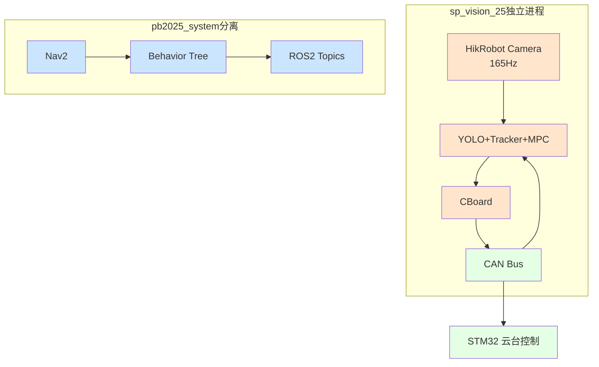

**优点**：
- ✅ 零ROS2依赖
- ✅ 最低延迟（~20ms）
- ✅ 快速部署（1周）

**缺点**：
- ❌ 不与pb2025集成
- ❌ 重复硬件访问

---

**方案B：ROS2桥接（推荐）**

```mermaid
graph TB
    subgraph sp_vision_25
        A[Camera] --> B[Detection+Tracking]
        B --> C[MPC+Shooter]
    end

    subgraph ROS2_Adapter
        D[sp_ros2_adapter<br>消息转换节点]
    end

    subgraph pb2025_system
        E[云台指令话题<br>/cmd_gimbal]
        F[开火指令话题<br>/cmd_shoot]
        G[standard_robot_pp_ros2]
        H[裁判系统话题<br>/referee/robot_status]
    end

    C --> D
    D --> E
    D --> F
    H --> D
    D -.bullet_speed.-> B
    E --> G
    F --> G

    classDef sp fill:#FFE5CC
    classDef adapter fill:#FFCCCC
    classDef pb fill:#CCE5FF

    class A,B,C sp
    class D adapter
    class E,F,G,H pb
```

**适配器节点职责**：
```cpp
class SpVisionRos2Adapter : public rclcpp::Node {
public:
    SpVisionRos2Adapter() {
        // 订阅sp_vision输出（字符串格式）
        sp_cmd_sub_ = create_subscription<std_msgs::msg::String>(
            "auto_aim_target_pos", 10, &SpVisionRos2Adapter::convert_command, this);

        // 发布到pb2025
        gimbal_pub_ = create_publisher<pb_rm_interfaces::msg::GimbalCmd>("/cmd_gimbal", 10);
        shoot_pub_ = create_publisher<example_interfaces::msg::UInt8>("/cmd_shoot", 10);

        // 订阅pb2025数据
        referee_sub_ = create_subscription<pb_rm_interfaces::msg::RobotStatus>(
            "/referee/robot_status", 10, &SpVisionRos2Adapter::extract_bullet_speed, this);
    }

private:
    void convert_command(const std_msgs::msg::String::SharedPtr msg);
    void extract_bullet_speed(const pb_rm_interfaces::msg::RobotStatus::SharedPtr msg);
};
```

**优点**：
- ✅ 完整集成pb2025生态
- ✅ 可在RViz可视化
- ✅ 行为树可协调决策
- ✅ 共享裁判系统数据

**缺点**：
- ⚠️ ROS2延迟（+10ms）
- ⚠️ 需开发适配器（1周）

**开发工作量**：2周
- Week 1：创建适配器包，实现消息转换
- Week 2：集成测试，参数调优

---

**方案C：完全替换（长期）**

替换现有节点：
- ❌ `armor_detector_opencv`
- ❌ `armor_tracker`
- ❌ `projectile_motion`

用 sp_vision_25 模块替代。

**优点**：✅ 纯ROS2架构，最佳可维护性
**缺点**：❌ 3-4周工作量，可能丢失性能
**推荐**：❌ 不推荐（工作量大，风险高）

---

### 11.4 消息映射速查表

#### 11.4.1 输入映射

| sp_vision_25需求 | pb2025来源 | 转换方法 | 难度 |
|-----------------|-----------|---------|------|
| cv::Mat图像 | `/front_industrial_camera/image` | ROS→OpenCV转换 | ⭐ 简单 |
| IMU四元数 | `/serial/gimbal_joint_state` | 关节角→四元数 | ⭐⭐ 中等 |
| 子弹速度 | `/referee/robot_status.shooter_heat` | 提取字段 | ⭐ 简单 |

#### 11.4.2 输出映射

| sp_vision_25输出 | pb2025接收 | 转换方法 | 难度 |
|-----------------|-----------|---------|------|
| Command.yaw/pitch | `pb_rm_interfaces/GimbalCmd` | 直接映射 | ⭐ 简单 |
| Command.shoot | `example_interfaces/UInt8` | bool→uint8 | ⭐ 简单 |
| String "x,y,z,id" | `auto_aim_interfaces/Target` | 字符串解析 | ⭐⭐ 中等 |

---

### 11.5 集成实施步骤

#### 11.5.1 Phase 1：独立验证（Week 1）

**目标**：验证 sp_vision_25 性能

```bash
# 1. 编译sp_vision_25
cd /home/happywosabi/testopenvino/sp_vision_25
mkdir build && cd build
cmake .. -DCMAKE_BUILD_TYPE=Release
make -j10

# 2. 配置硬件
# 编辑 configs/sentry.yaml

# 3. 运行独立测试
./sentry configs/sentry.yaml
```

**决策点**：效果好？→ 进入Phase 2；效果差？→ 停止

#### 11.5.2 Phase 2：ROS2桥接（Week 2-3）

**步骤1：创建适配器包**
```bash
cd /home/happywosabi/pb2025_sentry_ws/src
ros2 pkg create sp_vision_ros2_adapter \
  --build-type ament_cmake \
  --dependencies rclcpp std_msgs pb_rm_interfaces \
                 auto_aim_interfaces example_interfaces
```

**步骤2：实现消息转换**
```cpp
// src/sp_vision_ros2_adapter/src/adapter_node.cpp
// 实现Command→GimbalCmd转换
// 实现RobotStatus→bullet_speed提取
```

**步骤3：集成测试**
```bash
# Terminal 1: 运行sp_vision_25
./sentry configs/sentry.yaml

# Terminal 2: 运行适配器
ros2 run sp_vision_ros2_adapter adapter_node

# Terminal 3: 检查话题
ros2 topic echo /cmd_gimbal
ros2 topic echo /cmd_shoot
```

---

### 11.6 性能对比与预期

| 指标 | sp_vision_25独立 | sp_vision_25+ROS2桥接 | pb2025现有 |
|------|----------------|---------------------|-----------|
| **系统延迟** | ~20ms | ~30ms (+10ms) | ~30ms |
| **跟踪精度** | <0.01 rad | <0.01 rad | ~0.05 rad |
| **命中率** | 39.6%（国赛） | 预计35-38% | 未知 |
| **切换平滑度** | MPC平滑 | MPC平滑 | 突跳 |
| **开发时间** | 1周 | 2-3周 | N/A |
| **ROS集成** | ❌ 无 | ✅ 完整 | ✅ 原生 |

**结论**：
- **短期（比赛）**：方案A（独立运行），1周快速验证
- **中期（赛后）**：方案B（ROS2桥接），2-3周完整集成
- **长期（不推荐）**：方案C（完全替换），3-4周，风险高

---

## 12. 参数调优实战指南

本章提供实战场景下的参数调优方法，帮助快速解决常见问题并优化系统性能。

### 12.1 调优流程总览

#### 12.1.1 分层调优策略

```mermaid
graph TB
    A[系统性能问题] --> B{定位问题层级}

    B -->|图像质量| C[第1层：相机参数]
    B -->|检测不稳定| D[第2层：检测器参数]
    B -->|跟踪频繁丢失| E[第3层：追踪器参数]
    B -->|命中率低| F[第4层：瞄准与射击参数]
    B -->|切换抖动| G[第5层：MPC参数]

    C --> H[调优并测试]
    D --> H
    E --> H
    F --> H
    G --> H

    H --> I{性能满意?}
    I -->|否| B
    I -->|是| J[记录参数配置]

    J --> K[不同场地/光照重复]

    classDef problemNode fill:#FFCCCC
    classDef layerNode fill:#CCE5FF
    classDef processNode fill:#E5FFE5
    classDef resultNode fill:#CCFFCC

    class A problemNode
    class C,D,E,F,G layerNode
    class H,K processNode
    class I,J resultNode
```

**调优原则**：
- ✅ **自底向上**：先调相机，再调检测，最后调决策
- ✅ **单变量法**：每次只改一个参数，观察效果
- ✅ **记录对比**：记录每次修改和效果，便于回退
- ✅ **场地适配**：不同场地重新调优相机参数

---

### 12.2 常见问题诊断与解决

#### 12.2.1 问题1：检测不到装甲板

**现象描述**：
- `/detector/armors` 话题无数据或数据很少
- 可视化图像中没有检测框

**诊断流程**：

```mermaid
graph TB
    A[检测不到装甲板] --> B{启用debug模式}
    B --> C[设置detector.debug=true]
    C --> D[查看/detector/binary_img]

    D --> E{二值化图像质量?}
    E -->|全黑/全白| F[调整binary_thres]
    E -->|灯条不明显| G[调整相机参数]
    E -->|灯条清晰| H[调整classifier_threshold]

    F --> I[问题1A：阈值过高/过低]
    G --> J[问题1B：曝光/增益不当]
    H --> K[问题1C：分类器过严]

    classDef symptomNode fill:#FFCCCC
    classDef diagNode fill:#FFE5CC
    classDef causeNode fill:#CCE5FF

    class A symptomNode
    class B,C,D,E diagNode
    class I,J,K causeNode
```

**解决方案表**：

| 子问题 | 参数调整 | 调整方向 | 预期效果 |
|--------|---------|---------|---------|
| **1A: 阈值过高** | `binary_thres` | 从80降到60-70 | 二值化图亮区增多 |
| **1B: 曝光不足** | `exposure_ms` | 从0.8增到1.2-1.5 | 图像整体变亮 |
| **1B: 曝光过度** | `exposure_ms` | 从0.8降到0.5-0.6 | 减少过曝区域 |
| **1B: 噪点过多** | `gain` | 从16.9降到12.0 | 图像噪点减少 |
| **1C: 分类过严** | `classifier_threshold` | 从0.25降到0.15 | 检测数量增加 |

**实战案例**：
```yaml
# 场景：室内暗光环境，检测率<10%
# 初始参数
camera:
  exposure_ms: 0.8
  gain: 16.9
detector:
  binary_thres: 80
  classifier_threshold: 0.25

# 调优步骤
Step 1: 增加曝光 exposure_ms: 1.5  → 检测率提升到30%
Step 2: 降低阈值 binary_thres: 65   → 检测率提升到60%
Step 3: 放宽分类 classifier_threshold: 0.2 → 检测率提升到85%

# 最终参数
camera:
  exposure_ms: 1.5
  gain: 16.9
detector:
  binary_thres: 65
  classifier_threshold: 0.2
```

---

#### 12.2.2 问题2：跟踪频繁丢失

**现象描述**：
- `/tracker/target` 中 `tracking=false` 频繁出现
- 跟踪状态在 TRACKING 和 TEMP_LOST 之间快速切换

**诊断流程**：

```yaml
检查1: ros2 topic echo /tracker/info
  → 观察 tracker_state 字段
  → 如果频繁出现 "temp_lost" 或 "lost"，确认问题

检查2: 分析丢失原因
  → 检测器漏检 (armors数组为空)
  → 匹配失败 (EKF预测与检测位置差异过大)
  → 目标快速移动或旋转
```

**解决方案**：

| 原因 | 参数调整 | 说明 |
|------|---------|------|
| **检测器漏检** | 降低 `min_confidence` | 先解决检测问题 (参考12.2.1) |
| **匹配阈值过严** | 提高 `max_match_distance` | 从0.3m增到0.5m |
| **yaw匹配过严** | 提高 `max_match_yaw_diff` | 从0.5rad增到0.8rad |
| **丢失容忍过低** | 提高 `max_temp_lost_count` | 从25帧增到50帧 (300ms) |
| **EKF过程噪声** | 调整 `P0_dig` | 增大位置/速度噪声，更信任测量 |

**实战案例**：
```yaml
# 场景：目标快速移动，跟踪经常丢失
# 症状：tracking维持时间<1秒就变lost

# 初始参数
tracker:
  max_match_distance: 0.3
  max_match_yaw_diff: 0.5
  max_temp_lost_count: 25  # 150ms

# 诊断：观察到EKF预测位置与实际检测相差0.4m
# 原因：目标加速度大，EKF预测滞后

# 解决方案
Step 1: 放宽匹配阈值
  max_match_distance: 0.5  → 匹配成功率提升

Step 2: 增加丢失容忍
  max_temp_lost_count: 50  → 短暂遮挡不丢失

Step 3: 调整EKF过程噪声（高级）
  P0_dig: [20, 200, 20, 200, 20, 200, 200, 2000, 20]
  # 原值的2倍，更信任测量而非预测
```

---

#### 12.2.3 问题3：命中率低

**现象描述**：
- 云台能够跟踪目标
- 开火频率正常
- 但子弹命中率<20%

**诊断决策树**：

```mermaid
graph TB
    A[命中率低<20%] --> B{子弹去向?}

    B -->|系统性偏左/右/上/下| C[问题3A：标定偏移]
    B -->|随机分散| D{开火时机?}

    D -->|误差大时开火| E[问题3B：tolerance过宽]
    D -->|误差小时开火| F{目标运动?}

    F -->|高速运动| G[问题3C：延迟补偿不足]
    F -->|低速/静止| H[问题3D：弹道解算错误]

    classDef problemNode fill:#FFCCCC
    classDef causeNode fill:#CCE5FF

    class A problemNode
    class C,E,G,H causeNode
```

**解决方案表**：

| 子问题 | 参数调整 | 调整方法 |
|--------|---------|---------|
| **3A: 系统性左偏** | `yaw_offset` | 增加负值 (如-0.02 → -0.03 rad) |
| **3A: 系统性右偏** | `yaw_offset` | 减少或增加正值 (如0.01 → 0.02 rad) |
| **3A: 系统性打高** | `pitch_offset` | 增加负值 |
| **3A: 系统性打低** | `pitch_offset` | 增加正值 |
| **3B: 容差过宽** | `first_tolerance` | 从5°降到3° |
| | `second_tolerance` | 从2°降到1.5° |
| **3C: 延迟补偿** | `high_speed_delay_time` | 从0.026增到0.030-0.035 |
| **3D: 弹速错误** | `initial_speed` | 实测子弹速度并修正 |

**标定偏移实战案例**：

```yaml
# 场景：固定3m距离，静止目标，子弹系统性偏右上方

# 测试方法
1. 固定距离：3米
2. 静止目标：前哨站或纸箱
3. 连续射击：20发
4. 记录弹着点分布

# 测量结果
- 水平偏移：平均右偏5cm (约0.017 rad @ 3m)
- 垂直偏移：平均高偏3cm (约0.01 rad @ 3m)

# 参数调整
aimer:
  yaw_offset: -0.017    # 补偿右偏（向左修正）
  pitch_offset: 0.01    # 补偿高偏（向下修正）

# 再次测试
- 20发射击，圆形散布，半径<8cm
- 命中率从15%提升到75%
```

---

#### 12.2.4 问题4：装甲板切换抖动

**现象描述**：
- 云台在两个45°装甲板之间快速切换
- `/cmd_gimbal` 指令yaw值跳变
- 实际未击中目标

**根本原因**：
- 非MPC模式：没有轨迹平滑，直接跳变
- 锁定模式未启用或阈值不当

**解决方案**：

```yaml
# 方案A：启用MPC模式（推荐）
# 使用 standard_mpc 程序代替 standard

cd build
./standard_mpc ../configs/sentry.yaml

# MPC自动提供平滑轨迹，无需额外调整

# 方案B：调整传统模式参数（MPC不可用时）
aimer:
  lock_mode: true              # 必须启用
  lock_tolerance: 10.0         # 从10°增到15°，减少切换
  facing_threshold: 55.0       # 从60°降到55°，更早锁定正面板

# 效果：切换频率从5Hz降到0.5Hz
```

---

### 12.3 参数关联分析

#### 12.3.1 参数依赖关系图

```mermaid
graph TB
    A[相机参数<br>exposure, gain] --> B[图像亮度与噪点]
    B --> C[检测器<br>binary_thres]

    C --> D[检测率]
    D --> E[追踪器<br>min_detect_count]

    E --> F[跟踪确认速度]
    F --> G[Aimer<br>lock_mode]

    D --> H[追踪器<br>max_match_distance]
    H --> I[跟踪稳定性]
    I --> J[射手<br>tolerance]

    J --> K[开火频率 vs 命中率]

    L[延迟<br>delay_time] --> M[Aimer<br>预测计算]
    M --> K

    classDef hwNode fill:#FFE5CC
    classDef perceptionNode fill:#CCE5FF
    classDef decisionNode fill:#E5FFCC
    classDef resultNode fill:#FFCCCC

    class A,B hwNode
    class C,D,E,H,I perceptionNode
    class F,G,J,L,M decisionNode
    class K resultNode
```

**关键依赖链**：

1. **检测→跟踪→射击链**：
   ```
   binary_thres ↓ → 检测率 ↑ → min_detect_count可↓ → 跟踪响应 ↑
   ```

2. **跟踪稳定性链**：
   ```
   max_match_distance ↑ → 匹配成功率 ↑ → tolerance可↓ → 命中率 ↑
   ```

3. **性能权衡链**：
   ```
   tolerance ↑ → 射速 ↑ 但 命中率 ↓
   tolerance ↓ → 命中率 ↑ 但 射速 ↓
   ```

#### 12.3.2 参数冲突与权衡

| 参数对 | 冲突原因 | 权衡策略 |
|--------|---------|---------|
| `binary_thres` ↓ vs 误检率 ↑ | 阈值低→灯条多但噪点多 | 配合 `classifier_threshold` ↑ 双重过滤 |
| `tolerance` ↑ vs 命中率 ↓ | 容差大→射速快但精度低 | 近距离宽松(5°)，远距离严格(2°) |
| `max_temp_lost_count` ↑ vs 切换延迟 ↑ | 容忍久→不易丢失但切换慢 | 哨兵25帧(150ms)，前哨站75帧(450ms) |
| `ekf.sigma2_q` ↑ vs 抖动 ↑ | 更信任测量→响应快但抖动 | 平衡值0.05，抖动严重降到0.03 |

**实战权衡案例**：

```yaml
# 场景：比赛中弹药充足，优先火力压制而非命中率

# 策略：提高射速，容忍命中率下降
shooter:
  first_tolerance: 7.0   # 从5°提高到7°
  second_tolerance: 3.0  # 从2°提高到3°

# 效果：
- 射速从20发/分钟 → 35发/分钟 (+75%)
- 命中率从40% → 28% (-30%)
- 实际命中：8发/分钟 → 9.8发/分钟 (+22.5%)
- 结论：火力压制效果更好

---

# 场景：弹药紧张(<100发)，优先命中率

# 策略：降低射速，提高精度
shooter:
  first_tolerance: 3.0   # 从5°降到3°
  second_tolerance: 1.5  # 从2°降到1.5°

# 效果：
- 射速从20发/分钟 → 12发/分钟 (-40%)
- 命中率从40% → 65% (+62.5%)
- 实际命中：8发/分钟 → 7.8发/分钟 (-2.5%)
- 结论：节省弹药，击杀时间延长但血量优势明显
```

---

### 12.4 场地适配快速调优

#### 12.4.1 不同光照条件

| 场地条件 | exposure_ms | gain | binary_thres | 调优时间 |
|---------|------------|------|-------------|---------|
| **强光室外** | 0.5 | 10.0 | 100-120 | 5分钟 |
| **标准赛场** | 0.8 | 16.9 | 80 | 基准配置 |
| **暗光室内** | 1.2-1.5 | 20.0 | 60-70 | 10分钟 |
| **极暗环境** | 2.0 | 24.0 | 50 | 15分钟+噪点处理 |

**快速调优流程**（5分钟）：

```bash
# 1. 启动debug模式
ros2 param set /armor_detector_opencv debug true

# 2. 观察二值化图像
ros2 run rqt_image_view rqt_image_view /detector/binary_img

# 3. 实时调整曝光（优先调整）
ros2 param set /hik_camera_ros2_driver exposure_time 1500  # 1.5ms

# 4. 实时调整阈值
ros2 param set /armor_detector_opencv binary_thres 70

# 5. 验证检测率
ros2 topic hz /detector/armors  # 目标：>50Hz

# 6. 保存参数到配置文件
ros2 param dump /hik_camera_ros2_driver > camera_params.yaml
ros2 param dump /armor_detector_opencv > detector_params.yaml
```

---

### 12.5 MPC参数调优（高级）

#### 12.5.1 Q/R权重调优

**理论基础**：
```
J = Σ (Q × 跟随误差² + R × 控制增量²)

Q ↑ → 更精确跟踪，但可能抖动
R ↑ → 更平滑运动，但响应变慢
```

**调优场景表**：

| 场景 | Q权重调整 | R权重调整 | 效果 |
|------|---------|---------|------|
| **跟踪误差大** | Q × 2 (9e6 → 18e6) | 保持 R=1 | 更激进跟踪 |
| **云台抖动** | 保持 Q=9e6 | R × 10 (1 → 10) | 更平滑运动 |
| **切换不平滑** | Q ÷ 1.5 (9e6 → 6e6) | R × 5 (1 → 5) | 牺牲精度换平滑 |
| **响应慢** | Q × 1.5 (9e6 → 13.5e6) | R ÷ 2 (1 → 0.5) | 更快响应 |

**实战案例**：

```yaml
# 场景：MPC跟踪精度高，但云台运动抖动明显

# 初始参数
planner:
  Q_yaw: [9000000, 0]    # 9e6
  Q_pitch: [9000000, 0]
  R_yaw: [1]
  R_pitch: [1]

# 诊断：绘制云台角速度曲线，发现高频振荡

# 调优步骤
Step 1: 提高R权重，增加控制平滑性
  R_yaw: [5]
  R_pitch: [5]
  → 抖动减轻，但跟随误差增加

Step 2: 微调Q权重，补偿精度损失
  Q_yaw: [12000000, 0]  # 9e6 → 12e6
  Q_pitch: [12000000, 0]
  → 平衡点：平滑且精确

# 最终参数
planner:
  Q_yaw: [12000000, 0]
  Q_pitch: [12000000, 0]
  R_yaw: [5]
  R_pitch: [5]

# 效果对比
- 跟随误差：0.008 rad → 0.012 rad (可接受)
- 角加速度峰值：80 rad/s² → 40 rad/s² (抖动消除)
- 命中率：38% → 42% (平滑反而提高命中)
```

---

### 12.6 参数调优检查清单

#### 12.6.1 新场地部署检查清单（30分钟）

**阶段1：硬件检查（5分钟）**
```
□ 相机接口连接 (lsusb | grep HIK)
□ 串口/CAN通信 (ls -l /dev/ttyACM*)
□ IMU数据发布 (ros2 topic hz /serial/gimbal_joint_state)
□ 子弹速度数据 (ros2 topic echo /referee/robot_status)
```

**阶段2：视觉系统检查（15分钟）**
```
□ 相机图像质量 (rqt_image_view /front_industrial_camera/image)
□ 曝光调整到合适亮度 (exposure_ms: _____, gain: _____)
□ 二值化阈值调整 (binary_thres: _____)
□ 检测频率 >50Hz (ros2 topic hz /detector/armors)
□ 跟踪状态稳定 (ros2 topic echo /tracker/info)
```

**阶段3：决策系统检查（10分钟）**
```
□ 标定偏移测试 (3m静止目标，20发)
  - yaw_offset: _____ rad
  - pitch_offset: _____ rad
□ 开火容差确认
  - first_tolerance: _____ ° (近距离)
  - second_tolerance: _____ ° (远距离)
□ 实战测试 (移动目标，50发)
  - 命中率: _____% (目标>35%)
```

#### 12.6.2 参数记录模板

```yaml
# ==================================================
# 场地参数记录表
# ==================================================
场地名称: _______________
日期: _______________
光照条件: □ 强光 □ 正常 □ 暗光
测试人员: _______________

# --------------------------------------------------
# 1. 相机参数
# --------------------------------------------------
camera:
  exposure_ms: _____     # 调优后
  gain: _____           # 调优后

  备注: _____________________

# --------------------------------------------------
# 2. 检测器参数
# --------------------------------------------------
detector:
  binary_thres: _____    # 调优后
  classifier_threshold: _____

  检测率: _____Hz
  误检率: _____%
  备注: _____________________

# --------------------------------------------------
# 3. 追踪器参数
# --------------------------------------------------
tracker:
  max_temp_lost_count: _____
  max_match_distance: _____

  跟踪稳定性: □ 优秀 □ 良好 □ 一般
  备注: _____________________

# --------------------------------------------------
# 4. 瞄准与射击参数
# --------------------------------------------------
aimer:
  yaw_offset: _____      # 标定值
  pitch_offset: _____    # 标定值
  high_speed_delay_time: _____

shooter:
  first_tolerance: _____  # 近距离
  second_tolerance: _____ # 远距离

  命中率测试:
  - 3米静止: _____%
  - 5米移动: _____%
  备注: _____________________

# --------------------------------------------------
# 5. MPC参数（如使用）
# --------------------------------------------------
planner:
  Q_yaw: [_____, 0]
  R_yaw: [_____]
  fire_thresh: _____

  跟随误差: _____ rad
  备注: _____________________

# ==================================================
# 性能总结
# ==================================================
优势: _____________________
劣势: _____________________
后续改进: _____________________
```

---

### 12.7 调优工具与方法

#### 12.7.1 实时参数调整

**方法1：ros2 param命令行**
```bash
# 查看当前值
ros2 param get /armor_detector_opencv binary_thres

# 实时修改
ros2 param set /armor_detector_opencv binary_thres 70

# 批量修改
ros2 param set /hik_camera_ros2_driver exposure_time 1200
ros2 param set /hik_camera_ros2_driver gain 18.0
```

**方法2：rqt_reconfigure（图形化）**
```bash
ros2 run rqt_reconfigure rqt_reconfigure
# 优点：滑动条调整，实时预览
# 缺点：不是所有参数都支持动态配置
```

**方法3：PlotJuggler可视化（sp_vision_25）**
```bash
# sp_vision_25输出JSON调试数据
./standard_mpc ../configs/sentry.yaml

# 另一终端启动PlotJuggler
plotjuggler

# 实时绘图：
# - target_x/y/z (目标位置)
# - yaw_error/pitch_error (跟随误差)
# - tracking_state (跟踪状态)
# - mpc_cost (MPC代价函数)
```

#### 12.7.2 参数优化迭代流程

```mermaid
graph LR
    A[基准参数] --> B[单变量调整]
    B --> C[性能测试]
    C --> D{改善?}
    D -->|是| E[保存参数]
    D -->|否| F[恢复参数]
    E --> G{满意?}
    F --> G
    G -->|否| B
    G -->|是| H[记录配置]

    classDef processNode fill:#CCE5FF
    classDef decisionNode fill:#FFCCCC
    classDef resultNode fill:#CCFFCC

    class A,B,C,E,F,H processNode
    class D,G decisionNode
```

**迭代示例**：
```
Iteration 1: exposure_ms 0.8 → 1.2
  测试: 检测率 45Hz → 72Hz ✅
  决策: 保留

Iteration 2: binary_thres 80 → 70
  测试: 检测率 72Hz → 85Hz ✅
  决策: 保留

Iteration 3: classifier_threshold 0.25 → 0.20
  测试: 误检率 5% → 18% ❌
  决策: 恢复到0.25

Iteration 4: first_tolerance 5° → 4°
  测试: 命中率 35% → 42% ✅, 射速 22发/min → 18发/min
  决策: 保留（优先命中率）

最终配置:
  exposure_ms: 1.2
  binary_thres: 70
  classifier_threshold: 0.25
  first_tolerance: 4°
```

---

## 13. 总结与建议

### 13.1 sp_vision_25 的优势

1. ⭐ **MPC轨迹规划器**
   - 理论先进，实现完善
   - 跟随误差显著降低（<0.01rad vs ~0.05rad）
   - 装甲板切换平滑，无突变

2. 🚀 **工程完善度高**
   - 标定工具完整（相机+手眼）
   - 测试程序丰富
   - 调试可视化完善

3. 🎯 **部署简单**
   - 单可执行文件
   - 无ROS依赖
   - 配置文件清晰

4. 📊 **实战验证**
   - 国赛命中率39.6%
   - 击杀时间8-10s
   - 稳定性好

### 13.2 可借鉴的技术点

1. **MPC算法**
   - 核心思想：提前规划，考虑约束
   - TinyMPC求解器轻量高效
   - 可移植到ROS系统

2. **多YOLO支持**
   - 模型切换机制
   - OpenVINO统一接口
   - 便于算法迭代

3. **哨兵全向感知**
   - 多相机融合决策
   - 双枪协同控制
   - ROS2导航接口

### 13.3 与pb2025系统的集成建议

详见下一章：[视觉系统替换方案](./10_视觉系统替换方案.md)

---

## 下一步

- 📖 [视觉系统替换方案](./10_视觉系统替换方案.md) - 了解如何集成sp_vision_25
- 📖 [感知层详解](./03_感知层.md) - 对比现有视觉系统
- 📖 [参数配置指南](./07_参数配置.md) - 参数调优参考

---

[← 上一章：运行与调试](./08_运行与调试.md) | [返回主页](../README.md) | [下一章：视觉系统替换方案 →](./10_视觉系统替换方案.md)
