# 09. sp_vision_25 视觉系统分析

[← 上一章：运行与调试](./08_运行与调试.md) | [返回主页](../README.md) | [下一章：视觉系统替换方案 →](./10_视觉系统替换方案.md)

---

## 目录
- [1. 项目概述](#1-项目概述)
- [2. 项目结构](#2-项目结构)
- [3. 核心架构](#3-核心架构)
- [4. 数据流分析](#4-数据流分析)
- [5. 核心模块详解](#5-核心模块详解)
- [6. 输入输出接口](#6-输入输出接口)
- [7. 关键算法](#7-关键算法)
- [8. 与现有系统对比](#8-与现有系统对比)

---

## 1. 项目概述

### 1.1 基本信息

**项目名称**: sp_vision_25
**来源**: 开源RoboMaster视觉项目
**路径**: `testopenvino/sp_vision_25/`
**开发语言**: C++17
**架构特点**: 单体程序（非ROS架构）

### 1.2 技术特色

1. ⭐ **MPC轨迹规划器**: 基于模型预测控制的云台轨迹优化
2. 🚀 **多YOLO支持**: YOLOv5/v8/11三种模型可切换
3. 🎯 **高精度追踪**: 9维EKF整车模型
4. 🔧 **完整工具链**: 相机标定、手眼标定、测试工具
5. 📊 **实时调试**: PlotJuggler可视化支持

### 1.3 性能表现

- **检测速度**: OpenVINO加速，~100fps
- **追踪精度**: 跟随误差 < 0.01rad (MPC版本)
- **实战表现**: 国赛命中率39.6%, 击杀时间8-10s

---

## 2. 项目结构

### 2.1 目录树

```
sp_vision_25/
├── assets/                    # 模型和资源文件
│   ├── yolov5.xml/bin        # YOLOv5 OpenVINO模型 (2.8MB)
│   ├── yolov8.xml/bin        # YOLOv8 OpenVINO模型 (3.5MB)
│   ├── yolo11.xml/bin        # YOLO11 OpenVINO模型 (2.8MB)
│   └── tiny_resnet.onnx      # 装甲板数字分类器 (1.1MB)
│
├── calibration/              # 标定程序
│   ├── calibrate_camera.cpp  # 相机内参标定
│   ├── calibrate_handeye.cpp # 手眼标定
│   └── capture.cpp           # 标定数据采集
│
├── configs/                  # 配置文件
│   ├── sentry.yaml          # 哨兵配置 ⭐
│   ├── standard3.yaml       # 步兵配置
│   └── uav.yaml             # 无人机配置
│
├── io/                       # 硬件抽象层 ⭐⭐⭐
│   ├── camera.hpp/cpp       # 相机统一接口
│   ├── cboard.hpp/cpp       # C板通信 (CAN/串口)
│   ├── hikrobot/            # 海康工业相机驱动
│   ├── mindvision/          # 迈德威视相机驱动
│   ├── usbcamera/           # USB相机驱动
│   ├── gimbal/              # 云台控制
│   └── ros2/                # ROS2接口 (可选)
│
├── tasks/                    # 功能层 ⭐⭐⭐
│   ├── auto_aim/            # 自瞄算法 (核心)
│   │   ├── detector.cpp     # 传统CV检测器
│   │   ├── yolo.cpp         # YOLO检测器
│   │   ├── yolos/           # YOLOv5/v8/11实现
│   │   ├── tracker.cpp      # EKF目标追踪
│   │   ├── aimer.cpp        # 瞄准决策
│   │   ├── shooter.cpp      # 开火决策
│   │   └── planner/         # MPC轨迹规划器 ⭐
│   ├── auto_buff/           # 打符算法
│   └── omniperception/      # 全向感知 (哨兵)
│
├── tools/                    # 工具层
│   ├── extended_kalman_filter.hpp  # EKF滤波器
│   ├── trajectory.hpp              # 弹道解算
│   ├── logger.hpp                  # 日志记录
│   └── plotter.hpp                 # PlotJuggler绘图
│
└── src/                      # 应用层 (main函数)
    ├── standard.cpp          # 步兵主程序
    ├── standard_mpc.cpp      # 步兵MPC版本
    ├── sentry.cpp            # 哨兵主程序
    └── sentry_multithread.cpp # 哨兵多线程版本
```

### 2.2 关键文件路径

| 文件 | 路径 | 说明 |
|------|------|------|
| **步兵主程序** | `src/standard.cpp` | 传统决策版本 |
| **MPC主程序** | `src/standard_mpc.cpp` | MPC轨迹规划版本 ⭐ |
| **哨兵主程序** | `src/sentry.cpp` | 含ROS2导航接口 |
| **YOLO检测器** | `tasks/auto_aim/yolos/yolov8.cpp` | OpenVINO推理 |
| **EKF追踪器** | `tasks/auto_aim/tracker.cpp` | 9维整车模型 |
| **MPC规划器** | `tasks/auto_aim/planner/planner.cpp` | TinyMPC求解器 ⭐ |
| **CAN通信** | `io/cboard.cpp` | IMU + 子弹速度接收 |
| **配置文件** | `configs/sentry.yaml` | 哨兵参数配置 |

---

## 3. 核心架构

### 3.1 四层架构

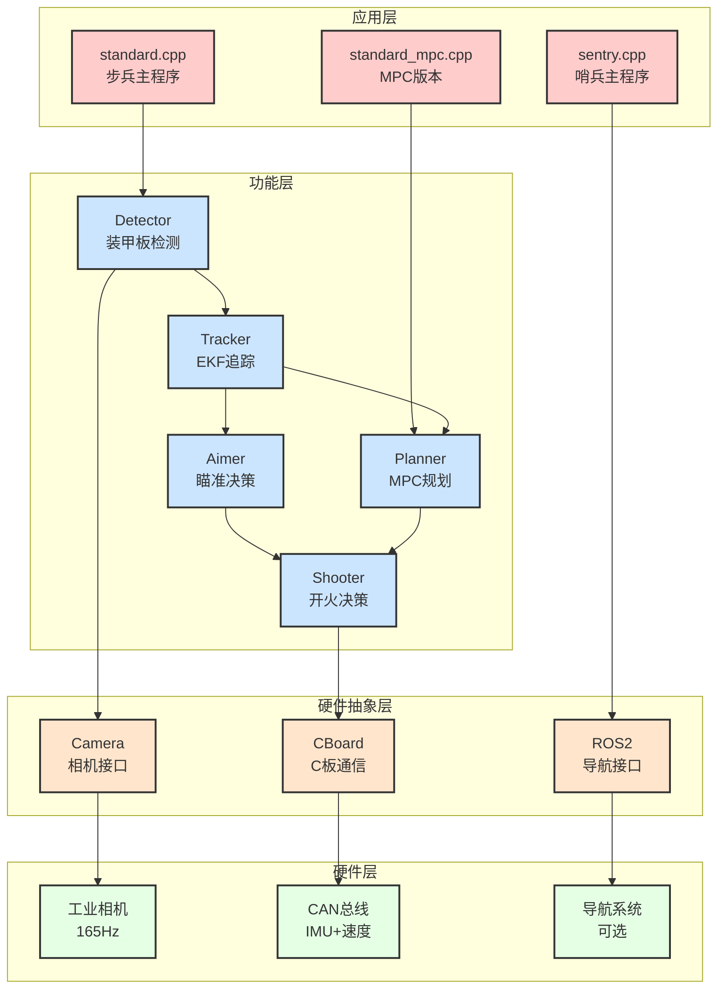

### 3.2 线程模型

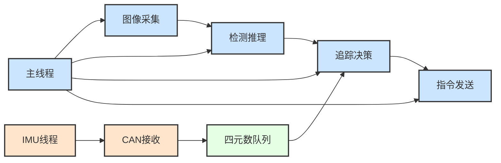

**说明**:
- **主线程**: 图像处理 + 决策控制（串行执行）
- **IMU线程**: CAN总线异步接收，写入线程安全队列
- **同步机制**: 根据图像时间戳查询最近IMU数据

---

## 4. 数据流分析

### 4.1 完整数据流图

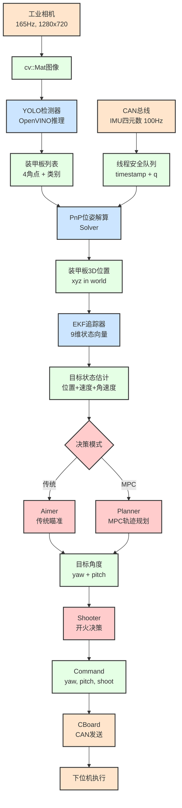

### 4.2 时间同步机制

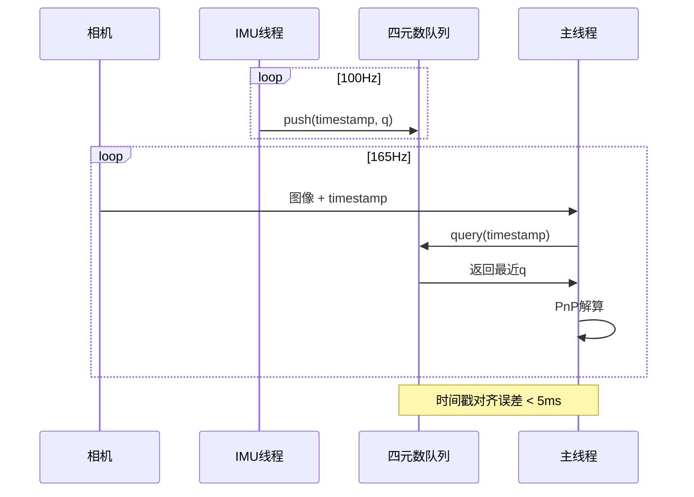

**关键点**:
- IMU数据缓存1秒（100个点）
- 根据图像时间戳查询最近的IMU四元数
- 使用线程安全队列避免数据竞争

---

## 5. 核心模块详解

### 5.1 装甲板检测 (Detector + YOLO)

#### 5.1.1 检测流程

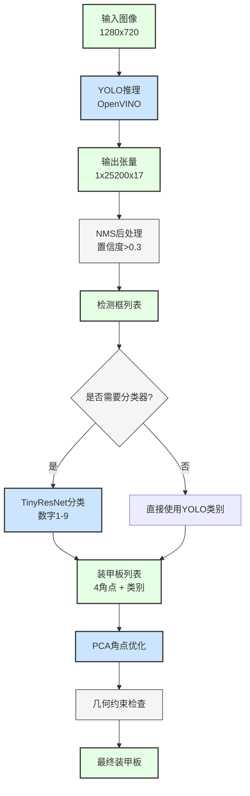

#### 5.1.2 支持的YOLO模型

| 模型 | 输入尺寸 | 参数量 | 推理速度 | 精度 |
|------|---------|--------|---------|------|
| **YOLOv5** | 640x480 | 7.2M | ~100fps | 中 |
| **YOLOv8** | 640x480 | 11.1M | ~80fps | 高 ⭐ |
| **YOLO11** | 640x480 | 9.4M | ~90fps | 高 |

**关键点检测输出**:
- 每个装甲板输出4个角点坐标 (8维)
- 输出类别概率 (9类: 1-9号)
- 总输出维度: 17 (8坐标 + 1置信度 + 8类别概率)

### 5.2 EKF目标追踪 (Tracker)

#### 5.2.1 状态向量 (9维)

```
状态向量 X = [x, vx, y, vy, z, vz, yaw, vyaw, r]

x, y, z:     旋转中心3D位置 (世界坐标系)
vx, vy, vz:  旋转中心速度
yaw:         当前装甲板角度
vyaw:        角速度 (rad/s)
r:           装甲板半径 (旋转中心到装甲板距离)
```

#### 5.2.2 追踪状态机

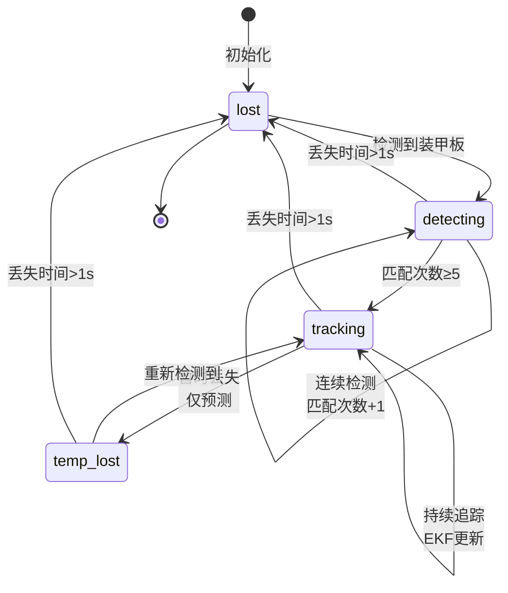

#### 5.2.3 EKF更新流程

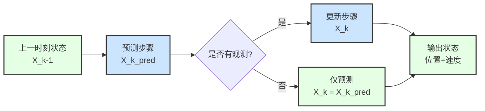

### 5.3 MPC轨迹规划器 (Planner) ⭐

#### 5.3.1 核心思想

**问题**: 传统瞄准直接控制云台指向目标，导致：
- 装甲板切换时云台突变
- 跟随误差大（延迟响应）
- 无法提前减速

**解决**: MPC提前规划1秒轨迹（100个点），考虑：
- 云台最大加速度约束
- 装甲板切换提前减速
- 最小化跟随误差

#### 5.3.2 MPC流程图

```mermaid
graph TB
    A[当前云台状态<br>yaw, pitch, vyaw, vpitch] --> B[未来1秒目标轨迹<br>100个点]
    C[目标状态估计<br>位置+速度] --> B

    B --> D[MPC优化问题<br>TinyMPC]
    D --> E[最小化目标函数]

    E --> F[约束条件]
    F --> G[|a| ≤ a_max<br>最大加速度]
    F --> H[|v| ≤ v_max<br>最大速度]

    D --> I[ADMM求解器<br><1ms]
    I --> J[优化轨迹<br>100个点]

    J --> K[取第1个点<br>作为当前指令]
    K --> L[发送至云台]

    classDef decisionClass fill:#FFCCCC,stroke:#333,stroke-width:2px
    classDef processClass fill:#F5F5F5,stroke:#333,stroke-width:1px
    classDef dataClass fill:#E5FFE5,stroke:#333,stroke-width:2px

    class D,I decisionClass
    class E,F,G,H processClass
    class A,B,C,J,K,L dataClass
```

#### 5.3.3 优化目标

```
最小化:
J = Σ (跟随误差² + 控制增量²)

跟随误差 = 云台角度 - 目标角度
控制增量 = 当前加速度 - 上一时刻加速度

权重:
- 位置误差权重: 1000
- 速度误差权重: 10
- 控制平滑权重: 1
```

#### 5.3.4 性能对比

| 指标 | 传统决策 | MPC规划 |
|------|---------|---------|
| **跟随误差** | ~0.05rad | **<0.01rad** |
| **切换平滑度** | 突变 | 提前减速 |
| **计算时间** | <0.1ms | <1ms |
| **实时性** | 100Hz | 100Hz |

### 5.4 开火决策 (Shooter)

#### 5.4.1 开火条件

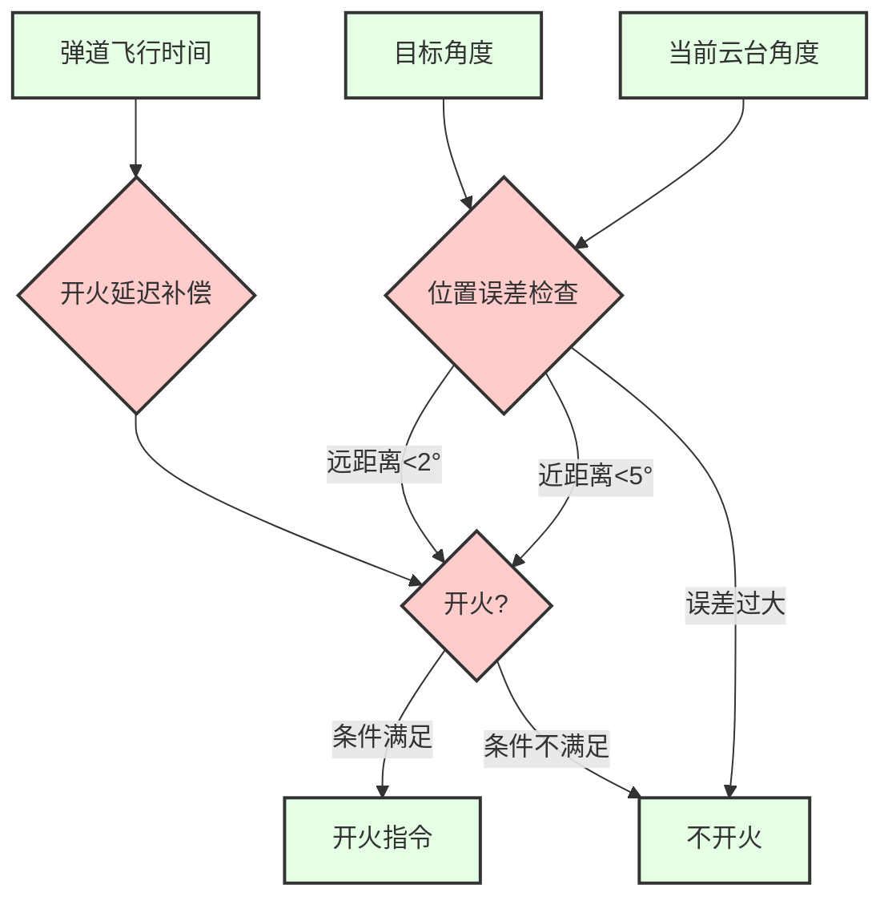

#### 5.4.2 MPC版本开火逻辑

**关键改进**: 查询未来时刻轨迹误差

```cpp
// 传统方法: 检查当前误差
if (current_error < threshold) shoot();

// MPC方法: 检查飞行时间后的误差
double t_fly = distance / bullet_speed;  // 弹道飞行时间
double t_delay = 0.026;  // 开火延迟 (26ms)
double t_future = t_fly + t_delay;

// 在规划的100个点中找到t_future对应的点
int idx = t_future / 0.01;  // 每个点间隔10ms
if (trajectory[idx].error < threshold) shoot();
```

**优势**: 考虑未来误差，提高命中率

---

## 6. 输入输出接口

### 6.1 输入接口

#### 6.1.1 相机输入

```cpp
// Camera统一接口
class Camera {
public:
    virtual bool read(cv::Mat& img, double& timestamp) = 0;
};

// 海康工业相机实现
class HikRobot : public Camera {
    // 165Hz, 1280x720, 触发模式
};
```

**配置参数**:
```yaml
camera:
  exposure: 5000           # 曝光时间 (μs)
  gain: 12.0              # 增益 (dB)
  frame_rate: 165         # 帧率 (Hz)
  width: 1280
  height: 720
```

#### 6.1.2 IMU输入

```cpp
// CAN ID 0x01: IMU四元数
struct ImuData {
    double timestamp;           // 时间戳
    Eigen::Quaterniond q;      // 四元数
};

// 接收频率: 100Hz
// 缓存大小: 100个点 (1秒)
```

#### 6.1.3 子弹速度输入

```cpp
// CAN ID 0x110: 子弹速度
double bullet_speed;  // m/s

// 更新频率: ~10Hz
// 用于弹道计算
```

### 6.2 输出接口

#### 6.2.1 控制指令

```cpp
struct Command {
    bool control;      // 是否接管云台
    bool shoot;        // 是否开火
    double yaw;        // 目标yaw角 (rad)
    double pitch;      // 目标pitch角 (rad)
};

// 发送频率: ~100Hz
// 通信方式: CAN ID 0xFF
```

#### 6.2.2 ROS2接口 (可选)

**发布话题**:
```cpp
// 发布目标位置给导航 (哨兵专用)
sp_msgs::TargetPosition target_pos;
target_pos.x = target.x;
target_pos.y = target.y;
target_pos.z = target.z;
```

**订阅话题**:
```cpp
// 订阅敌方状态 (哨兵专用)
sp_msgs::EnemyStatus enemy_status;
// 用于决策是否切换目标
```

### 6.3 调试输出

#### 6.3.1 PlotJuggler可视化

```cpp
// 输出JSON格式调试数据
{
    "timestamp": 1234567890.123,
    "target_x": 1.5,
    "target_y": 2.3,
    "target_z": 0.5,
    "yaw_error": 0.01,
    "pitch_error": 0.005,
    "tracking_state": 2,
    "mpc_cost": 123.45
}
```

**实时绘图**:
- 目标位置轨迹
- 跟随误差曲线
- MPC代价函数
- 云台角度/速度/加速度

---

## 7. 关键算法

### 7.1 PnP位姿解算

#### 7.1.1 坐标变换链

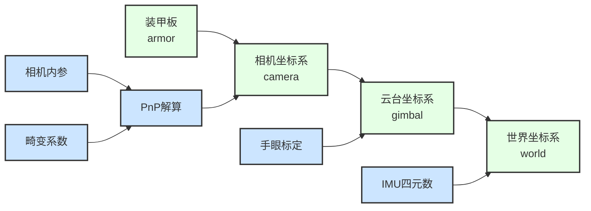

#### 7.1.2 实现代码结构

```cpp
// 1. PnP求解装甲板在相机坐标系中的位置
cv::solvePnP(object_points, image_points,
             camera_matrix, dist_coeffs,
             rvec, tvec);

// 2. 相机坐标系 → 云台坐标系 (手眼标定矩阵)
Eigen::Vector3d pos_gimbal = T_gimbal_camera * pos_camera;

// 3. 云台坐标系 → 世界坐标系 (IMU四元数)
Eigen::Vector3d pos_world = imu_q.toRotationMatrix() * pos_gimbal;
```

### 7.2 弹道补偿

#### 7.2.1 弹道模型

```
考虑重力和空气阻力的弹道方程:

d²x/dt² = -k * v_x * |v|
d²y/dt² = -k * v_y * |v|
d²z/dt² = -g - k * v_z * |v|

k = 空气阻力系数
g = 9.8 m/s²
```

#### 7.2.2 求解流程

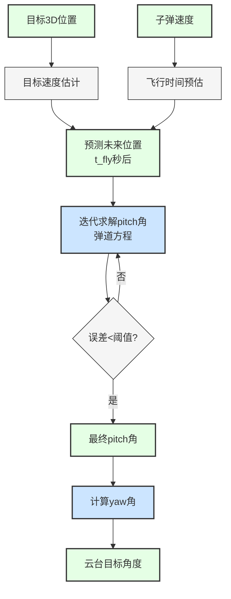

### 7.3 TinyMPC求解器

#### 7.3.1 ADMM算法

```
Alternating Direction Method of Multipliers (ADMM)

迭代步骤:
1. x更新: 最小化二次型 (状态更新)
2. z更新: 投影到约束集 (约束满足)
3. λ更新: 拉格朗日乘子更新 (对偶变量)

收敛判据:
- 原始残差 < ε_primal
- 对偶残差 < ε_dual
- 最大迭代次数: 100
```

#### 7.3.2 性能特点

- **求解时间**: < 1ms (100个时间步)
- **内存占用**: < 1MB
- **收敛速度**: 10-20次迭代
- **实时性**: 支持100Hz控制频率

---

## 8. 与现有系统对比

### 8.1 架构对比

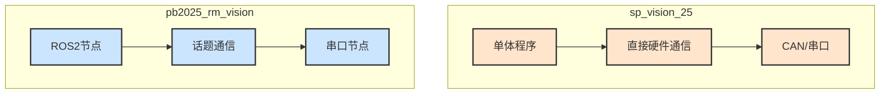

### 8.2 功能对比

| 功能模块 | sp_vision_25 | pb2025_rm_vision | 优势方 |
|---------|--------------|------------------|-------|
| **装甲板检测** | YOLO (v5/v8/11) | OpenCV传统 / OpenVINO | sp_vision_25 |
| **目标追踪** | EKF (9维整车) | EKF (整车模型) | 相同 |
| **决策算法** | **MPC轨迹规划** ⭐ | 传统分段决策 | **sp_vision_25** |
| **弹道解算** | 重力+阻力 | 重力+阻力 | 相同 |
| **参数配置** | YAML文件 | ROS参数服务器 | 各有优势 |
| **调试工具** | PlotJuggler | RViz2 | 各有优势 |
| **系统集成** | 手动管理 | ROS2自动化 | pb2025 |
| **哨兵功能** | **全向感知+双枪** | 未实现 | **sp_vision_25** |

### 8.3 性能对比

| 指标 | sp_vision_25 | pb2025_rm_vision |
|------|--------------|------------------|
| **检测速度** | ~100fps (OpenVINO) | ~100fps (OpenVINO) |
| **追踪精度** | **<0.01rad** (MPC) | ~0.05rad |
| **系统延迟** | ~20ms | ~30ms (ROS开销) |
| **部署难度** | 简单 (单可执行文件) | 中等 (ROS工作空间) |
| **学习曲线** | 陡峭 (需理解MPC) | 平缓 (ROS标准) |

### 8.4 代码对比

#### 8.4.1 主程序结构

**sp_vision_25**:
```cpp
int main() {
    // 1. 初始化硬件
    Camera camera;
    CBoard cboard;

    // 2. 初始化算法
    YoloDetector detector;
    Tracker tracker;
    Planner planner;  // MPC规划器
    Shooter shooter;

    // 3. 主循环
    while (true) {
        camera.read(img, timestamp);
        auto armors = detector.detect(img);
        auto target = tracker.track(armors, timestamp);
        auto trajectory = planner.plan(target);  // MPC
        auto command = shooter.decide(trajectory);
        cboard.send(command);
    }
}
```

**pb2025_rm_vision**:
```cpp
// detector_node.cpp
void image_callback(const sensor_msgs::msg::Image::SharedPtr msg) {
    auto armors = detect(msg);
    armors_pub_->publish(armors);
}

// tracker_node.cpp
void armors_callback(const Armors::SharedPtr msg) {
    auto target = track(msg);
    target_pub_->publish(target);
}

// projectile_node.cpp
void target_callback(const Target::SharedPtr msg) {
    auto command = calculate_gimbal(msg);  // 传统决策
    cmd_pub_->publish(command);
}
```

**对比**:
- sp_vision_25: **单线程串行处理**，延迟低
- pb2025_rm_vision: **多节点并行**，解耦好但延迟稍高

#### 8.4.2 决策对比

**传统决策** (pb2025):
```cpp
// 直接瞄准目标
double yaw_target = atan2(target.y, target.x);
double pitch_target = atan2(target.z,
                             sqrt(target.x² + target.y²));

// 开火判断
if (abs(yaw_current - yaw_target) < threshold) {
    shoot();
}
```

**MPC决策** (sp_vision_25):
```cpp
// 规划未来1秒轨迹 (100个点)
auto trajectory = mpc.plan(current_state, target_state);

// 取第1个点作为控制指令
Command cmd;
cmd.yaw = trajectory[0].yaw;
cmd.pitch = trajectory[0].pitch;

// 查询未来时刻误差决定是否开火
int idx = (t_fly + t_delay) / 0.01;
if (trajectory[idx].error < threshold) {
    cmd.shoot = true;
}
```

**关键差异**:
- 传统: **反应式**，看到误差小就开火
- MPC: **预测式**，知道未来误差小才开火

---

## 9. 总结与建议

### 9.1 sp_vision_25 的优势

1. ⭐ **MPC轨迹规划器**
   - 理论先进，实现完善
   - 跟随误差显著降低（<0.01rad vs ~0.05rad）
   - 装甲板切换平滑，无突变

2. 🚀 **工程完善度高**
   - 标定工具完整（相机+手眼）
   - 测试程序丰富
   - 调试可视化完善

3. 🎯 **部署简单**
   - 单可执行文件
   - 无ROS依赖
   - 配置文件清晰

4. 📊 **实战验证**
   - 国赛命中率39.6%
   - 击杀时间8-10s
   - 稳定性好

### 9.2 可借鉴的技术点

1. **MPC算法**
   - 核心思想：提前规划，考虑约束
   - TinyMPC求解器轻量高效
   - 可移植到ROS系统

2. **多YOLO支持**
   - 模型切换机制
   - OpenVINO统一接口
   - 便于算法迭代

3. **哨兵全向感知**
   - 多相机融合决策
   - 双枪协同控制
   - ROS2导航接口

### 9.3 与pb2025系统的集成建议

详见下一章：[视觉系统替换方案](./10_视觉系统替换方案.md)

---

## 下一步

- 📖 [视觉系统替换方案](./10_视觉系统替换方案.md) - 了解如何集成sp_vision_25
- 📖 [感知层详解](./03_感知层.md) - 对比现有视觉系统
- 📖 [参数配置指南](./07_参数配置.md) - 参数调优参考

---

[← 上一章：运行与调试](./08_运行与调试.md) | [返回主页](../README.md) | [下一章：视觉系统替换方案 →](./10_视觉系统替换方案.md)
