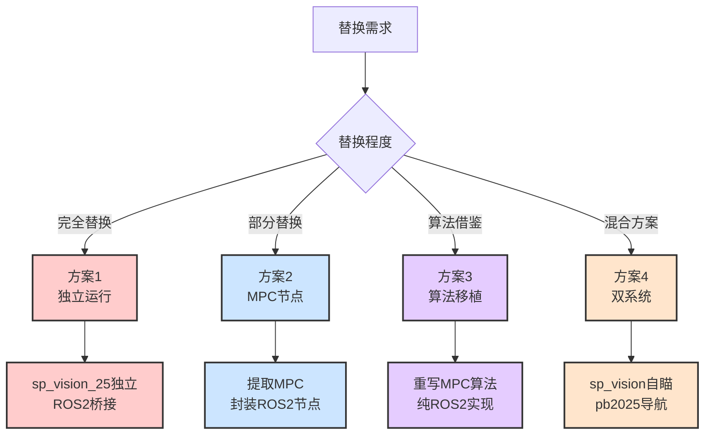
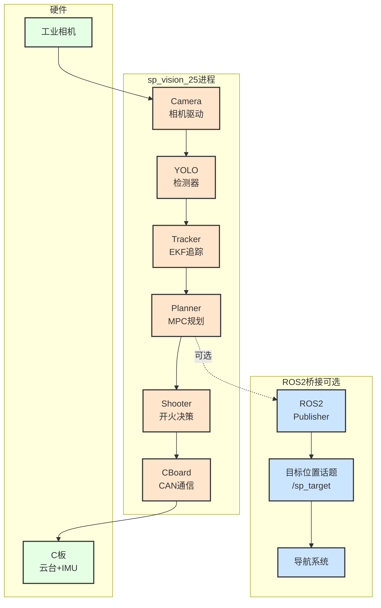
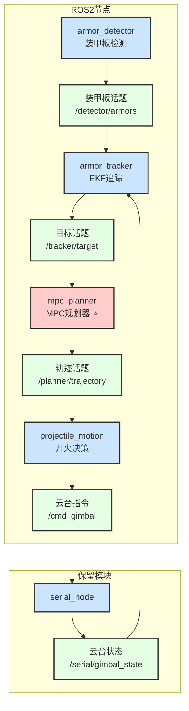
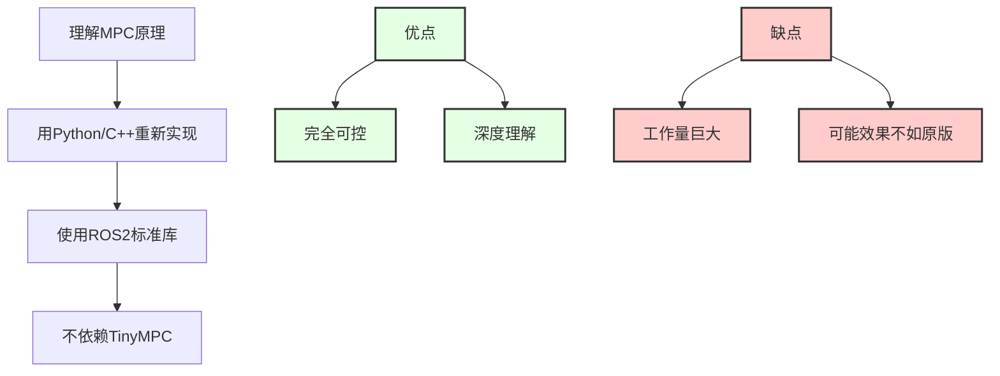
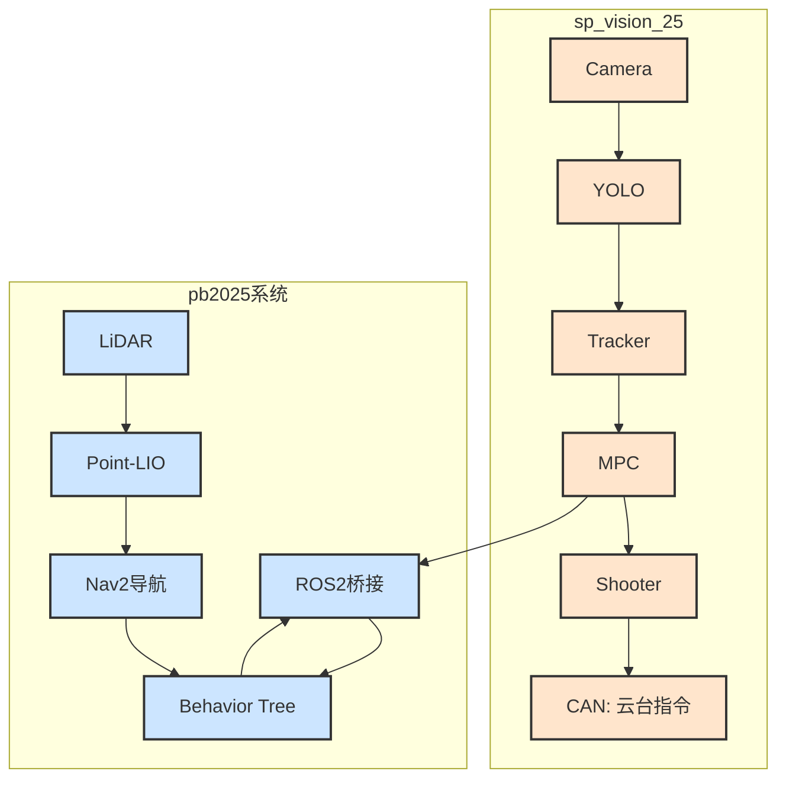
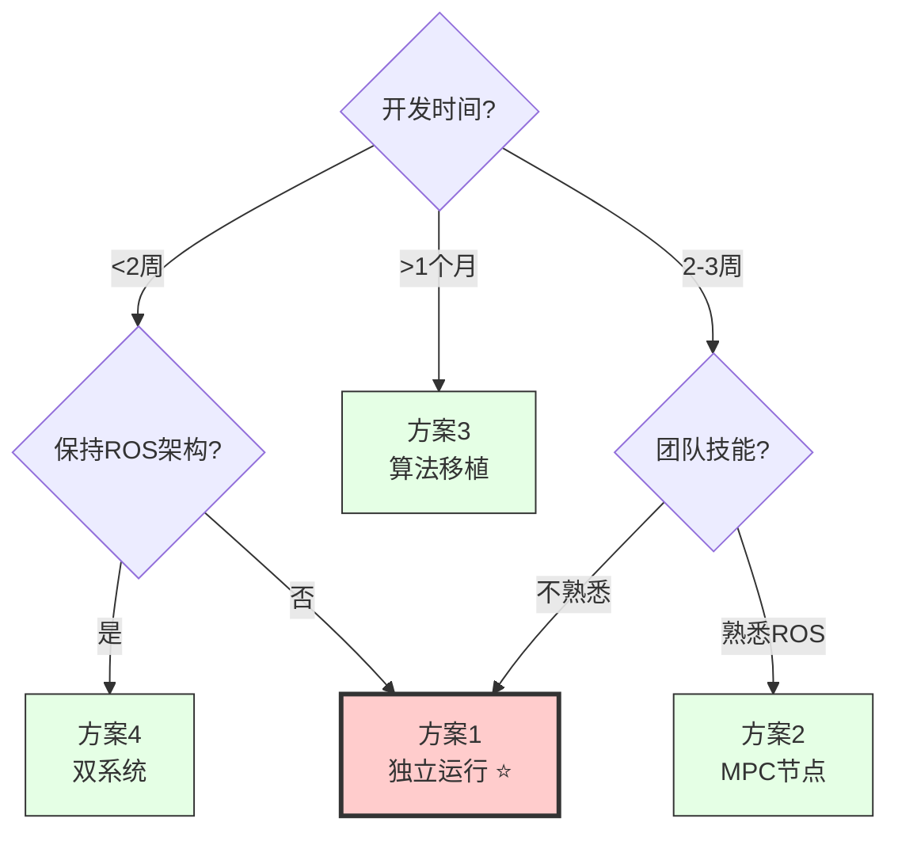
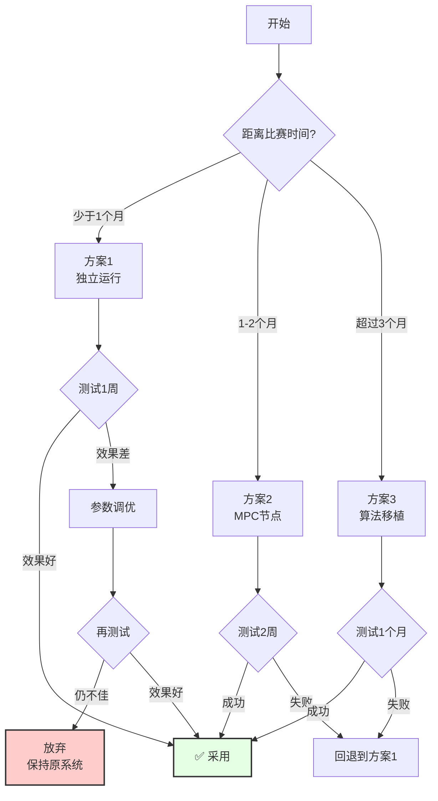

# 10. 视觉系统替换方案

[← 上一章：sp_vision_25分析](./09_sp_vision_25分析.md) | [返回主页](../README.md)

---

## 目录
- [1. 替换需求分析](#1-替换需求分析)
- [2. 方案概览](#2-方案概览)
- [3. 方案详解](#3-方案详解)
- [4. 方案对比](#4-方案对比)
- [5. 推荐方案](#5-推荐方案)
- [6. 实施路线图](#6-实施路线图)

---

## 1. 替换需求分析

### 1.1 现有系统问题

从你的描述来看，现有pb2025视觉系统存在以下问题：

| 问题 | 现象 | 根本原因 |
|------|------|---------|
| **跟丢频繁** | 目标丢失率高 | 追踪算法稳定性不足 |
| **打不中** | 命中率低 | 跟随误差大，决策延迟 |
| **切换突变** | 装甲板切换时云台抖动 | 无轨迹规划，直接跳变 |

### 1.2 sp_vision_25 的优势

| 优势 | 解决的问题 |
|------|----------|
| **MPC轨迹规划** | 跟随误差<0.01rad，切换平滑 |
| **多YOLO模型** | 检测鲁棒性更好 |
| **完整工程** | 标定、测试、调试工具齐全 |
| **实战验证** | 国赛命中率39.6% |

### 1.3 替换目标

✅ **提高命中率**: 从现状提升至35%+
✅ **减少跟丢**: 追踪稳定性提升
✅ **平滑控制**: 消除切换抖动
✅ **保持集成**: 与导航、决策系统兼容

---

## 2. 方案概览

### 2.1 四种替换方案



### 2.2 方案速览表

| 方案 | 复杂度 | 改动量 | 效果 | 风险 | 推荐度 |
|------|-------|-------|------|------|--------|
| **方案1: 独立运行** | 低 | 小 | ⭐⭐⭐⭐⭐ | 低 | ⭐⭐⭐⭐⭐ |
| **方案2: MPC节点** | 中 | 中 | ⭐⭐⭐⭐ | 中 | ⭐⭐⭐⭐ |
| **方案3: 算法移植** | 高 | 大 | ⭐⭐⭐ | 高 | ⭐⭐ |
| **方案4: 双系统** | 低 | 小 | ⭐⭐⭐⭐ | 低 | ⭐⭐⭐ |

---

## 3. 方案详解

### 方案1: 独立运行 + ROS2桥接 ⭐⭐⭐⭐⭐

#### 3.1.1 架构设计



#### 3.1.2 实施步骤

**阶段1: 编译和测试 (1天)**

```bash
# 1. 安装依赖
sudo apt install libopencv-dev libeigen3-dev \
                 libyaml-cpp-dev libspdlog-dev libfmt-dev

# 2. 安装OpenVINO 2024.6
# 参考官方文档

# 3. 编译sp_vision_25
cd testopenvino/sp_vision_25
mkdir build && cd build
cmake .. -DCMAKE_BUILD_TYPE=Release
make -j10

# 4. 测试最小系统
./minimum_vision_system
```

**阶段2: 配置相机和C板 (1-2天)**

```yaml
# configs/sentry.yaml
camera:
  type: hikrobot               # 使用海康相机
  exposure: 5000              # 曝光5ms
  gain: 12.0                  # 增益12dB
  frame_rate: 165             # 165fps

cboard:
  device: /dev/ttyACM0        # C板串口
  baudrate: 115200
  enable_can: true            # 启用CAN
```

**阶段3: 手眼标定 (半天)**

```bash
# 1. 采集标定数据
./calibrate_handeye --capture

# 2. 计算手眼标定矩阵
./calibrate_handeye --solve

# 3. 保存到配置文件
# T_gimbal_camera会写入configs/sentry.yaml
```

**阶段4: 参数调优 (1-2天)**

```yaml
# configs/sentry.yaml
detector:
  model: yolov8                # 选择YOLOv8
  confidence: 0.3              # 置信度阈值
  nms_threshold: 0.45          # NMS阈值

tracker:
  max_match_distance: 0.3      # 最大匹配距离
  lost_time_threshold: 1.0     # 丢失时间阈值

planner:
  max_acceleration: 20.0       # 最大加速度 rad/s²
  max_velocity: 10.0           # 最大速度 rad/s
  horizon: 1.0                 # 规划时域 1秒
```

**阶段5: ROS2桥接 (可选，1天)**

```cpp
// 在sentry.cpp中已实现ROS2接口
ros2_bridge->publish_target(target.x, target.y, target.z);
```

#### 3.1.3 优缺点分析

**优点** ✅:
1. **最小改动**: 现有pb2025系统不需要修改
2. **快速验证**: 1周内可完成测试
3. **低风险**: sp_vision独立运行，不影响其他模块
4. **完整功能**: MPC、多YOLO、全向感知全部可用
5. **易回滚**: 如果效果不好，随时切回原系统

**缺点** ❌:
1. **双系统维护**: 需要维护两套视觉代码
2. **资源占用**: 两个进程同时运行
3. **ROS生态**: 不能直接使用RViz可视化
4. **调试难度**: 需要熟悉非ROS架构

#### 3.1.4 适用场景

✅ 需要快速提升性能
✅ 团队熟悉C++但不熟悉ROS
✅ 希望保留原系统作为备份
✅ 有足够的计算资源

---

### 方案2: 提取MPC封装为ROS2节点 ⭐⭐⭐⭐

#### 3.2.1 架构设计



#### 3.2.2 新节点设计

**mpc_planner_node**:

```cpp
class MpcPlannerNode : public rclcpp::Node {
public:
    MpcPlannerNode() : Node("mpc_planner") {
        // 订阅追踪目标
        target_sub_ = create_subscription<Target>(
            "/tracker/target", 10,
            std::bind(&MpcPlannerNode::target_callback, this, _1));

        // 订阅云台状态
        gimbal_sub_ = create_subscription<JointState>(
            "/serial/gimbal_joint_state", 10,
            std::bind(&MpcPlannerNode::gimbal_callback, this, _1));

        // 发布规划轨迹
        traj_pub_ = create_publisher<Trajectory>(
            "/planner/trajectory", 10);

        // 初始化TinyMPC求解器
        planner_ = std::make_unique<Planner>(params);
    }

private:
    void target_callback(const Target::SharedPtr msg) {
        // 获取当前云台状态
        auto gimbal_state = get_latest_gimbal_state();

        // MPC规划
        auto trajectory = planner_->plan(gimbal_state, *msg);

        // 发布轨迹 (100个点)
        Trajectory traj_msg;
        traj_msg.points = trajectory;
        traj_pub_->publish(traj_msg);
    }

    std::unique_ptr<Planner> planner_;
};
```

#### 3.2.3 实施步骤

**阶段1: 提取MPC核心代码 (2-3天)**

```bash
# 1. 从sp_vision_25提取文件
cp testopenvino/sp_vision_25/tasks/auto_aim/planner/* \
   src/pb2025_rm_vision/mpc_planner/src/

cp testopenvino/sp_vision_25/tasks/auto_aim/planner/tinympc/* \
   src/pb2025_rm_vision/mpc_planner/src/tinympc/

# 2. 创建ROS2包
cd src/pb2025_rm_vision
ros2 pkg create mpc_planner \
  --build-type ament_cmake \
  --dependencies rclcpp auto_aim_interfaces
```

**阶段2: 适配ROS2接口 (2-3天)**

1. 创建Trajectory消息类型
2. 修改Planner类接口
3. 实现ROS2节点封装
4. 编写launch文件

**阶段3: 集成测试 (1-2天)**

```xml
<!-- mpc_vision_launch.py -->
<launch>
    <!-- 原有节点 -->
    <node pkg="armor_detector_opencv" />
    <node pkg="armor_tracker" />

    <!-- 新增MPC规划器 -->
    <node pkg="mpc_planner" name="mpc_planner" />

    <!-- 修改后的射击决策 -->
    <node pkg="projectile_motion" name="projectile_motion">
        <param name="use_mpc" value="true"/>
    </node>
</launch>
```

**阶段4: 参数调优 (1-2天)**

```yaml
mpc_planner:
  ros__parameters:
    horizon: 1.0                    # 规划时域 1秒
    dt: 0.01                        # 时间步长 10ms
    max_acceleration: 20.0          # 最大加速度
    max_velocity: 10.0              # 最大速度
    position_weight: 1000.0         # 位置误差权重
    velocity_weight: 10.0           # 速度误差权重
    control_weight: 1.0             # 控制平滑权重
```

#### 3.2.4 优缺点分析

**优点** ✅:
1. **保持ROS2生态**: 完全集成到现有系统
2. **模块化**: MPC作为独立节点，易于测试
3. **可视化**: 可用RViz显示规划轨迹
4. **统一管理**: colcon统一编译和部署
5. **渐进式**: 可先保留原决策，对比测试

**缺点** ❌:
1. **工作量大**: 需要提取代码并适配接口
2. **依赖复杂**: TinyMPC的Eigen依赖需处理
3. **测试周期长**: 需要充分测试稳定性
4. **维护成本**: 需要理解MPC算法原理

#### 3.2.5 适用场景

✅ 希望保持ROS2架构
✅ 团队熟悉ROS2开发
✅ 需要长期维护和迭代
✅ 有足够的开发时间

---

### 方案3: 算法思想移植 ⭐⭐

#### 3.3.1 架构设计



#### 3.3.2 实施步骤

**阶段1: 学习MPC理论 (1-2周)**
- 阅读论文和sp_vision_25代码
- 理解ADMM求解器原理
- 掌握凸优化基础

**阶段2: 算法实现 (2-3周)**
- 用Python实现MPC（用CVXPY库）
- 或用C++实现（用Eigen库）
- 验证算法正确性

**阶段3: ROS2封装 (1周)**
- 封装为ROS2节点
- 接口设计和测试

**阶段4: 调优和验证 (1-2周)**
- 参数调优
- 性能对比测试

#### 3.3.3 优缺点分析

**优点** ✅:
1. **深度理解**: 完全掌握算法原理
2. **灵活定制**: 可根据需求修改
3. **无黑盒**: 所有代码自己编写

**缺点** ❌:
1. **工作量巨大**: 需要1-2个月
2. **风险高**: 可能实现不正确
3. **性能难保证**: 可能不如原版优化
4. **学习曲线陡**: 需要深厚的数学基础

#### 3.3.4 适用场景

✅ 有充足时间和人力
✅ 团队有优化控制背景
✅ 希望深入理解算法
✅ 需要高度定制

**⚠️ 不推荐**: 对于比赛需求，时间成本太高

---

### 方案4: 双系统混合 ⭐⭐⭐

#### 3.4.1 架构设计



#### 3.4.2 实施方案

**思路**:
- sp_vision_25负责自瞄（检测+追踪+MPC+射击）
- pb2025负责导航和高层决策
- 通过ROS2桥接共享目标信息

**优点** ✅:
1. **各取所长**: 自瞄用sp_vision，导航用pb2025
2. **快速部署**: 两个系统都已成熟
3. **低风险**: 互不干扰

**缺点** ❌:
1. **资源占用**: 两个系统同时运行
2. **集成复杂**: 需要协调通信
3. **维护成本**: 两套代码库

#### 3.4.3 适用场景

✅ 哨兵机器人（需要导航+自瞄）
✅ 有多核处理器
✅ 短期快速部署

---

## 4. 方案对比

### 4.1 综合对比表

| 维度 | 方案1<br>独立运行 | 方案2<br>MPC节点 | 方案3<br>算法移植 | 方案4<br>双系统 |
|------|------------------|-----------------|------------------|----------------|
| **实施难度** | ⭐ 简单 | ⭐⭐⭐ 中等 | ⭐⭐⭐⭐⭐ 困难 | ⭐⭐ 较简单 |
| **开发周期** | 1周 | 2-3周 | 1-2月 | 1-2周 |
| **代码改动** | 极小 | 中等 | 巨大 | 小 |
| **效果保证** | ⭐⭐⭐⭐⭐ | ⭐⭐⭐⭐ | ⭐⭐⭐ | ⭐⭐⭐⭐ |
| **长期维护** | ⭐⭐ | ⭐⭐⭐⭐⭐ | ⭐⭐⭐⭐ | ⭐⭐ |
| **ROS集成** | ❌ | ✅ | ✅ | ✅ |
| **资源占用** | 高 | 低 | 低 | 高 |
| **风险等级** | 低 | 中 | 高 | 低 |

### 4.2 决策树



---

## 5. 推荐方案

### 5.1 最佳推荐: 方案1 (独立运行) ⭐⭐⭐⭐⭐

**理由**:
1. ✅ **最快验证**: 1周内可完成测试，立即看到效果
2. ✅ **风险最低**: sp_vision独立运行，不影响现有系统
3. ✅ **效果最好**: 完整MPC算法，国赛验证过的性能
4. ✅ **易回滚**: 如果不满意，随时切回原系统
5. ✅ **适合比赛**: 快速提升性能，满足比赛需求

**实施路径**:
```
第1天: 编译sp_vision_25，测试最小系统
第2-3天: 配置相机和C板，手眼标定
第4-5天: 参数调优，实际测试
第6-7天: 可选ROS2桥接，与导航集成
```

### 5.2 备选推荐: 方案2 (MPC节点) ⭐⭐⭐⭐

**适用条件**:
- 有2-3周开发时间
- 团队熟悉ROS2和C++
- 希望长期维护一套代码

**优势**:
- 完全融入ROS2生态
- 便于后续迭代和优化
- 统一的开发和调试流程

---

## 6. 实施路线图

### 6.1 短期方案 (1-2周): 方案1独立运行

#### 第一周

**Day 1-2: 环境搭建**
```bash
# 安装OpenVINO 2024.6
wget https://storage.openvinotoolkit.org/...
# 按官方文档安装

# 编译sp_vision_25
cd testopenvino/sp_vision_25
mkdir build && cd build
cmake .. -DCMAKE_BUILD_TYPE=Release
make -j10
```

**Day 3-4: 硬件配置**
- 配置海康相机参数
- 配置C板串口和CAN
- 手眼标定

**Day 5-6: 参数调优**
- 调整检测器参数
- 调整追踪器参数
- 调整MPC规划器参数

**Day 7: 实战测试**
- 对比原系统命中率
- 记录性能数据
- 决定是否采用

#### 风险预案

| 风险 | 应对措施 |
|------|---------|
| **编译失败** | 检查依赖版本，参考sp_vision文档 |
| **相机不工作** | 确认SDK安装，检查USB3.0 |
| **标定精度差** | 多次采集，使用更多标定板姿态 |
| **效果不佳** | 调整参数，或切回原系统 |

### 6.2 中期方案 (2-4周): 方案2 MPC节点

#### 第一阶段 (Week 1): 代码提取

```bash
# 创建mpc_planner包
ros2 pkg create mpc_planner \
  --build-type ament_cmake \
  --dependencies rclcpp auto_aim_interfaces

# 提取MPC核心代码
cp -r testopenvino/sp_vision_25/tasks/auto_aim/planner/* \
      src/pb2025_rm_vision/mpc_planner/src/

# 提取TinyMPC求解器
cp -r testopenvino/sp_vision_25/tasks/auto_aim/planner/tinympc \
      src/pb2025_rm_vision/mpc_planner/src/
```

#### 第二阶段 (Week 2): 接口适配

1. 创建Trajectory消息类型:
```bash
cd src/interfaces/auto_aim_interfaces
# 添加msg/Trajectory.msg
```

2. 实现ROS2节点:
```cpp
// mpc_planner_node.cpp
class MpcPlannerNode : public rclcpp::Node {
    // 实现订阅、发布和MPC调用
};
```

3. 编写launch文件:
```python
# mpc_vision_launch.py
from launch import LaunchDescription
from launch_ros.actions import Node

def generate_launch_description():
    return LaunchDescription([
        Node(package='armor_detector_opencv'),
        Node(package='armor_tracker'),
        Node(package='mpc_planner'),  # 新增
        Node(package='projectile_motion'),
    ])
```

#### 第三阶段 (Week 3): 集成测试

- 编译并测试独立节点
- 集成到视觉系统
- 使用rosbag测试
- 实际硬件测试

#### 第四阶段 (Week 4): 优化和文档

- 参数调优
- 性能对比测试
- 编写使用文档
- 代码注释完善

### 6.3 长期方案 (2-3个月): 方案3 算法移植

**不推荐**，除非有以下需求:
- 深入研究MPC算法
- 需要高度定制
- 有充足的时间和人力

### 6.4 实施决策流程



---

## 7. 总结与建议

### 7.1 核心建议

**对于比赛需求，强烈推荐方案1（独立运行）**:

1. ✅ **最快见效**: 1周内完成，立即提升性能
2. ✅ **风险可控**: 不影响现有系统，随时可回滚
3. ✅ **效果保证**: 国赛验证，命中率39.6%
4. ✅ **学习成本低**: 按文档配置即可，无需深入理解

### 7.2 实施建议

**Week 1**: 快速验证方案1
- 如果效果好 → 直接采用
- 如果效果不佳 → 分析原因，调整参数

**Week 2-3** (可选): 长期考虑方案2
- 如果有时间 → 开始提取MPC节点
- 如果比赛临近 → 继续优化方案1

### 7.3 关键成功因素

1. **手眼标定精度**: 决定系统基线性能
2. **参数调优**: 根据实际场地调整
3. **硬件性能**: 确保相机、C板正常工作
4. **测试验证**: 充分的实战测试

### 7.4 风险管理

**保留原系统**:
- 保持pb2025视觉系统可用
- 随时可切回备用
- 两套系统并行测试

**渐进式替换**:
- 先在测试环境验证
- 再在训练中使用
- 最后在正式比赛采用

---

## 8. 参考资料

### 8.1 sp_vision_25 文档

- **项目README**: `testopenvino/sp_vision_25/README.md`
- **配置说明**: `testopenvino/sp_vision_25/configs/`
- **代码注释**: 源码中有详细注释

### 8.2 相关文档

- [sp_vision_25分析](./09_sp_vision_25分析.md) - 详细技术分析
- [感知层详解](./03_感知层.md) - 现有视觉系统
- [运行与调试](./08_运行与调试.md) - 调试方法

### 8.3 技术论文

- MPC轨迹规划理论
- TinyMPC: ADMM求解器
- YOLO目标检测算法

---

## 下一步

现在你可以：

1. **立即行动**: 按照方案1快速验证效果
2. **深入研究**: 阅读sp_vision_25源码和论文
3. **团队讨论**: 根据实际情况选择合适方案
4. **制定计划**: 确定时间表和责任人

**祝你成功提升视觉系统性能！** 🎯

---

[← 上一章：sp_vision_25分析](./09_sp_vision_25分析.md) | [返回主页](../README.md)
