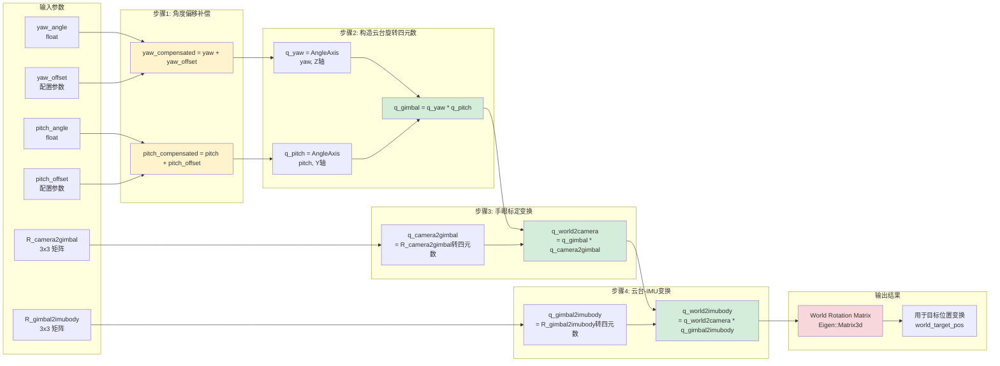
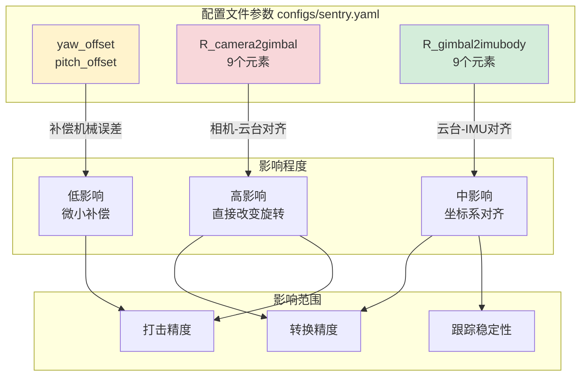
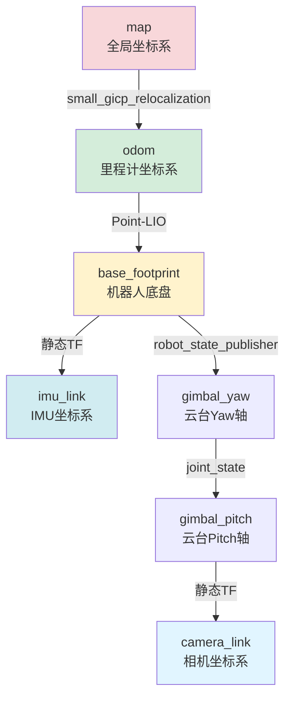
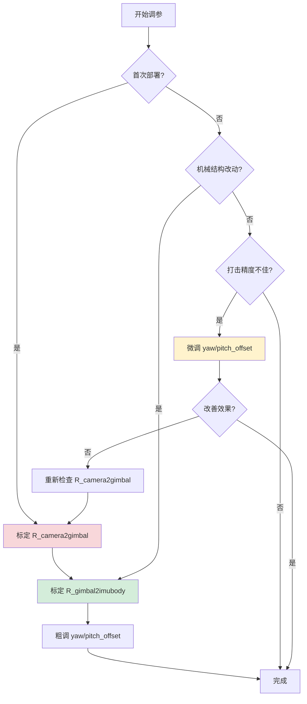
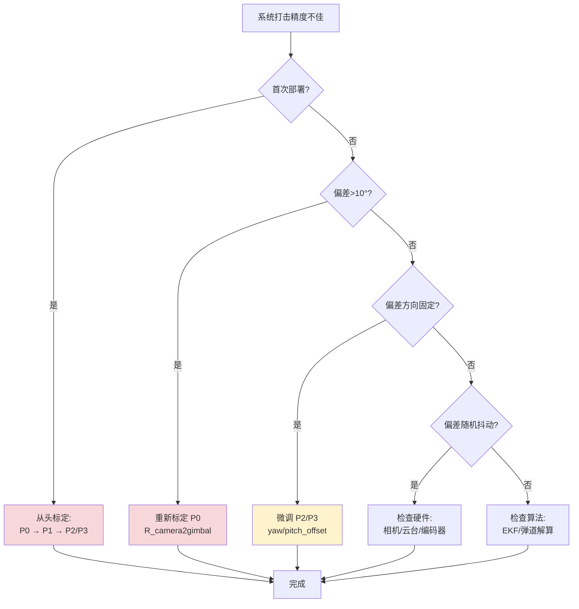

# 四元数转换与参数调优指南

> **文档版本**: v1.0
> **最后更新**: 2025-12-15
> **适用系统**: sp_vision_25 高性能视觉系统
> **作者**: SMBU PolarBear Robotics Team

---

## 📋 目录

### 第一部分：理论基础与流程详解

1. [文档概述](#1-文档概述)
   - 1.1 [文档目的](#11-文档目的)
   - 1.2 [适用场景](#12-适用场景)
   - 1.3 [前置知识要求](#13-前置知识要求)
   - 1.4 [阅读建议](#14-阅读建议)

2. [数据流程图](#2-数据流程图)
   - 2.1 [整体数据流概览](#21-整体数据流概览)
   - 2.2 [四元数转换流程](#22-四元数转换流程)
   - 2.3 [坐标变换链路](#23-坐标变换链路)
   - 2.4 [参数影响范围](#24-参数影响范围)

3. [转换过程详细说明](#3-转换过程详细说明)
   - 3.1 [输入数据源](#31-输入数据源)
   - 3.2 [转换步骤拆解](#32-转换步骤拆解)
   - 3.3 [关键数据结构](#33-关键数据结构)
   - 3.4 [输出结果说明](#34-输出结果说明)

4. [坐标系统详解](#4-坐标系统详解)
   - 4.1 [涉及的坐标系](#41-涉及的坐标系)
   - 4.2 [坐标系关系图](#42-坐标系关系图)
   - 4.3 [坐标系转换矩阵](#43-坐标系转换矩阵)
   - 4.4 [右手坐标系规则](#44-右手坐标系规则)

5. [可调参数详细指南](#5-可调参数详细指南)
   - 5.1 [参数分类](#51-参数分类)
   - 5.2 [手眼标定参数](#52-手眼标定参数)
   - 5.3 [云台-IMU参数](#53-云台-imu参数)
   - 5.4 [偏移量参数](#54-偏移量参数)
   - 5.5 [参数优先级](#55-参数优先级)

### 第二部分：实践与优化（见下个文档部分）

6. 数学公式与推导
7. 实践调参指南
8. 代码示例与调试
9. 常见问题与故障排查
10. 与传统方案对比
11. 附录与参考资料

---

## 1. 文档概述

### 1.1 文档目的

本文档旨在详细说明 **sp_vision_25** 高性能视觉系统中，从云台关节角度到世界坐标系的四元数转换流程。主要目标包括：

1. **理解转换流程**：完整描述从 `/serial/gimbal_joint_state` 到世界坐标系旋转矩阵的全过程
2. **掌握参数作用**：详细说明每个可调参数对转换结果的影响
3. **指导参数调优**：提供系统化的调参方法和实践经验
4. **解决实际问题**：针对常见的转换错误提供诊断和修复方案

### 1.2 适用场景

本文档适用于以下工作场景：

- **系统集成阶段**：首次部署 sp_vision_25，需要进行手眼标定和参数配置
- **精度调优阶段**：系统已运行但打击精度不理想，需要微调转换参数
- **故障排查阶段**：出现坐标系错误、旋转异常等问题，需要定位参数配置问题
- **系统维护阶段**：云台机械结构调整后，需要重新校准参数
- **算法研究阶段**：深入理解坐标变换算法，进行算法优化

### 1.3 前置知识要求

阅读本文档需要具备以下基础知识：

**必需知识**：
- ROS2 基础：话题、消息类型、坐标变换（TF2）
- 线性代数：向量、矩阵、旋转矩阵基本概念
- C++ 编程：能够阅读和修改 sp_vision_25 源代码

**推荐知识**（有助于深入理解）：
- 四元数数学原理：四元数表示旋转的优势和运算规则
- Eigen 库使用：矩阵运算、四元数操作的 C++ 实现
- 机器人学基础：DH 参数、手眼标定原理
- 计算机视觉：相机成像模型、坐标系转换

### 1.4 阅读建议

**根据不同需求选择阅读路径**：

| 用户类型 | 推荐阅读顺序 | 重点章节 |
|---------|------------|---------|
| **初次集成用户** | 1→2→3→5→7 | 流程图、参数详解、实践调参 |
| **调参优化用户** | 5→7→9 | 参数详解、实践调参、故障排查 |
| **算法研究用户** | 全部顺序阅读 | 数学公式、代码示例 |
| **故障排查用户** | 9→4→5 | 故障排查、坐标系统、参数详解 |

**符号约定**：
- 📌 **关键概念**：核心知识点，必须理解
- ⚙️ **可调参数**：需要根据实际情况调整的参数
- ⚠️ **注意事项**：容易出错的地方，特别注意
- 💡 **最佳实践**：经过验证的推荐方法
- 🔧 **调试技巧**：实用的调试和验证方法

---

## 2. 数据流程图

### 2.1 整体数据流概览

下图展示了从串口接收云台关节状态到最终发布目标位置的完整数据流：

```mermaid
graph TB
    subgraph "硬件接口层"
        A[STM32 嵌入式系统] -->|串口通信| B[standard_robot_pp_ros2]
        B -->|发布| C[/serial/gimbal_joint_state<br/>JointState消息]
    end

    subgraph "sp_vision_25 核心处理"
        C --> D[SentryRos2::jointStateCallback]
        D -->|提取角度| E[yaw_angle, pitch_angle]
        E -->|偏移量补偿| F[yaw + yaw_offset<br/>pitch + pitch_offset]

        F --> G[构造四元数<br/>Eigen::Quaterniond]

        H[R_camera2gimbal<br/>手眼标定矩阵] --> G
        I[R_gimbal2imubody<br/>云台-IMU关系] --> G

        G --> J[World Rotation Matrix<br/>世界坐标系旋转矩阵]

        J --> K[Aimer::aim<br/>弹道解算器]
        L[EKF Tracker<br/>目标跟踪器] --> K

        K --> M[Gimbal Command<br/>云台控制指令]
        M --> N[/cmd_gimbal]
        M --> O[/cmd_shoot]
    end

    subgraph "输出层"
        N --> P[串口控制器]
        O --> P
        P --> Q[云台电机执行]
    end

    style C fill:#e1f5ff
    style G fill:#fff3cd
    style J fill:#d4edda
    style M fill:#f8d7da
```

**关键数据节点说明**：

1. **输入节点** (`/serial/gimbal_joint_state`):
   - 消息类型：`sensor_msgs/msg/JointState`
   - 频率：~100 Hz
   - 内容：`position[0]` = yaw角度（rad），`position[1]` = pitch角度（rad）

2. **转换中心** (四元数构造):
   - 输入：关节角度 + 标定矩阵 + 偏移量
   - 输出：世界坐标系旋转矩阵（Eigen::Matrix3d）

3. **输出节点** (`/cmd_gimbal`):
   - 消息类型：`pb_rm_interfaces/msg/GimbalCmd`
   - 频率：~100 Hz
   - 内容：目标 yaw/pitch 角度或角速度

### 2.2 四元数转换流程

详细展示四元数转换的内部步骤：



**步骤时序说明**：

| 步骤 | 操作 | 输入 | 输出 | 代码位置 |
|-----|------|------|------|---------|
| 0 | 接收关节状态 | ROS消息 | yaw, pitch (rad) | `sentry_ros2.cpp:163` |
| 1 | 偏移量补偿 | 原始角度 + offset | 补偿后角度 | `sentry_ros2.cpp:167-168` |
| 2 | 构造云台旋转 | 补偿角度 | q_gimbal | `sentry_ros2.cpp:171-173` |
| 3 | 手眼标定变换 | q_gimbal + R_c2g | q_world2camera | `sentry_ros2.cpp:176-177` |
| 4 | 云台-IMU变换 | q_w2c + R_g2i | q_world2imubody | `sentry_ros2.cpp:180-182` |
| 5 | 转换为旋转矩阵 | q_world2imubody | world_R | `sentry_ros2.cpp:185` |

### 2.3 坐标变换链路

展示从相机坐标系到世界坐标系的完整变换链：

```mermaid
graph TD
    subgraph "相机坐标系 Camera Frame"
        A[检测到的装甲板位置<br/>camera_target_pos<br/>X轴: 相机光轴向前<br/>Y轴: 相机水平向右<br/>Z轴: 相机竖直向下]
    end

    subgraph "云台坐标系 Gimbal Frame"
        B[云台参考系<br/>gimbal_frame<br/>Yaw轴: 竖直向上<br/>Pitch轴: 水平向右]
    end

    subgraph "IMU坐标系 IMU Body Frame"
        C[IMU测量参考系<br/>imubody_frame<br/>X轴: 机器人前方<br/>Y轴: 机器人左侧<br/>Z轴: 机器人上方]
    end

    subgraph "世界坐标系 World Frame"
        D[导航参考系<br/>world_frame<br/>X轴: 地图东向<br/>Y轴: 地图北向<br/>Z轴: 重力反向]
    end

    A -->|R_camera2gimbal<br/>手眼标定矩阵| B
    B -->|R_gimbal2imubody<br/>安装关系矩阵| C
    C -->|World Rotation Matrix<br/>四元数转换结果| D

    E[/serial/gimbal_joint_state<br/>yaw, pitch角度] -.->|影响旋转| B
    F[yaw_offset<br/>pitch_offset] -.->|补偿误差| E

    style A fill:#e1f5ff
    style B fill:#fff3cd
    style C fill:#d4edda
    style D fill:#f8d7da
```

**坐标系变换数学表达式**：

```
world_target_pos = world_R * (R_gimbal2imubody * (R_camera2gimbal * camera_target_pos))
```

其中：
- `camera_target_pos`: 相机坐标系中的目标位置（来自视觉检测）
- `R_camera2gimbal`: 手眼标定矩阵（固定参数）
- `R_gimbal2imubody`: 云台到IMU的旋转矩阵（固定参数）
- `world_R`: 世界坐标系旋转矩阵（由云台角度实时计算）
- `world_target_pos`: 世界坐标系中的目标位置（最终输出）

### 2.4 参数影响范围

下图展示各参数对系统的影响范围和强度：



**参数影响优先级**：

| 优先级 | 参数名称 | 影响范围 | 调整频率 | 调整难度 |
|--------|---------|---------|---------|---------|
| 🔴 **P0** | `R_camera2gimbal` | 全局旋转变换 | 仅安装时 | ⭐⭐⭐⭐⭐ 极难 |
| 🟠 **P1** | `R_gimbal2imubody` | IMU坐标对齐 | 机械改动时 | ⭐⭐⭐⭐ 较难 |
| 🟡 **P2** | `yaw_offset` | Yaw轴补偿 | 每次标定 | ⭐⭐ 简单 |
| 🟢 **P3** | `pitch_offset` | Pitch轴补偿 | 每次标定 | ⭐⭐ 简单 |

**💡 最佳实践建议**：
1. 首次部署时，按优先级从 P0→P3 依次标定
2. 日常调优时，仅调整 P2、P3 偏移量参数
3. 机械结构改动后，必须重新标定 P0、P1

---

## 3. 转换过程详细说明

### 3.1 输入数据源

四元数转换的输入数据来自多个源头，需要正确配置和验证。

#### 3.1.1 云台关节状态（实时输入）

**数据来源**：`/serial/gimbal_joint_state` 话题

```cpp
// 消息类型定义
sensor_msgs::msg::JointState {
  std_msgs/Header header
  string[] name            // ["yaw_joint", "pitch_joint"]
  float64[] position       // [yaw_rad, pitch_rad]
  float64[] velocity       // [yaw_vel, pitch_vel]
  float64[] effort         // [yaw_torque, pitch_torque]
}
```

**关键字段说明**：

| 字段 | 索引 | 单位 | 典型范围 | 说明 |
|------|------|------|---------|------|
| `position[0]` | yaw | 弧度(rad) | [-π, π] | 云台水平旋转角度，0为正前方 |
| `position[1]` | pitch | 弧度(rad) | [-π/4, π/4] | 云台俯仰角度，0为水平，正值向上 |

**数据验证方法**：

```bash
# 1. 检查话题是否发布
ros2 topic hz /serial/gimbal_joint_state

# 预期输出：average rate: 100.000 (±5 Hz)

# 2. 查看实时数据
ros2 topic echo /serial/gimbal_joint_state --field position

# 预期输出示例：
# [0.1234, -0.0567]  (yaw=0.12rad≈7°, pitch=-0.057rad≈-3.3°)

# 3. 验证数据范围
ros2 run plotjuggler plotjuggler
# 打开 /serial/gimbal_joint_state/position[0] 和 position[1]
# 观察波形是否在合理范围内
```

⚠️ **常见问题**：
- **问题1**：`position` 数组为空或长度不足2
  - 原因：串口节点未正确解析STM32数据
  - 解决：检查 `standard_robot_pp_ros2` 的参数配置和串口通信

- **问题2**：角度值异常大（如 >10 rad）
  - 原因：单位错误（度数与弧度混淆）
  - 解决：确认STM32发送的是弧度制数据

- **问题3**：角度抖动严重（>0.1 rad峰峰值）
  - 原因：编码器噪声或通信干扰
  - 解决：添加滤波或检查硬件连接

#### 3.1.2 手眼标定矩阵（固定参数）

**数据来源**：`configs/sentry.yaml` 配置文件

```yaml
camera2gimbal:
  data: [
    0.0, 0.0, 1.0,   # R[0][0], R[0][1], R[0][2]
    1.0, 0.0, 0.0,   # R[1][0], R[1][1], R[1][2]
    0.0, 1.0, 0.0    # R[2][0], R[2][1], R[2][2]
  ]
```

**矩阵含义**：描述相机坐标系到云台坐标系的旋转关系

📌 **默认值解释**（上述示例矩阵）：

```
R_camera2gimbal = [
  [0  0  1]   ← 相机X轴(光轴) → 云台Z轴(向上)
  [1  0  0]   ← 相机Y轴(右) → 云台X轴(前)
  [0  1  0]   ← 相机Z轴(下) → 云台Y轴(右)
]
```

这表示：
- 相机水平安装在云台上
- 相机光轴（X轴）指向云台的竖直向上方向（Z轴）
- 相机右侧（Y轴）指向云台前方（X轴）

**标定方法**（详见第7章实践指南）：
1. 手眼标定工具（推荐）：使用 ROS2 hand-eye calibration 包
2. 几何测量法：根据机械设计图纸推导
3. 试凑法（不推荐）：逐步调整观察效果

#### 3.1.3 云台-IMU关系矩阵（固定参数）

**数据来源**：`configs/sentry.yaml` 配置文件

```yaml
gimbal2imubody:
  data: [
    1.0, 0.0, 0.0,   # 单位矩阵（假设云台与IMU坐标系一致）
    0.0, 1.0, 0.0,
    0.0, 0.0, 1.0
  ]
```

**矩阵含义**：描述云台坐标系到IMU坐标系的旋转关系

📌 **常见配置**：

| 安装方式 | R_gimbal2imubody | 说明 |
|---------|------------------|------|
| IMU与云台同向 | 单位矩阵 I₃ | 默认配置 |
| IMU旋转90° | 见下方示例 | 需要旋转矩阵 |
| IMU倒装 | 含负号元素 | 需要镜像变换 |

**示例：IMU绕Z轴逆时针旋转90°**

```yaml
gimbal2imubody:
  data: [
    0.0, -1.0, 0.0,   # cos(90°)=-0, -sin(90°)=-1
    1.0,  0.0, 0.0,   # sin(90°)=1,  cos(90°)=0
    0.0,  0.0, 1.0    # Z轴不变
  ]
```

⚠️ **注意事项**：
- 该矩阵通常由机械设计决定，不需要频繁修改
- 错误的配置会导致世界坐标系方向完全错误
- 可通过 `ros2 run tf2_ros tf2_echo odom base_footprint` 验证方向正确性

#### 3.1.4 偏移量参数（微调参数）

**数据来源**：`configs/sentry.yaml` 配置文件

```yaml
gimbal:
  yaw_offset: 0.0      # 单位：弧度
  pitch_offset: 0.0    # 单位：弧度
```

**参数作用**：补偿机械安装误差和零点偏移

💡 **使用场景**：
1. 云台零点与编码器零点不一致
2. 相机光轴与理论安装位置有微小偏差
3. 机械结构磨损导致的长期漂移
4. 快速微调打击精度而不重新标定手眼矩阵

**典型值范围**：
- `yaw_offset`: [-0.1, 0.1] rad（约 ±5.7°）
- `pitch_offset`: [-0.05, 0.05] rad（约 ±2.9°）

⚠️ **警告**：
- 如果需要设置 >10° 的偏移量，说明手眼标定矩阵可能有问题
- 偏移量应该是"微调"而非"主要校正"

### 3.2 转换步骤拆解

下面详细拆解代码中的每一步转换操作：

#### 步骤0：接收关节状态消息

**代码位置**：`src/sentry_ros2.cpp:163-165`

```cpp
void SentryRos2::jointStateCallback(const sensor_msgs::msg::JointState::SharedPtr msg)
{
  // 提取 yaw 和 pitch 角度（单位：弧度）
  float yaw = msg->position[0];    // 水平旋转角度
  float pitch = msg->position[1];  // 俯仰角度
```

**输入**：ROS2 消息指针 `msg`
**输出**：两个浮点数 `yaw`, `pitch`（单位：弧度）

🔧 **调试技巧**：
```cpp
// 添加调试输出
std::cout << "Raw joint state: yaw=" << yaw << " rad ("
          << yaw * 180.0 / M_PI << " deg), pitch=" << pitch
          << " rad (" << pitch * 180.0 / M_PI << " deg)" << std::endl;
```

#### 步骤1：偏移量补偿

**代码位置**：`src/sentry_ros2.cpp:167-168`

```cpp
  // 应用偏移量补偿
  yaw += yaw_offset_;      // yaw_offset_ 从配置文件读取
  pitch += pitch_offset_;  // pitch_offset_ 从配置文件读取
```

**数学表达式**：
```
yaw_compensated = yaw_raw + yaw_offset
pitch_compensated = pitch_raw + pitch_offset
```

**参数影响**：
- `yaw_offset_` > 0：云台向左转（逆时针）
- `yaw_offset_` < 0：云台向右转（顺时针）
- `pitch_offset_` > 0：云台向上抬
- `pitch_offset_` < 0：云台向下压

⚙️ **调参示例**：
- 如果打击点始终偏右 2°，设置 `yaw_offset: 0.035`（2° ≈ 0.035 rad）
- 如果打击点始终偏低 1.5°，设置 `pitch_offset: 0.026`（1.5° ≈ 0.026 rad）

#### 步骤2：构造云台旋转四元数

**代码位置**：`src/sentry_ros2.cpp:171-173`

```cpp
  // 分别构造 yaw 和 pitch 的旋转
  Eigen::AngleAxisd yaw_rotation(yaw, Eigen::Vector3d::UnitZ());    // 绕Z轴旋转
  Eigen::AngleAxisd pitch_rotation(pitch, Eigen::Vector3d::UnitY()); // 绕Y轴旋转
  Eigen::Quaterniond q_gimbal = yaw_rotation * pitch_rotation;       // 组合旋转
```

**数学原理**：

1. **AngleAxis 表示法**：用旋转轴和旋转角度描述旋转
   - `yaw_rotation`：绕Z轴旋转 `yaw` 角度
   - `pitch_rotation`：绕Y轴旋转 `pitch` 角度

2. **四元数乘法**：组合两个旋转
   ```
   q_gimbal = q_yaw × q_pitch
   ```
   注意：四元数乘法顺序很重要，不满足交换律

3. **旋转顺序**：先yaw后pitch（符合云台物理运动）
   - 第一步：云台底座绕Z轴旋转（yaw）
   - 第二步：云台俯仰轴绕自身Y轴旋转（pitch）

**等效旋转矩阵**（3x3）：

```
R_gimbal = R_z(yaw) * R_y(pitch)
         = [cos(yaw) -sin(yaw) 0] * [cos(pitch) 0 sin(pitch)]
           [sin(yaw)  cos(yaw) 0]   [    0      1     0     ]
           [   0        0      1]   [-sin(pitch) 0 cos(pitch)]
```

🔧 **调试技巧**：
```cpp
// 验证四元数合理性
std::cout << "q_gimbal: w=" << q_gimbal.w()
          << ", x=" << q_gimbal.x()
          << ", y=" << q_gimbal.y()
          << ", z=" << q_gimbal.z() << std::endl;
std::cout << "q_gimbal norm: " << q_gimbal.norm() << std::endl;  // 应该≈1.0
```

#### 步骤3：应用手眼标定变换

**代码位置**：`src/sentry_ros2.cpp:176-177`

```cpp
  // 将手眼标定矩阵转换为四元数
  Eigen::Quaterniond q_camera2gimbal(R_camera2gimbal_);
  // 计算相机坐标系到世界坐标系的旋转
  Eigen::Quaterniond q_world2camera = q_gimbal * q_camera2gimbal;
```

**数学表达式**：
```
q_world2camera = q_gimbal × q_camera2gimbal
```

**物理含义**：
- `q_camera2gimbal`：描述"相机怎么安装在云台上"
- `q_gimbal`：描述"云台当前姿态"
- `q_world2camera`：描述"相机在世界坐标系中的姿态"

**坐标变换链**：
```
world frame → gimbal frame → camera frame
     (q_gimbal)  (q_camera2gimbal)
```

逆向思考（从目标点变换到世界坐标）：
```
camera_point → gimbal_point → world_point
  (R_c2g^T)      (R_gimbal^T)
```

⚠️ **易错点**：
- 四元数乘法顺序不能颠倒！
- `q_gimbal * q_camera2gimbal` ≠ `q_camera2gimbal * q_gimbal`
- 错误的顺序会导致目标位置完全错误

#### 步骤4：应用云台-IMU变换

**代码位置**：`src/sentry_ros2.cpp:180-182`

```cpp
  // 将云台-IMU关系矩阵转换为四元数
  Eigen::Quaterniond q_gimbal2imubody(R_gimbal2imubody_);
  // 最终得到世界坐标系到IMU坐标系的旋转
  Eigen::Quaterniond q_world2imubody = q_world2camera * q_gimbal2imubody;
```

**数学表达式**：
```
q_world2imubody = q_world2camera × q_gimbal2imubody
```

**完整变换链**：
```
world → gimbal → camera → imubody
  (q_gimbal)(q_c2g)(q_g2i)

组合结果：q_world2imubody = q_gimbal × q_camera2gimbal × q_gimbal2imubody
```

**为什么需要IMU坐标系？**

1. **导航系统兼容**：Point-LIO、Nav2等导航算法使用IMU坐标系作为机体坐标系
2. **传感器融合**：将视觉检测结果与IMU测量结果融合
3. **坐标统一**：所有传感器数据最终统一到同一坐标系

#### 步骤5：转换为旋转矩阵

**代码位置**：`src/sentry_ros2.cpp:185`

```cpp
  // 将四元数转换为3x3旋转矩阵
  world_R_ = q_world2imubody.toRotationMatrix();
```

**输出数据类型**：`Eigen::Matrix3d`（3x3双精度矩阵）

**使用场景**：在 `aimer_->aim()` 中将目标位置从相机坐标系变换到世界坐标系

```cpp
// 在 aimer.cpp 中的使用
Eigen::Vector3d camera_target_pos(x, y, z);  // 视觉检测的目标位置
Eigen::Vector3d world_target_pos = world_R * camera_target_pos;
```

**为什么转换为矩阵？**

1. **计算效率**：矩阵乘法比四元数旋转向量更快
2. **接口兼容**：弹道解算器接受Matrix3d类型
3. **可读性**：3x3矩阵更直观地表示坐标轴对应关系

### 3.3 关键数据结构

了解代码中使用的数据结构有助于调试和扩展功能。

#### 3.3.1 Eigen::Quaterniond

**定义**：表示三维旋转的四元数（双精度浮点数）

```cpp
#include <Eigen/Geometry>

Eigen::Quaterniond q;
// 四个分量：q = w + xi + yj + zk
double w = q.w();  // 实部
double x = q.x();  // 虚部i
double y = q.y();  // 虚部j
double z = q.z();  // 虚部k
```

**常用构造方法**：

| 构造方式 | 代码示例 | 说明 |
|---------|---------|------|
| 单位四元数 | `Quaterniond()` | 默认构造，表示无旋转 |
| 指定四元数分量 | `Quaterniond(w, x, y, z)` | 直接指定四个值 |
| 从旋转矩阵 | `Quaterniond(matrix3d)` | 3x3旋转矩阵转四元数 |
| 从角轴 | `Quaterniond(angleaxis)` | AngleAxis转四元数 |
| 从欧拉角 | `AngleAxisd(...)*AngleAxisd(...)` | 需要多个AngleAxis组合 |

**常用操作**：

```cpp
// 四元数乘法（组合旋转）
Eigen::Quaterniond q3 = q1 * q2;

// 归一化（确保单位四元数）
q.normalize();

// 转换为旋转矩阵
Eigen::Matrix3d R = q.toRotationMatrix();

// 旋转向量
Eigen::Vector3d v_rotated = q * v_original;

// 四元数插值（平滑过渡）
Eigen::Quaterniond q_interpolated = q1.slerp(0.5, q2);  // 50%插值
```

#### 3.3.2 Eigen::AngleAxisd

**定义**：用旋转轴和旋转角度表示旋转（双精度）

```cpp
#include <Eigen/Geometry>

// 绕Z轴旋转90度
Eigen::AngleAxisd rotation(M_PI / 2.0, Eigen::Vector3d::UnitZ());

// 获取旋转角度和旋转轴
double angle = rotation.angle();           // 弧度
Eigen::Vector3d axis = rotation.axis();    // 单位向量
```

**坐标轴单位向量**：

| 坐标轴 | Eigen表示 | 向量值 |
|--------|-----------|--------|
| X轴 | `Vector3d::UnitX()` | [1, 0, 0] |
| Y轴 | `Vector3d::UnitY()` | [0, 1, 0] |
| Z轴 | `Vector3d::UnitZ()` | [0, 0, 1] |

**常见旋转**：

```cpp
// Yaw（偏航）：绕Z轴旋转
AngleAxisd yaw_rotation(yaw_angle, Vector3d::UnitZ());

// Pitch（俯仰）：绕Y轴旋转
AngleAxisd pitch_rotation(pitch_angle, Vector3d::UnitY());

// Roll（翻滚）：绕X轴旋转
AngleAxisd roll_rotation(roll_angle, Vector3d::UnitX());
```

#### 3.3.3 Eigen::Matrix3d

**定义**：3x3双精度矩阵，用于表示旋转矩阵

```cpp
#include <Eigen/Core>

Eigen::Matrix3d R;

// 访问元素（行优先）
double r11 = R(0, 0);  // 第1行第1列
double r12 = R(0, 1);  // 第1行第2列
// ...

// 单位矩阵
R = Eigen::Matrix3d::Identity();

// 从数组初始化
R << r11, r12, r13,
     r21, r22, r23,
     r31, r32, r33;
```

**旋转矩阵性质**：

1. **正交矩阵**：`R * R^T = I`（转置等于逆）
2. **行列式为1**：`det(R) = 1`（保持右手坐标系）
3. **列向量为单位向量**：每列长度为1

**验证旋转矩阵合法性**：

```cpp
// 检查正交性
Eigen::Matrix3d should_be_identity = R * R.transpose();
std::cout << "R * R^T:\n" << should_be_identity << std::endl;
// 应该接近单位矩阵

// 检查行列式
double det = R.determinant();
std::cout << "det(R) = " << det << std::endl;
// 应该接近1.0
```

### 3.4 输出结果说明

转换的最终输出是 `world_R_` 旋转矩阵，存储为类成员变量。

#### 3.4.1 world_R_ 的用途

**在弹道解算器中的使用**：

```cpp
// src/sentry_ros2.cpp: 主循环中调用
auto [yaw, pitch, shoot_speed, timestamp] = aimer_->aim(
    timestamp,
    yaw_angle,
    pitch_angle,
    world_R_,        // ← 这里使用转换结果
    bullet_speed
);
```

**在 aimer.cpp 内部**：

```cpp
// tasks/auto_aim/aimer.cpp (示意代码)
Eigen::Vector3d Aimer::transformToWorld(
    const Eigen::Vector3d & camera_pos,
    const Eigen::Matrix3d & world_R
) {
  // 1. 应用手眼标定和云台-IMU变换
  Eigen::Vector3d gimbal_pos = R_camera2gimbal_ * camera_pos;
  Eigen::Vector3d imubody_pos = R_gimbal2imubody_ * gimbal_pos;

  // 2. 应用世界坐标系旋转
  Eigen::Vector3d world_pos = world_R * imubody_pos;

  return world_pos;
}
```

#### 3.4.2 数据流向示意

```
[JointState Callback]
       ↓
  world_R_ 更新 (~100 Hz)
       ↓
[Main Loop: detector + tracker]
       ↓
  aimer_->aim(world_R_)
       ↓
[弹道解算]
       ↓
  /cmd_gimbal, /cmd_shoot
```

#### 3.4.3 输出验证方法

**方法1：打印旋转矩阵**

```cpp
// 在 sentry_ros2.cpp:185 后添加
std::cout << "world_R:\n" << world_R_ << std::endl;

// 预期输出示例（云台正前方，水平姿态）：
// world_R:
//  1.0000  0.0000  0.0000
//  0.0000  1.0000  0.0000
//  0.0000  0.0000  1.0000
```

**方法2：检查矩阵合法性**

```cpp
// 验证正交性
double orthogonality_error =
    (world_R_ * world_R_.transpose() - Eigen::Matrix3d::Identity()).norm();
if (orthogonality_error > 0.01) {
    std::cerr << "WARNING: world_R is not orthogonal! Error="
              << orthogonality_error << std::endl;
}

// 验证行列式
double det = world_R_.determinant();
if (std::abs(det - 1.0) > 0.01) {
    std::cerr << "WARNING: det(world_R) = " << det
              << " (should be 1.0)" << std::endl;
}
```

**方法3：可视化验证**

在 RViz2 中显示坐标系：

```cpp
// 发布 TF 变换（调试用）
geometry_msgs::msg::TransformStamped tf;
tf.header.stamp = this->now();
tf.header.frame_id = "odom";
tf.child_frame_id = "gimbal_world";

// 将旋转矩阵转为四元数
Eigen::Quaterniond q(world_R_);
tf.transform.rotation.w = q.w();
tf.transform.rotation.x = q.x();
tf.transform.rotation.y = q.y();
tf.transform.rotation.z = q.z();

tf_broadcaster_->sendTransform(tf);
```

然后在 RViz2 中添加 TF 显示，观察 `gimbal_world` 坐标系是否与预期一致。

---

## 4. 坐标系统详解

### 4.1 涉及的坐标系

sp_vision_25 系统涉及 5 个主要坐标系，理解它们的定义和关系是正确配置参数的前提。

#### 4.1.1 相机坐标系 (Camera Frame)

**坐标系名称**：`camera_frame` 或 `camera_optical_frame`

**定义**：以相机光学中心为原点的右手坐标系

| 坐标轴 | 方向 | 说明 |
|--------|------|------|
| **X轴** | 相机光轴方向（向前） | 图像深度方向，垂直于成像平面 |
| **Y轴** | 相机水平向右 | 图像u轴正方向（像素坐标横轴） |
| **Z轴** | 相机竖直向下 | 图像v轴正方向（像素坐标纵轴） |

**ASCII示意图**：

```
        Z (向下)
        ↓
        +-------→ Y (向右)
       /|
      / |
     /  |
    ↗   |
   X (向前，光轴)

相机成像平面：
    ┌─────────┐
    │         │
    │    ●    │ ← 光学中心 (原点)
    │         │
    └─────────┘
```

**在代码中的体现**：

```cpp
// 视觉检测结果（装甲板中心位置）
Eigen::Vector3d camera_target_pos(x, y, z);
// x: 距离（沿光轴深度）
// y: 水平偏移（正值=目标在右侧）
// z: 垂直偏移（正值=目标在下方）
```

⚠️ **OpenCV坐标系规则**：
- OpenCV的相机坐标系默认为：X右，Y下，Z前（与ROS不同！）
- sp_vision_25 已按ROS标准转换：X前，Y右，Z下

#### 4.1.2 云台坐标系 (Gimbal Frame)

**坐标系名称**：`gimbal_frame`

**定义**：以云台旋转中心为原点，随云台yaw轴旋转

| 坐标轴 | 方向 | 说明 |
|--------|------|------|
| **X轴** | 云台前方（初始朝向） | Yaw=0时指向机器人前方 |
| **Y轴** | 云台右侧 | Pitch旋转轴方向 |
| **Z轴** | 云台上方 | Yaw旋转轴方向（竖直向上） |

**ASCII示意图**：

```
        Z (Yaw轴，向上)
        ↑
        |
        +-------→ Y (Pitch轴，向右)
       /
      /
     /
    ↗
   X (云台前方)

侧视图（Pitch旋转）：

       Z
       ↑  ↗ X (Pitch=0°)
       | /
       |/____→ Y
        \
         ↘ X' (Pitch>0°，向上抬)
```

**云台角度定义**：

| 角度 | 旋转轴 | 零点定义 | 正方向 |
|------|--------|---------|--------|
| **Yaw** | Z轴 | 正前方 | 逆时针（从上往下看）|
| **Pitch** | Y轴 | 水平 | 向上抬 |

示例：
- Yaw = 0°, Pitch = 0°：云台正前方水平
- Yaw = 90°, Pitch = 0°：云台向左90°
- Yaw = 0°, Pitch = 30°：云台向上抬30°

#### 4.1.3 IMU坐标系 (IMU Body Frame)

**坐标系名称**：`imu_link` 或 `imubody_frame`

**定义**：以IMU芯片中心为原点，固连在机器人底盘上

| 坐标轴 | 方向 | 说明 |
|--------|------|------|
| **X轴** | 机器人前方 | 与底盘朝向一致 |
| **Y轴** | 机器人左侧 | 注意：左侧（不是右侧！） |
| **Z轴** | 机器人上方 | 重力加速度反方向 |

**ASCII示意图**：

```
俯视图（IMU在底盘上）：

        ↑ X (前方)
        |
        |
    Y ←─┼─── IMU
        |   (底盘中心)
        |

    左侧是 +Y 方向
```

**与ROS REP-103标准一致**：
- X：前（Forward）
- Y：左（Left）
- Z：上（Up）

⚠️ **注意Y轴方向**：
- IMU坐标系Y轴向左（Left），符合ROS标准
- 相机坐标系Y轴向右（Right），符合视觉习惯
- 需要通过 `R_gimbal2imubody` 处理这个方向差异

#### 4.1.4 里程计坐标系 (Odom Frame)

**坐标系名称**：`odom`

**定义**：局部参考系，原点为机器人启动位置（或重定位后的初始位置）

| 坐标轴 | 方向 | 说明 |
|--------|------|------|
| **X轴** | 初始前方 | 机器人启动时的朝向 |
| **Y轴** | 初始左侧 | 符合ROS REP-105标准 |
| **Z轴** | 竖直向上 | 与重力垂直 |

**特点**：
- 相对准确：短时间内累积误差小（由Point-LIO提供）
- 会漂移：长时间运行会有累积误差
- 平滑连续：不会突变（即使重定位也是平滑过渡）

#### 4.1.5 地图坐标系 (Map Frame)

**坐标系名称**：`map`

**定义**：全局参考系，原点为地图原点（通常是建图时的起点）

| 坐标轴 | 方向 | 说明 |
|--------|------|------|
| **X轴** | 地图东向（或任意固定方向）| 由建图时决定 |
| **Y轴** | 地图北向（或任意固定方向）| 垂直于X轴 |
| **Z轴** | 竖直向上 | 与重力垂直 |

**特点**：
- 全局一致：整个比赛场地共用一个地图坐标系
- 绝对准确：不会漂移（由 small_gicp_relocalization 全局定位维护）
- 可能跳变：重定位成功时，`map→odom` 变换会跳变

**map与odom的关系**：

```
map → odom → base_footprint → ... → camera
 (全局)  (局部)    (机器人)
```

- Point-LIO 发布：`odom → base_footprint`
- small_gicp_relocalization 发布：`map → odom`
- 机器人在map中的位置 = `map → odom` + `odom → base_footprint`

### 4.2 坐标系关系图

完整的TF树结构：



**TF发布者**：

| 父坐标系 | 子坐标系 | 发布者 | 更新频率 | 说明 |
|---------|---------|--------|---------|------|
| `map` | `odom` | small_gicp_relocalization | ~1 Hz | 全局定位校正 |
| `odom` | `base_footprint` | Point-LIO | ~20 Hz | 里程计 |
| `base_footprint` | `imu_link` | robot_state_publisher | 静态 | URDF定义 |
| `base_footprint` | `gimbal_yaw` | robot_state_publisher | 静态 | URDF定义 |
| `gimbal_yaw` | `gimbal_pitch` | robot_state_publisher | ~100 Hz | 由joint_state驱动 |
| `gimbal_pitch` | `camera_link` | robot_state_publisher | 静态 | URDF定义 |

### 4.3 坐标系转换矩阵

下面给出各坐标系之间的旋转矩阵定义和典型值。

#### 4.3.1 相机→云台 (R_camera2gimbal)

**矩阵作用**：将相机坐标系中的向量转换到云台坐标系

**数学表达式**：
```
v_gimbal = R_camera2gimbal * v_camera
```

**典型配置1：相机水平前置（光轴水平向前）**

```yaml
camera2gimbal:
  data: [
    1.0, 0.0, 0.0,   # 相机X(前) → 云台X(前)
    0.0, 1.0, 0.0,   # 相机Y(右) → 云台Y(右)
    0.0, 0.0, 1.0    # 相机Z(下) → 云台Z(上) [需要翻转！]
  ]
```

⚠️ **注意**：上述矩阵可能需要调整Z轴，因为相机Z向下，云台Z向上！

**正确的配置应该是**：

```yaml
camera2gimbal:
  data: [
    1.0,  0.0,  0.0,   # 相机X(前) → 云台X(前)
    0.0,  1.0,  0.0,   # 相机Y(右) → 云台Y(右)
    0.0,  0.0, -1.0    # 相机Z(下) → 云台Z(上)，需要取反
  ]
```

**典型配置2：相机竖直向下安装（光轴竖直向下）**

```yaml
camera2gimbal:
  data: [
    0.0, 0.0, 1.0,   # 相机X(前) → 云台Z(上)
    1.0, 0.0, 0.0,   # 相机Y(右) → 云台X(前)
    0.0, 1.0, 0.0    # 相机Z(下) → 云台Y(右)
  ]
```

**如何确定这个矩阵？**

方法1：几何推导（推荐）

1. 确定相机3个坐标轴在云台坐标系中的方向
2. 填写旋转矩阵的每一列

示例：
- 相机X轴（光轴）→ 云台坐标系中的 `[0, 0, 1]`（向上）
- 相机Y轴（右）→ 云台坐标系中的 `[1, 0, 0]`（前）
- 相机Z轴（下）→ 云台坐标系中的 `[0, 1, 0]`（右）

则旋转矩阵为：
```
R = [camera_X_in_gimbal, camera_Y_in_gimbal, camera_Z_in_gimbal]
  = [[0, 1, 0],
     [0, 0, 1],
     [1, 0, 0]]
```

方法2：手眼标定工具（最准确）

使用 ROS2 手眼标定包：
```bash
ros2 run hand_eye_calibration hand_eye_calibration_node
```

需要多组数据：云台不同姿态下，观察同一个标定板的位置。

#### 4.3.2 云台→IMU (R_gimbal2imubody)

**矩阵作用**：将云台坐标系中的向量转换到IMU坐标系

**数学表达式**：
```
v_imu = R_gimbal2imubody * v_gimbal
```

**典型配置1：云台与IMU完全对齐**

```yaml
gimbal2imubody:
  data: [
    1.0, 0.0, 0.0,
    0.0, 1.0, 0.0,
    0.0, 0.0, 1.0
  ]
```

这表示云台坐标系和IMU坐标系重合（最简单的情况）。

**典型配置2：IMU相对云台旋转90°**

假设IMU安装时旋转了，需要绕某轴旋转对齐：

```yaml
# 绕Z轴逆时针旋转90°
gimbal2imubody:
  data: [
    0.0, -1.0, 0.0,   # cos(90°), -sin(90°), 0
    1.0,  0.0, 0.0,   # sin(90°),  cos(90°), 0
    0.0,  0.0, 1.0    # 0,         0,        1
  ]
```

**如何确定这个矩阵？**

方法1：根据机械设计图纸

- 查看IMU在云台上的安装方向
- 记录IMU的X/Y/Z轴相对云台的对应关系

方法2：实际测试（运动学验证）

1. 云台保持静止（Yaw=0, Pitch=0）
2. 向前推动机器人，观察IMU输出
3. 确认IMU的X轴是否指向前方
4. 调整矩阵直到IMU数据符合预期

### 4.4 右手坐标系规则

所有坐标系必须遵循右手坐标系规则，否则会导致镜像错误。

#### 4.4.1 右手定则

**手势记忆法**：
1. 伸出右手
2. 拇指指向X轴正方向
3. 食指指向Y轴正方向
4. 中指指向Z轴正方向（与拇指、食指垂直）

**ASCII示意**：

```
      Z (中指)
      ↑
      |
      +-----→ Y (食指)
     /
    /
   ↗
  X (拇指)
```

#### 4.4.2 旋转正方向

**右手螺旋定则**：
- 右手握拳，拇指指向旋转轴正方向
- 四指弯曲方向为旋转正方向

示例：
- 绕Z轴正向旋转：从上往下看，逆时针
- 绕Y轴正向旋转：从右往左看，逆时针
- 绕X轴正向旋转：从前往后看，逆时针

#### 4.4.3 验证坐标系正确性

**检查方法1：叉乘验证**

```cpp
Eigen::Vector3d X_axis = R.col(0);  // 第一列
Eigen::Vector3d Y_axis = R.col(1);  // 第二列
Eigen::Vector3d Z_axis = R.col(2);  // 第三列

// 右手系必须满足：X × Y = Z
Eigen::Vector3d Z_computed = X_axis.cross(Y_axis);
double error = (Z_computed - Z_axis).norm();

if (error > 0.01) {
    std::cerr << "ERROR: Not a right-handed coordinate system!" << std::endl;
}
```

**检查方法2：行列式验证**

```cpp
double det = R.determinant();
if (det < 0) {
    std::cerr << "ERROR: Left-handed coordinate system detected!" << std::endl;
    // det = -1 表示左手系（镜像变换）
}
```

---

## 5. 可调参数详细指南

本章详细说明每个可调参数的作用、调整方法和典型值范围。

### 5.1 参数分类

sp_vision_25 中与四元数转换相关的参数可分为三类：

| 类别 | 参数名称 | 调整频率 | 影响范围 | 难度 |
|------|---------|---------|---------|------|
| **核心标定** | `R_camera2gimbal` | 仅安装时 | 全局坐标变换 | ⭐⭐⭐⭐⭐ |
| **辅助标定** | `R_gimbal2imubody` | 机械改动时 | IMU数据融合 | ⭐⭐⭐⭐ |
| **微调补偿** | `yaw_offset`, `pitch_offset` | 每次调参 | 打击精度微调 | ⭐⭐ |

**调参优先级建议**：



### 5.2 手眼标定参数

#### 5.2.1 参数定义

**配置路径**：`configs/sentry.yaml`

```yaml
camera2gimbal:
  data: [
    r11, r12, r13,   # 旋转矩阵第1行
    r21, r22, r23,   # 旋转矩阵第2行
    r31, r32, r33    # 旋转矩阵第3行
  ]
```

**物理含义**：描述相机如何安装在云台上的旋转关系

**9个元素的含义**：

```
R_camera2gimbal = [r11 r12 r13]   [相机X在云台系中的表示]
                  [r21 r22 r23] = [相机Y在云台系中的表示]
                  [r31 r32 r33]   [相机Z在云台系中的表示]
```

或者按列理解：
```
第1列 [r11, r21, r31]^T = 相机X轴在云台系中的坐标
第2列 [r12, r22, r32]^T = 相机Y轴在云台系中的坐标
第3列 [r13, r23, r33]^T = 相机Z轴在云台系中的坐标
```

#### 5.2.2 标定方法

**方法1：手眼标定工具（推荐）**

使用 ROS2 官方手眼标定包：

```bash
# 安装标定工具
sudo apt install ros-humble-hand-eye-calibration

# 准备标定板（Charuco板或棋盘格）
# 打印A4大小，固定在平面上

# 启动标定节点
ros2 launch hand_eye_calibration hand_eye_calibration_launch.py

# 操作步骤：
# 1. 移动云台到不同姿态（至少10个姿态）
# 2. 每个姿态保持稳定，采集数据
# 3. 工具自动计算 R_camera2gimbal
# 4. 将计算结果复制到 configs/sentry.yaml
```

**方法2：几何测量法**

适用于相机安装角度已知的情况（如设计图纸标注）：

示例：相机绕云台Y轴旋转30°安装

```python
import numpy as np

# 旋转角度（弧度）
angle = np.deg2rad(30)

# 绕Y轴旋转矩阵
R_y = np.array([
    [np.cos(angle),  0, np.sin(angle)],
    [0,              1, 0            ],
    [-np.sin(angle), 0, np.cos(angle)]
])

print("camera2gimbal:")
print("  data: [")
for row in R_y:
    print(f"    {row[0]:.6f}, {row[1]:.6f}, {row[2]:.6f},")
print("  ]")
```

**方法3：试凑法（不推荐，仅用于粗略估计）**

1. 观察相机相对云台的安装方向
2. 根据常见配置（见下表）选择初始值
3. 运行系统，观察打击效果
4. 逐步微调矩阵元素

⚠️ **警告**：试凑法很难得到准确结果，强烈建议使用方法1或方法2！

#### 5.2.3 常见配置模板

| 安装方式 | R_camera2gimbal | 说明 |
|---------|-----------------|------|
| 相机水平前置 | `[1,0,0; 0,1,0; 0,0,-1]` | 光轴水平向前，注意Z轴反向 |
| 相机竖直向下 | `[0,0,1; 1,0,0; 0,1,0]` | 光轴竖直向下 |
| 相机竖直向上 | `[0,0,-1; 1,0,0; 0,-1,0]` | 光轴竖直向上（罕见） |
| 相机倾斜30° | 见上方代码生成 | 需要旋转矩阵计算 |

**验证配置正确性**：

```cpp
// 在 sentry_ros2.cpp 中添加验证代码
Eigen::Matrix3d R = R_camera2gimbal_;

// 1. 检查是否为旋转矩阵
double det = R.determinant();
std::cout << "det(R_camera2gimbal) = " << det << std::endl;
// 应该接近1.0

// 2. 检查正交性
Eigen::Matrix3d should_be_I = R * R.transpose();
std::cout << "R * R^T =\n" << should_be_I << std::endl;
// 应该接近单位矩阵

// 3. 检查列向量长度
for (int i = 0; i < 3; ++i) {
    double len = R.col(i).norm();
    std::cout << "Column " << i << " length: " << len << std::endl;
    // 应该接近1.0
}
```

#### 5.2.4 调整建议

📌 **何时需要重新标定**：

1. **首次部署系统**
2. **更换相机或云台**
3. **相机安装角度改变**（如机械碰撞导致松动）
4. **打击效果突然变差**，且偏移量参数无法解决

💡 **标定技巧**：

- 使用高质量标定板（精确打印，避免变形）
- 标定时云台姿态要分散（覆盖整个运动范围）
- 每个姿态保持稳定至少2秒
- 避免在强光或暗光环境标定（影响图像检测）
- 标定完成后，用测试数据验证精度

### 5.3 云台-IMU参数

#### 5.3.1 参数定义

**配置路径**：`configs/sentry.yaml`

```yaml
gimbal2imubody:
  data: [
    r11, r12, r13,
    r21, r22, r23,
    r31, r32, r33
  ]
```

**物理含义**：描述云台坐标系到IMU坐标系的旋转关系

**作用**：确保视觉系统的目标位置能正确转换到导航系统使用的IMU坐标系

#### 5.3.2 确定方法

**方法1：根据URDF模型**

如果机器人有URDF描述文件，可以从中提取：

```xml
<!-- 在 URDF 中查找 gimbal_link 到 imu_link 的静态变换 -->
<link name="gimbal_yaw_link"/>
<link name="imu_link"/>

<joint name="gimbal_to_imu" type="fixed">
  <parent link="gimbal_yaw_link"/>
  <child link="imu_link"/>
  <origin xyz="0 0 0.1" rpy="0 0 1.5708"/>  <!-- rpy: roll, pitch, yaw -->
</joint>
```

上述示例中 `rpy="0 0 1.5708"` 表示绕Z轴旋转90°（1.5708 rad）。

对应的旋转矩阵：
```yaml
gimbal2imubody:
  data: [
    0.0, -1.0, 0.0,   # Rz(90°)
    1.0,  0.0, 0.0,
    0.0,  0.0, 1.0
  ]
```

**方法2：运动学测试**

1. 云台保持水平（Yaw=0, Pitch=0）
2. 向前推动机器人，记录IMU加速度
3. 向左推动机器人，记录IMU加速度
4. 确认IMU的X轴确实指向前方，Y轴指向左侧
5. 如果不符合，调整矩阵

**方法3：默认配置（最简单）**

如果IMU直接安装在云台上，且方向一致，使用单位矩阵：

```yaml
gimbal2imubody:
  data: [1,0,0, 0,1,0, 0,0,1]
```

#### 5.3.3 调整建议

⚠️ **注意事项**：

- 该参数通常不需要频繁修改
- 错误的配置会导致导航系统失效（目标位置完全错误）
- 修改后必须验证导航功能是否正常

🔧 **验证方法**：

1. 运行完整系统（包括导航）
2. 发布一个导航目标：机器人前方5米处
3. 观察机器人是否正确向前移动
4. 如果机器人向左/右/后移动，说明矩阵配置错误

### 5.4 偏移量参数

#### 5.4.1 参数定义

**配置路径**：`configs/sentry.yaml`

```yaml
gimbal:
  yaw_offset: 0.0      # 单位：弧度
  pitch_offset: 0.0    # 单位：弧度
```

**物理含义**：
- `yaw_offset`：云台水平方向的零点偏移补偿
- `pitch_offset`：云台俯仰方向的零点偏移补偿

**作用场景**：

| 问题现象 | 原因 | 解决方法 |
|---------|------|---------|
| 打击点始终偏右 | 云台零点右偏 | 增大 `yaw_offset` |
| 打击点始终偏左 | 云台零点左偏 | 减小 `yaw_offset` |
| 打击点始终偏高 | 云台零点上抬 | 减小 `pitch_offset` |
| 打击点始终偏低 | 云台零点下压 | 增大 `pitch_offset` |

#### 5.4.2 调整方法

**步骤1：记录偏差**

```bash
# 运行系统，记录打击点偏差
# 测试至少10次射击，记录平均偏差

# 示例数据：
# 偏差统计：
# 水平偏差：平均右偏 3.0°
# 垂直偏差：平均上偏 1.5°
```

**步骤2：转换为弧度**

```python
# 角度转弧度公式：rad = deg * π / 180
import math

horizontal_error_deg = 3.0  # 右偏3°
vertical_error_deg = 1.5    # 上偏1.5°

yaw_offset_rad = -math.radians(horizontal_error_deg)    # 右偏需要负补偿
pitch_offset_rad = -math.radians(vertical_error_deg)    # 上偏需要负补偿

print(f"yaw_offset: {yaw_offset_rad:.6f}")      # 输出：-0.052360
print(f"pitch_offset: {pitch_offset_rad:.6f}")  # 输出：-0.026180
```

**步骤3：修改配置文件**

```yaml
gimbal:
  yaw_offset: -0.052360    # 补偿右偏3°
  pitch_offset: -0.026180  # 补偿上偏1.5°
```

**步骤4：重新测试**

```bash
# 重启节点（如果已经运行）
ros2 lifecycle set /sp_vision_25 shutdown
ros2 lifecycle set /sp_vision_25 configure
ros2 lifecycle set /sp_vision_25 activate

# 或者直接重启
ros2 run sp_vision_25 sentry_ros2
```

#### 5.4.3 典型值范围

| 参数 | 正常范围 | 警告范围 | 说明 |
|------|---------|---------|------|
| `yaw_offset` | ±0.087 rad (±5°) | ±0.175 rad (±10°) | 超过10°说明标定有问题 |
| `pitch_offset` | ±0.052 rad (±3°) | ±0.105 rad (±6°) | 超过6°说明标定有问题 |

⚠️ **如果需要超过警告范围的偏移量**：

1. 检查 `R_camera2gimbal` 是否正确
2. 检查云台机械结构是否松动
3. 考虑重新进行手眼标定

#### 5.4.4 在线调参方法

如果支持动态参数（需要在代码中实现）：

```bash
# 在线修改参数（假设已实现动态参数功能）
ros2 param set /sp_vision_25 yaw_offset 0.05
ros2 param set /sp_vision_25 pitch_offset -0.02

# 保存参数到配置文件
ros2 param dump /sp_vision_25 > /path/to/configs/sentry.yaml
```

目前sp_vision_25可能不支持动态参数，需要修改配置文件后重启节点。

### 5.5 参数优先级

调参时应遵循以下优先级顺序：

```
P0 (最高) R_camera2gimbal     →  决定全局坐标变换正确性
P1         R_gimbal2imubody   →  影响导航系统数据融合
P2         yaw_offset         →  水平方向微调
P3 (最低)  pitch_offset       →  垂直方向微调
```

**调参决策树**：



**参数修改影响范围**：

| 参数 | 影响模块 | 重启需求 | 验证方法 |
|------|---------|---------|---------|
| `R_camera2gimbal` | 视觉→云台变换 | 需要重启节点 | 打击精度测试 |
| `R_gimbal2imubody` | 云台→IMU变换 | 需要重启节点 | 导航功能测试 |
| `yaw_offset` | 云台控制 | 需要重启节点 | 水平打击精度测试 |
| `pitch_offset` | 云台控制 | 需要重启节点 | 垂直打击精度测试 |

---

## 第一部分总结

本文档第一部分详细介绍了：

✅ **已完成的章节**：
1. ✅ 文档概述与适用场景
2. ✅ 完整的数据流程图（5个Mermaid图表）
3. ✅ 转换过程的5个步骤详解
4. ✅ 5个坐标系的定义和关系
5. ✅ 3类可调参数的详细说明

📚 **第二部分预告**（将在下一个会话完成）：
6. ⏳ 数学公式与推导
7. ⏳ 实践调参指南
8. ⏳ 代码示例与调试
9. ⏳ 常见问题与故障排查
10. ⏳ 与传统方案对比
11. ⏳ 附录与参考资料

💡 **当前可用内容**：
- 查阅坐标系定义和关系图
- 理解四元数转换的完整流程
- 识别需要调整的参数类型
- 准备手眼标定工作

📌 **继续阅读第二部分，获取**：
- 详细的数学公式推导
- 逐步的实践调参流程
- 可直接使用的代码示例
- 常见错误的诊断和修复方法

---

*文档第一部分结束。请保存此文件，并在下一个会话中继续完成第二部分。*
